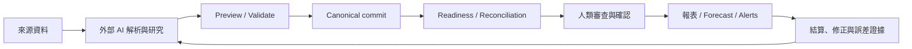
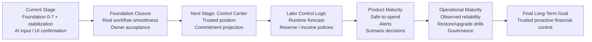

# Last Say Final Long-Term Goal

Status: Draft
Authority: Repository evidence and inferred target state
Owner approval required: Yes
Last validated against repository: 2026-07-16

## 文件用途

這份文件定義 Last Say 的長期產品終點、不可破壞的邊界，以及從目前狀態走向終點所需的能力順序。它用來約束功能、架構、維護與優先級，不是短期待辦清單。

- `README.md` 說明產品與快速開始。
- [`docs/README.md`](docs/README.md) 是專案文件入口。
- [`docs/planning/ROADMAP.md`](docs/planning/ROADMAP.md) 定義可執行階段與近期順序。
- Issue／Backlog 可記錄單一工作，但不能自行改寫本文件的終局。

只有產品使命、主要使用者、不可替代價值或長期責任邊界發生明確變化時，才應修改本文件。框架升級、單一功能、一次 bug 修復或短期交付日期都不應改變長期目標。

## 專案使命

### Confirmed mission

既有 canonical 目標 `LTG-1` 的核心意思予以保留：

> 讓個人或家庭用可長期承受的最低維護成本，與 AI 共同維持一份可追溯、知道自身缺口的完整財務事實，使使用者理解現在的財務位置、未來資金義務與決策影響，並在風險發生前採取行動。

**Confirmed evidence:** repository Git history中的原始`LTG-1`、`README.md`、`AGENTS.md`、`.claude/skills/last-say-ops/SKILL.md`，以及本文件記錄的2026-07-15 owner decisions。舊目標文件已在本文件吸收其有效內容後自working tree移除，避免形成競爭入口。

專案的不可替代價值不是「另一個記帳畫面」，而是保存單次 AI 對話不適合承擔的持久狀態：來源事實、人工裁決、分類與報表規則、資料範圍、對帳結果、缺口與稽核軌跡。

### Owner-confirmed operating model（2026-07-15）

- **AI是主要資料輸入與流程操作介面。** 外部AI負責讀來源、查capabilities／inventory／readiness、解析、preview、提出結構化資料與後續缺口。
- **UI負責人類確認與少量修正。** UI不以「每一張table都有完整CRUD」為長期目標；只有高頻確認、歧義、例外修正與高風險操作值得建立直接介面。
- **目前產品階段是資料基礎建設的業務流程收斂。** 已完成的foundation phases是技術基線，但必須持續讓AI輸入→typed validation→canonical commit→UI確認／修正的實際流程順暢且令owner滿意，才視為目前階段完成。
- **財務控制中心是下一階段。** 它必須消費既有資料基礎，不得建立第二套account、balance、liability、investment或source真相。
- **先讓業務邏輯跑順，再做優化。** 在核心流程未穩定前，維持single-user localhost與現有簡單defaults，不提前投入完整GUI、remote deployment、複雜policy、平台化或架構美化。

### Inferred mission

**Inferred:** 成熟後的 Last Say 應由目前已確認的「AI主輸入、UI確認／少量修正」模式，演進為本機財務事實與決策控制層；工具負責deterministic calculations、readiness、證據與狀態，人類保留高風險決策權。

這項推論來自已實作的 typed financial foundation、governed analysis datasets、human confirmation boundary，以及尚未實作但已有 spec-plan 的 forecast／safe-to-spend／alerts。證據：`lib/finance/**`、`lib/queries/finance/**`、`docs/contracts/financial-data-core-contract.md`、`docs/contracts/readiness-analysis-context-contract.md`、`docs/project/CURRENT-STATUS.md`、`docs/plans/master-financial-control-plan.md`。

### Needs owner decision

- 是否維持「個人／家戶優先」且不進入多人共同編輯與多租戶產品。
- 三張管理報表是否永久維持personal-management boundary，或未來另建接近statutory accounting的獨立產品範圍。
- 專案是否仍以開源、自己架設的 localhost 工具為唯一部署姿態。

## 目標、角色與工作

### Primary goal

`PG-1`：使用者能以可信且可追溯的資料，理解「現在在哪裡、未來何時有風險、缺什麼資料、採取某個選項會改變什麼」，並在不把判斷權交給 AI 的前提下採取行動。

### Supporting goals

| Goal ID | 目標 | 可觀察結果 |
|---|---|---|
| `G1` | 維持 canonical 財務事實 | 帳戶、餘額、交易、卡片、負債、承諾、投資與估值可追溯至來源與 as-of |
| `G2` | 誠實表達完整度 | 所有重要分析顯示 scope、freshness、coverage、未對帳差額與 blocker |
| `G3` | 降低人工維護成本 | 重複商家與資料處理逐期減少，人工只處理高價值裁決 |
| `G4` | 建立跨情境一致的 deterministic calculations | 同一筆卡費、貸款或轉帳在報表與控制畫面不重複計算 |
| `G5` | 在風險發生前揭露時間與原因 | 可信資料下可指出最低現金點、風險日期、差額與來源事件 |
| `G6` | 保留人類權威與可回復性 | 高風險變更需 browser confirmation；錯誤匯入可反轉且保留歷史 |
| `G7` | 形成可驗證的學習迴圈 | 修正、結算、對帳與預測誤差能改進下一期結果 |
| `G8` | 維持可接手與可營運性 | 新的人類或 AI 能從文件、測試、健康檢查與備份流程安全接手 |

### Soft goals

- 信任：不以漂亮數字掩蓋資料不足。
- 清楚：事實、工具推導與 AI 解釋必須分層。
- 可承受：正常使用不要求每日重建完整帳本。
- 可維護：核心語意有單一 owner，文件與程式碼同步演進。
- 隱私：真實財務資料預設留在本機，公開 artifact 不含個資。

### Domain invariants

1. 原始金額、日期、來源與人工裁決不得被預測或方便 UI 的需求反向改寫。
2. `correction_log`、`rule_change_log` 與 typed `data_change_log` 的稽核語意不可被一般 CRUD 繞過。
3. 資料不完整、過期、衝突或未對帳時，不得輸出無條件的「安全」結論。
4. 工具負責財務公式與 readiness；外部 AI 不得成為第二資料庫或直接寫 SQLite。
5. 高風險操作必須由實際 browser same-origin 人類確認，不以 actor header 代替。
6. Local-first、AI 可替換、無 server-side LLM 是目前既定邊界。
7. 新能力不得另建與既有 account、source、liability、valuation、reconciliation 平行的 canonical facts。
8. Control Center只能投影與解釋foundation facts，不能反向成為canonical資料owner。
9. 核心AI輸入／UI確認流程未達owner可接受程度前，不以完整CRUD、remote deployment或抽象重構取代業務流程修正。

## 最終產品狀態

### 核心使用者體驗

成熟後，使用者應能從一次低摩擦、AI主導的onboarding開始：外部AI先查capabilities、inventory與readiness，只要求最高價值的缺漏資料並提出typed preview；使用者在Web UI確認範圍、歧義與少量例外；系統再提供可追溯的現況、報表、未來義務與情境差異。UI不是完整資料後台，AI也不能繞過typed contract與人類權限。

核心流程應形成閉環：

### 核心能力與自動化

- 能處理 legacy monthly ledger 與 typed multi-context financial ingestion。
- 能以來源、權威、新鮮度與 scope 判斷分析是否可成立。
- 能產出可 drill down 的管理損益表、資產負債表與 direct-method 現金流量表。
- 能以 deterministic 方式產出未來義務、每日 projected cash、safe-to-spend、risk date 與 scenario delta。
- AI 自動化解析、研究、候選規則與解釋；人類保留 scope、歧義與高風險行動決策。
- 所有自動化都必須有失敗狀態、重試／反轉路徑與可觀察證據。

### 可靠性、安全性與資料治理

- Schema 版本、migration checksum、backup manifest 與 restore integrity 可驗證。
- 關鍵流程具 idempotency、optimistic concurrency、atomic commit／rollback 與 append-only evidence。
- 只支援 localhost 的版本應明確 fail closed；若未來要公開部署，auth、authorization、CSRF／origin、rate limit、TLS、secret 與多租戶隔離必須先成為新安全邊界。
- 每個重要衍生結果可追到 source/resource watermarks、policy version、scope 與 as-of。
- 備份、還原、升級、故障排查與 rollback 都有可重跑 runbook。

### 可維護性、可觀測性與開發者體驗

- route 只做 HTTP 邊界；domain/query owner 清楚；UI 不重算財務公式。
- 巨型元件與重複 money formatting 被拆成有測試的共享 owner，但不為抽象而抽象。
- 快速 gates（lint、unit/integration tests、build）與完整 release verifier 都可在隔離 DB 重跑。
- 正式瀏覽器 E2E 覆蓋核心 onboarding、review、Data Center、report 與 control flows。
- 健康狀態、migration／backup 結果、重要錯誤與 alert lifecycle 可觀察；本機 log 不洩漏財務內容。
- 文件入口、current status、roadmap、contracts 與 code evidence 同步更新。

### 對外整合能力

- 外部 AI 只透過版本化 capabilities 與 REST contracts 操作。
- 銀行／券商格式以可替換 adapter 或 operator mapping 擴充，不進入核心領域邏輯。
- 未來 connector 必須遵守 preview、source evidence、idempotency、timeout、retry 與 privacy contract；目前不因尚無 connector 而引入平台化過度設計。

## 使用者與成功情境

### 主要使用者

**Confirmed:** 願意在自己的電腦管理敏感財務資料、使用外部 AI agent 協助整理，但要求自己保有最後決定權的個人使用者。家戶支援是既有長期目標的一部分，但目前共同操作與權限模型為 **Unknown**。

### 成功情境

1. 使用者啟動本機服務並提供帳單、餘額、貸款或投資來源。
2. AI 先做 preflight，不重複詢問已存在且仍新鮮的資料。
3. AI 以 preview 提出結構化資料；工具驗證、去重並原子 commit。
4. 使用者只處理低信心、衝突、scope 與高風險確認。
5. 工具呈現現況、coverage、未來承諾與風險；AI 解釋原因與選項。
6. 使用者決定是否調整支出、承諾或政策；系統保存變更證據。
7. 下一期重複工作與同類錯誤應下降。

應消除的摩擦包括重複提供資料、逐筆重做相同判斷、把卡費付款重算成支出、看不到資料過期，以及只得到「月末已經出事」的報告。付款、借貸、投資與債務協商仍由人類決定；解析、候選分類、缺口排序、計算與解釋適合自動化。

## 核心能力支柱

| 支柱 | 理想成熟狀態 | 目前狀態（2026-07-16） | 主要差距／前置能力 | 成熟判定 |
|---|---|---|---|---|
| Product | 從資料補齊到風險行動的完整閉環 | **Confirmed:** transaction review、Data Center、unified workbench、三張management reports、readiness可用 | runtime forecast、safe-to-spend、alerts與owner真實流程acceptance | 貼文式情境能在扣款前指出風險與選項 |
| Domain | account／obligation／investment／reconciliation 語意一致 | **Confirmed:** foundation Phase 0–7、三時間線kernel、typed reconciliation與cross-report fixtures完成 | Control projection／policy semantics | 同一事件跨 surface 不重複、不遺失 |
| Data | canonical facts、source、freshness、scope、audit 完整 | **Confirmed:** code schema v9、typed contexts、watermarks與server reports；formal DB仍v6 | 正式升級、真實onboarding與coverage quality | 可由來源重建並解釋每個重要數字 |
| Automation | AI 做機械工作，人類處理裁決 | **Confirmed:** operator Skill、12 datasets、proposal envelope、preview/commit與unified review | owner代表性驗收、recurring／forecast learning | 維護成本與重複錯誤可量測下降 |
| Integration | 可替換 AI 與來源 adapter | **Partial:** local REST + external AI；無 bank connector | adapter contract、failure/retry/privacy boundary | 新來源不需改核心 domain |
| Reliability | 失敗可見、可重試、可反轉、可恢復 | **Partial:** atomic ingestion、reversal、verified backup、temporary migration rehearsal、5-case Chromium、release verifier | formal migration/postflight、owner-approved recovery policy、observability | 故障演練可重現且無資料遺失 |
| Security | 部署邊界與資料權限相稱 | **Confirmed local-only:** localhost、no auth、confirmation guard | 公開部署前需完整 authz/security redesign | 威脅模型與實際部署一致 |
| Operations | 可升級、備份、還原、回復與診斷 | **Partial:** CLI backup/restore、health endpoint | 排程、保留策略、升級/rollback與 log runbook | 新機還原與版本升級有定期證據 |
| Developer experience | 新 session 可定位 owner 並選對驗證 | **Confirmed baseline:** docs入口、current status、module routing、contracts、tests與release gate已同步 | 持續防止docs drift；擴充真實journey evidence | 不靠聊天記憶可安全完成 slice |
| Governance | 目標、contract、roadmap、實作狀態一致 | **Partial:** LTG、Gate F plan、Control plan與contracts已同步 | owner批准LTG與完成MP-07 acceptance | release 時無重大 docs/code drift |

## 長期架構原則

1. 核心領域邏輯不依賴特定 UI 或 AI provider。
2. route、query/domain、persistence、presentation 各有清楚 owner；相同語意只有一個 canonical owner。
3. 外部服務與來源格式透過邊界契約替換，不把 vendor 特例寫進 shared kernel。
4. 關鍵流程可用 synthetic fixture 重現；UI 不自行複製財務公式。
5. 非同步或多步驟工作必須可追蹤、可重試、可反轉或明確停止。
6. 資料變更使用版本化 migration；來源事實與衍生結果分離。
7. 重要操作可稽核，高風險操作由人類確認。
8. 系統具備與部署姿態相稱的 health、logging、backup、restore 與 failure visibility。
9. 文件、Skill、API、schema、tests 與 UI 必須在同一變更中同步。
10. 先證明第二個消費者與真實需求，再新增抽象層或平台能力。

目前最大原則差距是：巨型client components仍集中責任；Control Phase 0只有pure reference而無runtime adapter；正式DB尚未發布v9；真實typed matching與position／cash boundaries仍使三張表partial；browser coverage仍屬bounded；owner尚未完成Gate F acceptance。Unified review workbench、server-backed BS／CF、5條Chromium流程與verified backup→migration rehearsal已於2026-07-16補齊。證據詳見[`docs/planning/GAPS-RISKS-AND-DEBT.md`](docs/planning/GAPS-RISKS-AND-DEBT.md)。

## 非目標

- 不取代會計師、理財顧問、稅務或法律專業。
- 不聲稱 GAAP、IFRS、稅務申報、法定審計或投資績效保證。
- 不由 AI 自動付款、借貸、投資、協商債務或確認高風險變更。
- 不在資料不足時輸出單一財務健康分數或假精準 safe-to-spend。
- 不把任意 SQL、generic EAV、universal posting table 或 generic CRUD API 當捷徑。
- 不為目前單人 localhost 規模預先建立多租戶、分散式 queue、microservices 或即時銀行同步平台。
- 稅務、選擇權、期貨、保證金、DeFi 與複雜衍生品需另有 typed context；不得塞入一般投資模型。
- 大量 vendor connector、進階 BI 與裝飾性 dashboard 在核心 control loop 完成前屬 Later。

## 長期成功標準

| 面向 | 成功標準 |
|---|---|
| 使用者價值 | 可信資料下，核心風險可在付款前被辨識；使用者能理解原因、差額、時間與下一步 |
| 功能完整度 | transaction review、三大管理報表、position、commitments、forecast、safe-to-spend、alerts 與 scenario 形成閉環 |
| 可靠性 | 核心 fixture 對重跑、重複提交、衝突、反轉、restore 與 migration drift 有自動證據 |
| 效能 | 個人資料規模下的 inventory、readiness、report、forecast 有可重跑 benchmark；目標值需先建立 baseline，不杜撰數字 |
| 安全 | 預設資料不離開本機；公開 artifact privacy scan 通過；部署邊界若變更，先完成 authz 與威脅模型 |
| 維護成本 | 正常月度流程不要求手工重建；重複分類與重複缺口詢問可觀察下降 |
| 開發效率 | 新 agent 可由文件入口定位 owner、contract、tests 與風險；核心 slice 不靠聊天記憶 |
| 文件 | current status、roadmap、contracts、operator Skill 與實作無已知重大衝突 |
| 部署與恢復 | 新路徑 restore rehearsal、schema integrity、foreign keys、health 與核心資料計數均通過 |
| 擴展 | 新來源或 AI provider 可透過既有邊界加入，不修改 canonical domain semantics |

目前不存在可支持真實「每週維護分鐘數」「預警提前天數」「forecast error」的 production baseline；這些必須先量測，再由 owner 核准目標值。

## 現況與終局差距

### 現在在哪裡

**Confirmed:** Financial Data Foundation Phase 0–7、Data Center correctness、AI context／proposal contract、unified review workbench、management P&L／Balance Sheet／Cash Flow、bounded browser E2E、backup health，以及Control Phase 0 reference已在repository code完成。Owner將目前階段定義為資料基礎建設的業務流程收斂：正式DB仍是v6，真實報表coverage仍partial，owner acceptance未完成。財務控制中心是下一階段；runtime forecast、safe-to-spend、alerts與scenario尚未完成。

### 不能直接跳到終點的原因

- 沒有可信 opening cash、future obligations 與 freshness，就無法產生可靠 forecast。
- 沒有 coverage 與 reconciliation，就不能把 safe-to-spend 顯示成確定值。
- Phase 0 contract／fixture只證明純語意；沒有governed DB adapter與cross-report runtime tests，Control Center仍可能重複計算卡費、貸款本金與轉帳。
- 單條可重跑E2E與backup health不等於日常維運；尚缺owner-approved schedule、restore drill、graceful shutdown與更廣journey evidence。

文件外觀、首頁裝飾與框架升級屬表面改善；currency-aware money owner、正式 position read model、projection contracts、E2E 與 docs truth gate 能解鎖大量後續工作。

## 逆推路徑

### Backward reasoning

| 終局條件 | 必要條件 | 再往前的前置能力 |
|---|---|---|
| 使用者能在風險前行動 | risk date、headroom、safe-to-spend、alert explanation | deterministic forecast + confirmed obligations + current cash |
| 結果可信且可追溯 | coverage、reconciliation、watermarks、policy version | canonical facts + scope/freshness + formal report projections |
| AI 能低摩擦協作 | preflight、named datasets、preview/commit、error recovery | operator Skill + capabilities + typed APIs |
| 系統能持續改善 | settlement 與 forecast error evidence | commitment lifecycle + reconciliation + learning policy |
| 能長期維護 | E2E、release gates、backup/restore、docs governance | clear owners + synthetic fixtures + runbooks |

### Forward execution

1. **Completed 2026-07-15：** 修正status／doc truth、money／report／manual-entry correctness，建立bounded E2E與backup health基線。
2. **Reference completed 2026-07-15；owner approval pending：** Financial Control Phase 0 contracts、metric dictionary、synthetic fixture與pure timeline projector。
3. **Completed in code 2026-07-16：** 三時間線語意、typed reimbursement／transfer／obligation lifecycle、12 datasets、proposal envelope、unified review workbench、三張management statements與17-case Skill eval。
4. **Current：** 以verified backup與temporary rehearsal保護正式DB，完成v9 publication、真實material review與owner acceptance；只修正實際阻礙，不做提前優化。
5. **Next stage：** 讓Control Center直接消費既有position／statements與commitment timeline；不另建canonical facts。
6. 到forecast／safe-to-spend切片時，才由owner決定reserve與reliable income等必要policy，不拿它們阻擋目前foundation工作。
7. 建立deterministic runtime 90-day forecast、reconciliation delta與source watermarks。
8. 在coverage guard下推出safe-to-spend與persistent alerts，再完成settlement／forecast error learning、operations／observability與必要優化。

詳細切片、前置條件與驗收見 [`docs/planning/ROADMAP.md`](docs/planning/ROADMAP.md)。

## Goal-to-plan traceability

| Goal | 近期 requirement | Roadmap phase | Evidence owner |
|---|---|---|---|
| `G1/G2/G8` | current truth、money correctness、bounded E2E／backup health | Roadmap Stage 0（completed） | audit report、tests、docs gate |
| `G2/G4/G5` | control contracts、metrics、synthetic reference | Roadmap Stage 1 reference（completed；policy pending） | contracts、metric dictionary、golden test |
| `G1/G3/G6/G8` | AI主輸入→canonical commit→UI確認／少量修正的foundation業務閉環 | Current Foundation Closure Gate | operator Skill、typed API、browser evidence、owner acceptance |
| `G1/G4` | trusted position + formal Balance Sheet | Gate F MP-05 completed in code；real-data acceptance current | position contract、query tests、browser evidence、Gate F postflight |
| `G4/G5` | obligations + deterministic forecast | Roadmap Stage 3–4 | golden fixture、forecast tests、watermarks |
| `PG-1/G5/G6` | safe-to-spend + alerts + human policy | Roadmap Stage 5 | coverage states、alert lifecycle、mobile E2E |
| `G3/G7` | settlement／forecast-error learning | Roadmap Stage 6–7 | next-period evidence、error attribution |
| `G8` | operational maturity | Every phase | release verifier、restore/upgrade rehearsal、docs review |

## 決策框架

未來提出新功能、重構或優化時，必須回答：

1. 是否讓系統更接近本長期目標？
2. 解決的是核心問題還是表面症狀？
3. 是補齊必要能力，還是增加額外複雜度？
4. 是否具備前置條件？
5. 是否存在更小且可驗證的做法？
6. 是否增加未來維護成本？
7. 是否破壞既有核心能力或 domain invariant？
8. 如何以使用者結果、資料證據與回歸測試證明改善？
9. 不做會造成什麼後果？
10. 是否仍有更高優先級的阻礙？

任何提案還必須標示 Goal ID、owner、non-goals、資料來源、失敗狀態、驗證方式與文件同步點。答不出來時，先補研究或 owner decision，不以實作猜測代替產品決策。

## 維護規則

- 修改長期使命、主要使用者、角色邊界、non-goals 或成功標準，必須有 owner 明確決策與 repository evidence。
- 變更時在 PR／commit 與本文件加入原因、替代方案、受影響 Goal ID、日期及核准者；不得只寫「需求變更」。
- AI 不得因單次任務、現有 schema、框架偏好或容易實作而擅自改變終局。
- Roadmap 可以依證據與風險重排，但每個階段必須仍可追到本文件的 goal。
- 完成工作後，同步更新 `docs/project/CURRENT-STATUS.md`、受影響的架構／功能文件、Roadmap、contracts、operator Skill 與 audit evidence。
- 若文件與程式碼衝突，先把狀態標記為 `Unknown`／`Drift`，以原始碼與 runtime 重新驗證；不可靜默選一方。
- 至少在每次 release、重大 migration、核心資料流變更或長期主線切換時重新驗證本文件。

## Owner approval checklist

- [ ] 核准保留的 `LTG-1` 核心使命。
- [ ] 核准本文件提出的成熟產品狀態與 success criteria。
- [x] Owner確認AI為主要輸入方式，UI負責確認與少量修正（2026-07-15）。
- [x] Owner確認目前先收斂資料基礎建設，Financial Control Center為下一階段且必須建立於foundation之上（2026-07-15）。
- [x] Owner確認核心業務邏輯順暢前採簡單defaults，不提前優化（2026-07-15）。
- [ ] 回答 [`docs/planning/OPEN-QUESTIONS.md`](docs/planning/OPEN-QUESTIONS.md) 的 owner decisions。
- [ ] 核准後將 `Status` 改為 `Approved`，記錄日期與變更理由。

---

更新規則：使命、角色邊界、長期成功標準或能力依賴改變時更新；一般 bug、樣式、依賴版本或短期排程變動不更新。每次更新後必須重新核對 `README.md`、Roadmap、current status 與相關 contracts。
