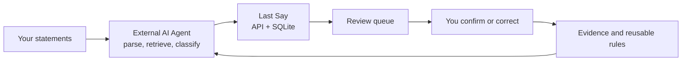

<p align="center">
  
</p>

<h1 align="center">Last Say</h1>

<p align="center">
  <strong>Your AI prepares. You have the last say.</strong><br>
  A local-first, human-in-the-loop workspace for reviewing bank statements.
</p>

<p align="center">
  <a href="https://github.com/cablate/last-say/actions/workflows/ci.yml"></a>
  <a href="./LICENSE"></a>
  
  
</p>

<p align="center">
  <a href="./README.md">繁體中文</a> · English
</p>

---

Last Say turns bank statements into a reviewable, auditable workflow. Bring Claude Code, Codex, or another agent to parse statements and propose classifications. Review only the uncertain transactions in the web UI. Last Say keeps the rules, corrections, and evidence so the next month does not start from zero.

It does not embed a model, require an AI API key, or upload your database to a finance SaaS.

## Why it exists

- **Spreadsheets store numbers, not decisions.** They do not remember why a merchant was classified a certain way.
- **AI chats can organize a statement, but forget the next session.** Last Say supplies durable rules and evidence retrieval.
- **Cloud budgeting tools are convenient, but require trust with sensitive data.** Last Say keeps SQLite, statements, and outputs on your machine.
- **Automation needs human authority.** Low-confidence work is explicit, reviewable, and never silently promoted to truth.


## How it works



1. The agent follows the bundled [Last Say Skill](./.claude/skills/last-say-ops/SKILL.md).
2. Known merchants use deterministic rules. Unknown merchants retrieve prior human corrections and similar cases before web research.
3. Every AI proposal includes a category, calibrated confidence, and a human-readable reason.
4. Human corrections become append-only evidence. Before the next import, the agent runs Flow B and creates only evidence-supported exact rules.
5. Editing, disabling, or deleting a rule re-evaluates linked history instead of leaving stale classifications behind.

<table>
  <tr>
    <td width="50%"></td>
    <td width="50%"></td>
  </tr>
</table>

## Try it in three minutes

Requires [Node.js 22.5+](https://nodejs.org/) and Git.

```bash
git clone https://github.com/cablate/last-say.git
cd last-say
npm ci
npm run seed:demo
npm run dev
```

Open [http://127.0.0.1:3127](http://127.0.0.1:3127). The demo contains fictional data and exercises transactions, review, rules, trends, management P&L, typed accounts, obligations, investments, valuations, and readiness gaps.

If `3127` is already in use:

```bash
PORT=3128 npm run dev
```

In PowerShell, use `$env:PORT='3128'; npm run dev`. The launcher keeps the host bound to `127.0.0.1`; use the actual URL printed in the terminal.

> Do not run a reset seed against an existing database. Development and tests must use a separate `FINANCE_DB_PATH`, never `data/finance.sqlite`.

## Use your own statement

Start the server, attach a CSV, PDF, or other statement to your preferred agent, and send:

```text
Last Say is running at http://127.0.0.1:3127.
Read only .claude/skills/last-say-ops/SKILL.md and the references it routes to.
Run Flow A for this statement: <file path>.
Stop after one imported month and report data quality plus the exact review URL.
Do not continue to another month without confirmation.
```

The Skill contains bank quirks, category boundaries, web research guidance, confidence rules, API contracts, privacy boundaries, and acceptance checks. Merchant facts stay in database rules and correction evidence rather than being hard-coded into the Skill.

## Current capabilities

| Capability | Status |
|---|---|
| Statement import, dedupe, source linking | Ready |
| Low-confidence and grouped human review | Ready |
| Correction evidence, rule quality, historical reclassification | Ready |
| Monthly overview, movers, recurring baseline, trends | Ready |
| Management P&L with explicit coverage | Ready, coverage-dependent |
| Financial Data Center | Ready: all typed account kinds, sources, balances, cards, loans, commitments, manual investments/quotes/FX, Tier 2 values, and review tasks |
| AI analysis preflight | Ready: 8 readiness goals, prioritized gaps, scoped/as-of checks, 12 named datasets, and provenance watermarks |
| Control Phase 0 reference | Complete but not a runtime capability: contracts, metric dictionary, synthetic fixture, and pure 90-day timeline projector; no real DB/API/UI adapter yet |
| Financial Health Review v0 | First runtime read model; formal-data coverage is partial | `/api/finance/control/financial-health` recomputes position, liquidity, debt, explicit investment-factor exposure, and stress into a compact AI Context Pack; it does not answer safe-to-spend or forecast questions |
| Balance sheet | Server-backed report with explicit coverage; missing snapshots, valuation, or FX keep it partial |
| Cash flow statement | Server-backed direct-method report with explicit boundary and reconciliation coverage |
| Tax, options, and complex derivatives | Unsupported; requires a separate typed context |

Last Say is currently a single-user localhost application with no authentication or tenant isolation. Do not expose any configured port to a network or reverse proxy. See [SECURITY.md](./SECURITY.md).

Start with the [documentation index](./docs/README.md) for the evidence-backed project map, architecture, data flows, operations, risks, and AI bootstrap order. The proposed end state and backward path are in [Final Long-Term Goal](./Final-Long-Term-Goal.md); it is still a Draft and requires owner approval.

## Feedback and contributions

- Star the repository if this workflow solves a problem for you.
- [Open an Issue](https://github.com/cablate/last-say/issues/new/choose) for reproducible bugs or missing bank formats.
- Use [Discussions](https://github.com/cablate/last-say/discussions) for workflows, operator ideas, and product direction.
- Read [CONTRIBUTING.md](./CONTRIBUTING.md) before a PR. Never attach real statements, transactions, balances, databases, or unsanitized screenshots.

## Development

```bash
npm run dev
npm run lint
npm test
npm run test:e2e
npm run build
npm run audit:prod
npm run verify:release
```

The release verifier runs lint, dependency audit, Node tests, an isolated Chromium E2E flow, an isolated build, and a real runtime smoke test without opening `data/finance.sqlite`. It scans tracked and non-ignored untracked working files for personal finance residue, checks demo metrics, rehearses backup/restore, and validates committed screenshots.

## Roadmap

Financial Data Foundation Phases 0-7 plus the trust-stabilization and Control Phase 0 reference slice are complete; `FA-0 Financial Health Review v0` is also the first runtime read model for deterministic financial-health context. See [Current Status](./docs/project/CURRENT-STATUS.md). The current priority is to make the AI-primary input → typed commit → UI confirmation/minor-correction foundation workflow run smoothly and validate FA-0 with five owner questions. Financial Control Center is the next stage; base-currency, reserve, and reliable-income policies are deferred until their runtime consumers actually need them.

See the evidence-derived [Roadmap](./docs/planning/ROADMAP.md) for gates and acceptance criteria, and [Open Questions](./docs/planning/OPEN-QUESTIONS.md) for decisions that still belong to the project owner.

## License

[MIT](./LICENSE) © 2026 CabLate
