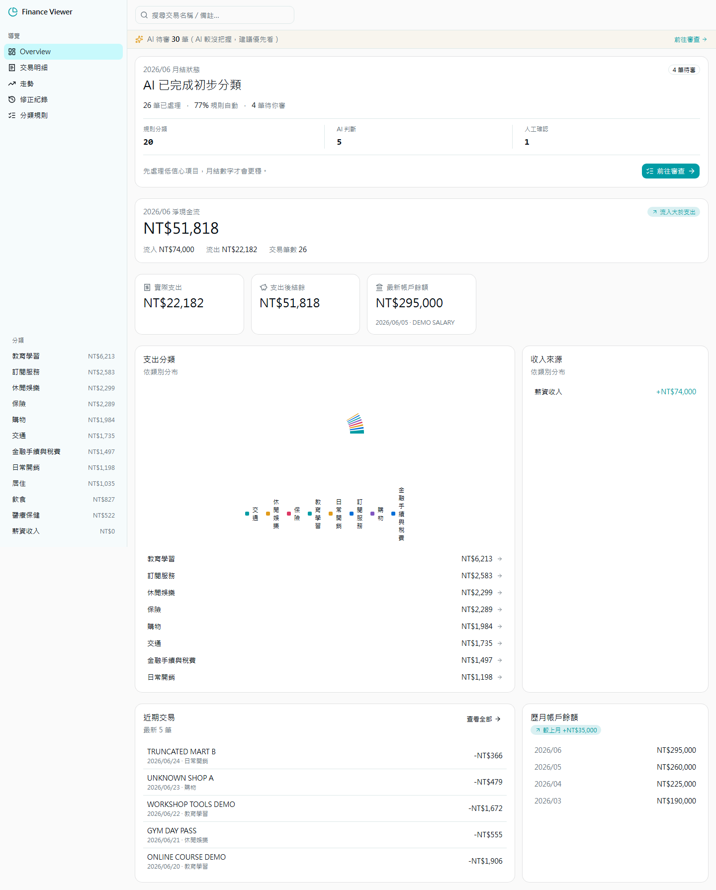
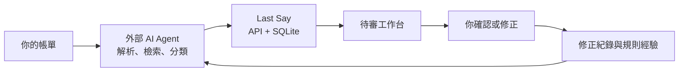
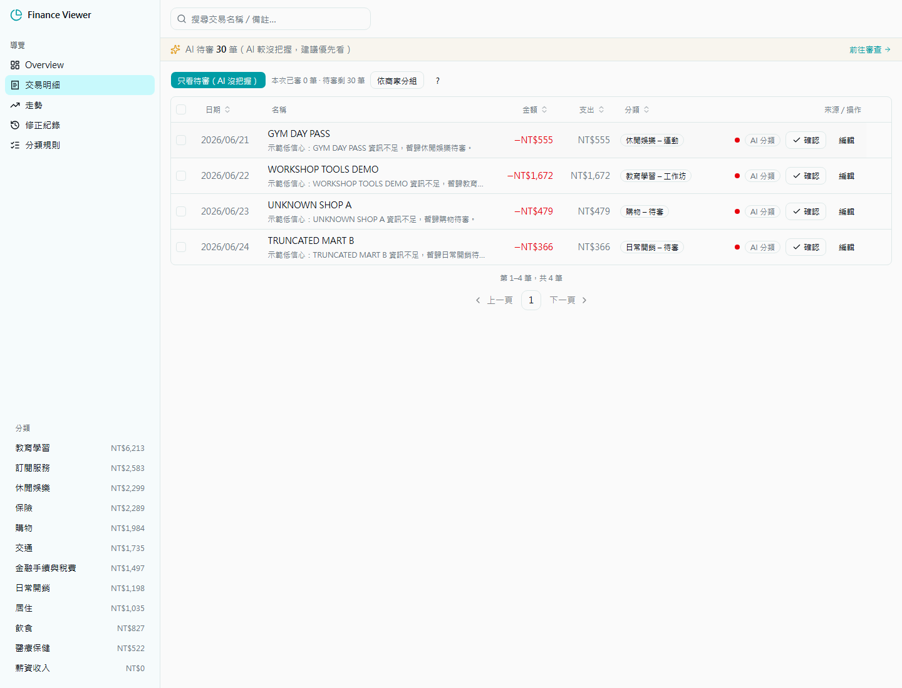
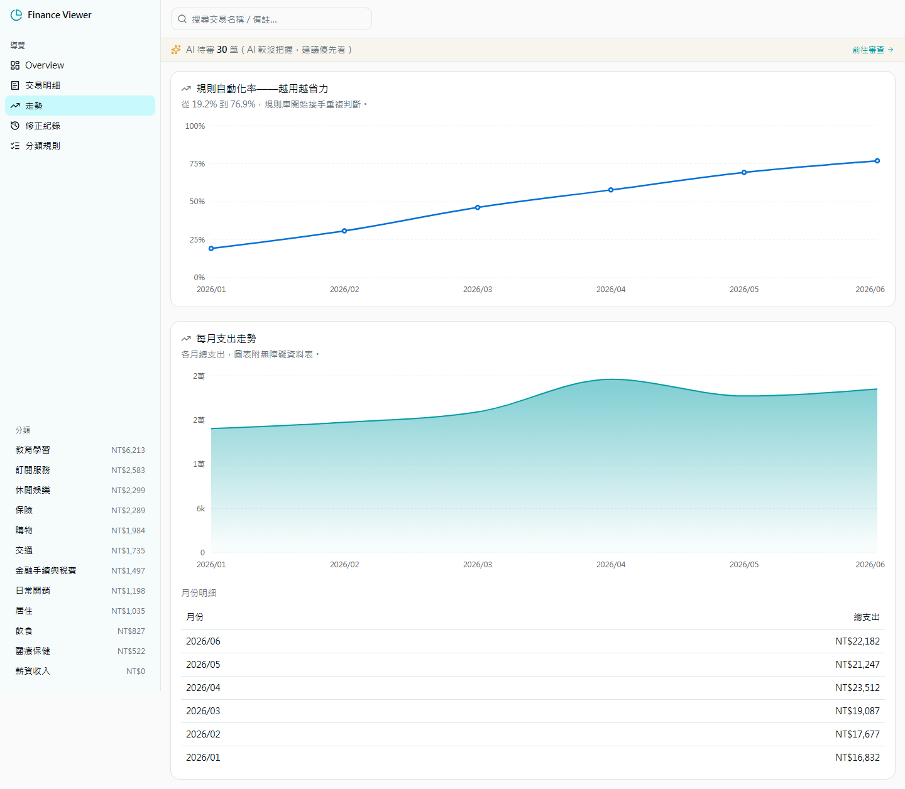

<p align="center">
  
</p>

<h1 align="center">Last Say</h1>

<p align="center">
  <strong>AI 先整理，最後由你決定。</strong><br>
  把銀行帳單變成可審查、可追溯、會累積經驗的本機財務工作流。
</p>

<p align="center">
  <a href="https://github.com/cablate/last-say/actions/workflows/ci.yml"></a>
  <a href="./LICENSE"></a>
  
  
</p>

<p align="center">
  繁體中文 · <a href="./README.en.md">English</a>
</p>

<p align="center">
  <a href="#三分鐘試用">三分鐘試用</a> ·
  <a href="#它怎麼運作">運作方式</a> ·
  <a href="#用自己的帳單">使用真實帳單</a> ·
  <a href="#目前完成度">目前完成度</a> ·
  <a href="#參與與回饋">參與與回饋</a>
</p>

---

Last Say 是一個 **local-first、human-in-the-loop 的財務審查工作台**。它不內建模型，而是讓你把 Claude Code、Codex 或其他 AI agent 帶進來：AI 讀帳單、補全商家、提出分類與信心度；你只審需要判斷的部分；Last Say 則保存規則、修正與稽核軌跡，讓下一個月不用重頭再來。

> Your AI prepares. You have the last say. The system remembers.

## 為什麼做這個

試算表能存數字，但不會記得你為什麼這樣分類；一般 AI 對話能整理帳單，但下一次常常忘了；雲端記帳服務方便，卻要求你把最敏感的財務資料交出去。

Last Say 補的是中間那一層：

- **資料留在本機**：SQLite、原始帳單與輸出都在你的電腦。
- **AI 可替換**：不綁模型、不內建 API key，使用你已經信任的 agent。
- **人保有決定權**：低信心優先、逐筆理由、批次與鍵盤審查。
- **修正真的會留下來**：人工修正、規則命中與覆寫都有可追溯紀錄。
- **錯誤規則不會永久污染**：修改、停用或刪除規則時，歷史交易會重新校正或回到待審。



## 它怎麼運作



1. AI 依專案內的 [Last Say Skill](./.claude/skills/last-say-ops/SKILL.md) 逐筆讀取帳單。
2. 已知商家由規則處理；未知商家先查人工修正與相似案例，必要時才 web search。
3. 每筆 AI 判斷都帶分類、信心度與人話理由；信心不足就留給你審。
4. 你的修正寫入 append-only evidence；AI 在下次匯入前執行 Flow B，建立或修訂有依據的精確規則。
5. 規則修改會同步校正仍受影響的歷史交易，不只影響未來資料。

<table>
  <tr>
    <td width="50%"></td>
    <td width="50%"></td>
  </tr>
  <tr>
    <td align="center"><strong>只看需要你判斷的交易</strong></td>
    <td align="center"><strong>看見規則是否真的減少工作量</strong></td>
  </tr>
</table>

## 三分鐘試用

需要 [Node.js 22.5+](https://nodejs.org/) 與 Git。

```bash
git clone https://github.com/cablate/last-say.git
cd last-say
npm ci
npm run seed:demo
npm run dev
```

開啟 [http://127.0.0.1:3127](http://127.0.0.1:3127)。Demo seed 只包含虛構交易，可直接體驗總覽、待審、規則、走勢與管理用損益表。

> 已經有正式資料時，不要執行 reset seed。請用 `FINANCE_DB_PATH` 指向隔離資料庫；開發與測試也不得使用 `data/finance.sqlite`。

預設 port 必須是空的；若 `3127` 已被占用，可改用：

```bash
npx next dev -H 127.0.0.1 -p 3128
```

## 用自己的帳單

啟動服務後，把下面這段交給你的 AI agent，並附上 CSV、PDF 或其他帳單檔案：

```text
我已啟動 Last Say（http://127.0.0.1:3127）。
請只讀專案內 .claude/skills/last-say-ops/SKILL.md 與它路由的 references，
依 Flow A 處理這份帳單：<檔案路徑>。
匯入一個月份後停止，回報資料品質與待審入口，不要自行繼續下個月。
```

完整操作契約包含銀行格式地雷、分類邊界、web search 方法、信心度、規則門檻、API 與驗收清單。商家知識存在資料庫規則與修正紀錄，不寫死在 Skill 裡。

## 目前完成度

| 能力 | 狀態 | 說明 |
|---|---|---|
| 帳單匯入、去重與來源連結 | 可用 | 保留原始事實，重新匯入不覆蓋人工決策 |
| AI 待審與批次修正 | 可用 | 低信心排序、理由、同商家分組、鍵盤流程 |
| 規則學習與歷史回溯 | 可用 | correction evidence、弱規則、覆寫率、歷史重新校正 |
| 月結總覽與趨勢 | 可用 | 本月 vs 常態、Top movers、固定支出底盤、自動化率 |
| 管理用損益表 | 可用但依覆蓋率 | 清楚標示 mapped、unmapped、needs review 與排除項目 |
| 資產負債表 | 尚未完整 | 需要帳戶角色與期末餘額快照，系統不會用流水硬猜 |
| 現金流量表 | 尚未完整 | 需要期初期末現金、轉帳配對與現金流分類 |

這是單人本機工具，API 只應綁定 localhost，目前沒有登入與多租戶隔離。不要直接公開部署到網路；詳見 [SECURITY.md](./SECURITY.md)。

## 參與與回饋

這個專案最需要的不是更多裝飾功能，而是真實使用情境：不同銀行格式、難判斷的商家、審查摩擦，以及規則長期使用後的偏差。

- 覺得方向有用，請在 GitHub **Star**，讓更多需要 local-first 財務工具的人找到它。
- 遇到錯誤或缺少銀行格式，請[建立 Issue](https://github.com/cablate/last-say/issues/new/choose)。
- 想討論使用流程、AI operator 或產品方向，請到 [Discussions](https://github.com/cablate/last-say/discussions)。
- 準備送 PR 前先讀 [CONTRIBUTING.md](./CONTRIBUTING.md)，切勿附上真實帳單或交易截圖。

## 開發與驗證

```bash
npm run dev
npm run lint
npm test
npm run build
npm run audit:prod
npm run verify:release
```

`verify:release` 會在隔離 DB 與 `.next-verify` 中執行 lint、依賴稽核、測試、build、實際 runtime smoke test，並檢查公開檔案是否殘留銀行名稱、卡號或個人資料；不會改寫正式服務的 `.next`。核心技術為 Next.js 15、React 19、Tailwind CSS 4、shadcn/ui 與 Node 內建 SQLite。

## Roadmap

長期產品方向以 [Last Say Long-Term Goal](./docs/long-term-goal.md) 為準；近期先依 [財務資料基礎建設 Master Plan](./docs/plans/financial-data-foundation-master-plan.md) 完成可追溯資料與缺口判斷，再推進預測與主動財務控制。功能必須能改善可信財務全貌、提早風險控制或人類與 AI 的長期協作成本。

- 帳戶角色與餘額快照，完成可對帳的資產負債表。
- 轉帳配對與 direct-method 現金流量表。
- 個人／事業等客觀維度與可配置分類。
- 更多可分享、去識別化的銀行格式 adapters。
- AI 月度洞察：只讀分析，不擅自修改財務資料。

## License

[MIT](./LICENSE) © 2026 CabLate
