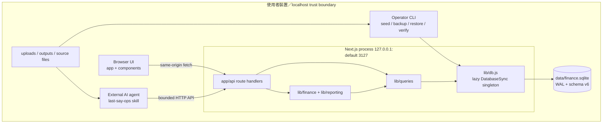
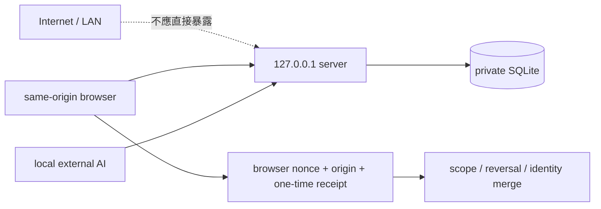

# Architecture

用途：描述 Last Say 實際部署形態、模組依賴、信任邊界與目前架構原則的落差；不是理想化分層圖。

Last validated against repository: 2026-07-15

## 實際系統形態

**Confirmed：** Last Say 是單一 Next.js process 加單一 SQLite database 的 localhost 應用。UI 與 API 由同一 App Router 專案提供；API route 直接呼叫第一方 query／domain modules；`lib/db.js` 以 lazy `globalThis` singleton 開啟 `DatabaseSync`。

沒有獨立 backend service、queue、worker、cron、webhook receiver、cache server 或 server-side LLM。證據：`app/api/**`、`lib/**`、`package.json` 與全 Repository 搜尋。

## 實際責任層

| 層 | 位置 | 實際責任 | 邊界問題 |
|---|---|---|---|
| Presentation | `app/**/page.js`、`components/**` | 頁面、client state、fetch、表格與視覺化 | 多個大型 component 同時負責取數、轉換與互動；Data Center money 已共用 canonical helper，legacy UI仍有自己的表示邏輯 |
| HTTP／control | `app/api/**/route.js` | 解析 request、呼叫 validation／query、回傳 JSON | route 數量多；legacy 與 typed APIs 並存；一般 write route 無 auth |
| Domain／contract | `lib/finance/**`、`lib/reporting/**` | typed schema、money、readiness、analysis registry、ingestion／reversal、Control Phase 0 reference projector、報表語意 | 核心語意已有邊界，但並非所有 legacy query 都經過 domain layer；control projector尚未接 runtime DB／UI |
| Application／query | `lib/queries/**` | SQL、transaction orchestration、read model、learning／reclassification | SQL 與業務規則集中；部分檔案變大，變更半徑高 |
| Persistence | `lib/db.js`、`lib/db/**` | connection、PRAGMA、compatibility schema、migration ledger、transaction | `lib/db.js` 同時保留 legacy schema bootstrap 與新 migration façade，責任較重 |
| Operator | `.claude/skills/last-say-ops/**`、`scripts/**` | 外部 AI SOP、seed、backup／restore／health check、local launcher、browser E2E、release verification | 核心 onboarding 仍依賴 agent／CLI；不是一般 GUI 使用流程 |

## 依賴方向

主要方向是 `UI → route → domain/query → db`。純 helper（money、contract validation、report line、coverage）可被 route／query／test 共用。

**Confirmed boundary crossing：** legacy `lib/queries/transactions.js` 與 `lib/queries/rules.js` 直接承擔 SQL、分類規則、review preservation 與 audit logging；這不是循環依賴證據，但讓修改分類語意時必須同時檢查 transaction、learning、rules、report mapping 與 UI。

CodeGraph 在專案根目錄重新索引後顯示：

- `normalizeForRule` 的影響範圍跨 rules、transaction routes、seed 與 UI consumers。
- `reclassifyRuleDependents` 影響 rules API、transaction query 與 rule management UI。
- `getDb` 是廣泛共用的 persistence choke point；2026-07-15 CodeGraph index顯示18個direct callers，數量會隨實作演進。
- `commitIngestion` 由 `/api/finance/imports/[key]/commit` 進入並在單一 DB transaction 內建立多 context facts。

這些是導航線索；最終結論已回看相應 source files。

## 狀態與資料所有權

- **Server state：** SQLite 是持久 source of truth；UI 每次 fetch API，沒有 Redux／全域 client store。
- **Connection state：** `globalThis` singleton 避免 dev hot reload 建立多連線；CLI 可直接 `openDatabase`。
- **UI state：** 各 client component 以 React local state 管理 dialog、filters、loading、selection。
- **Derived state：** P&L、overview、readiness、inventory、valuation與 reconciliation 由 query/read model 計算，不另設 cache。
- **AI state：** 不存模型 session；只保存來源、規則、人工裁決、review／confirmation 與 audit evidence。

## 安全與信任邊界

- `scripts/run-next-local.mjs` 將 dev／start 綁定 `127.0.0.1`，port可設定且預設3127；這是一般 API 無 auth 的必要前提。
- `middleware.js` 設定 CSP、frame denial、nosniff、permissions policy。
- high-risk routes 使用 `human_confirmation_requests`、browser session nonce、Origin／Sec-Fetch-Site 檢查與一次性 authorization；`actor` header 不是確認。
- 一般 CRUD 沒有 authentication、authorization、rate limit 或 anti-abuse。任何 LAN／remote deployment 都會改變 threat model，必須先設計安全層。
- `data/`、`uploads/`、`outputs/` 與 `.env*` 被 gitignore；release verifier 另掃描 tracked與untracked、未被ignore的 working artifacts敏感模式。

## 一致性、失敗與可恢復性

- SQLite 開啟 `foreign_keys=ON`、WAL、`busy_timeout=5000`。
- migration、compound ingestion、reversal、rule mutation 使用明確 transaction；關鍵流程用 `BEGIN IMMEDIATE` 降低中途競爭。
- ingestion 使用 run／context／item staging、typed identity 與 unique indexes支援 idempotency。
- correction／rule change／data change logs 由 trigger 保持 append-only。
- backup 產生 manifest／hash，read-only health check驗證hash／integrity／foreign keys／schema／freshness，restore只寫新 target並執行 integrity check。
- **Gap：** 沒有 production shutdown hook、job retry queue、distributed idempotency 或外部 service circuit breaker；目前單機同步架構也沒有這些前置需求。

## 高風險修改區

| 區域 | 原因 | 修改前最低檢查 |
|---|---|---|
| `lib/db.js`、`lib/db/migrations/**` | 所有資料與向後相容性 choke point | migration tests、new/old DB、checksum、backup restore |
| `lib/queries/transactions.js`／`rules.js`／`learning.js` | 分類、human authority、append-only evidence 互相牽動 | correction、rule history、review policy、import dedupe tests |
| `lib/finance/ingestion/**` | 多 context 原子性、identity、reversal | compound ingestion、reversal、contracts、conflict tests |
| `lib/queries/finance/obligations.js` | cards、loans、commitments 共用且檔案大 | obligations 全測試與 cross-context invariant |
| `lib/queries/finance/investments.js`／money helpers | manual source+fact atomicity、quote／FX／minor-unit correctness | JPY／TWD／USD fixtures、rollback與valuation tests |
| `components/TransactionTable.jsx`／`Overview.jsx` | UI 責任集中、行為與展示耦合 | browser flow、API contract、responsive state |

## 長期原則與目前差距

| 原則 | 現況 | 差距 |
|---|---|---|
| 核心語意不依賴 UI | typed contracts／queries 大致符合 | legacy UI仍重複 money／filter logic |
| 外部 AI 可替換 | skill 是 HTTP operator contract，server 無模型 SDK | 尚無 vendor-neutral operator conformance suite，只測現行 skill |
| 關鍵流程可驗證 | 47 Node test files、1條隔離 Chromium E2E + release verifier | browser coverage仍窄；缺效能與長時間運行基線 |
| 失敗可恢復 | atomic commit/reversal、backup/restore | 無 service-level rollback／operational drill automation |
| 重要操作可稽核 | 多個 append-only logs + confirmation | 一般 CRUD audit coverage 不完全一致 |
| 文件與程式碼同步 | contracts／plans／audit入口齊備，本次已同步主要repo reality | owner政策與未來實作完成後仍須持續回寫，避免Phase 0 reference被誤寫成runtime能力 |

更新觸發：process topology、依賴方向、資料 owner、信任邊界、transaction／recovery 模型或高風險 choke point 改變時更新。
