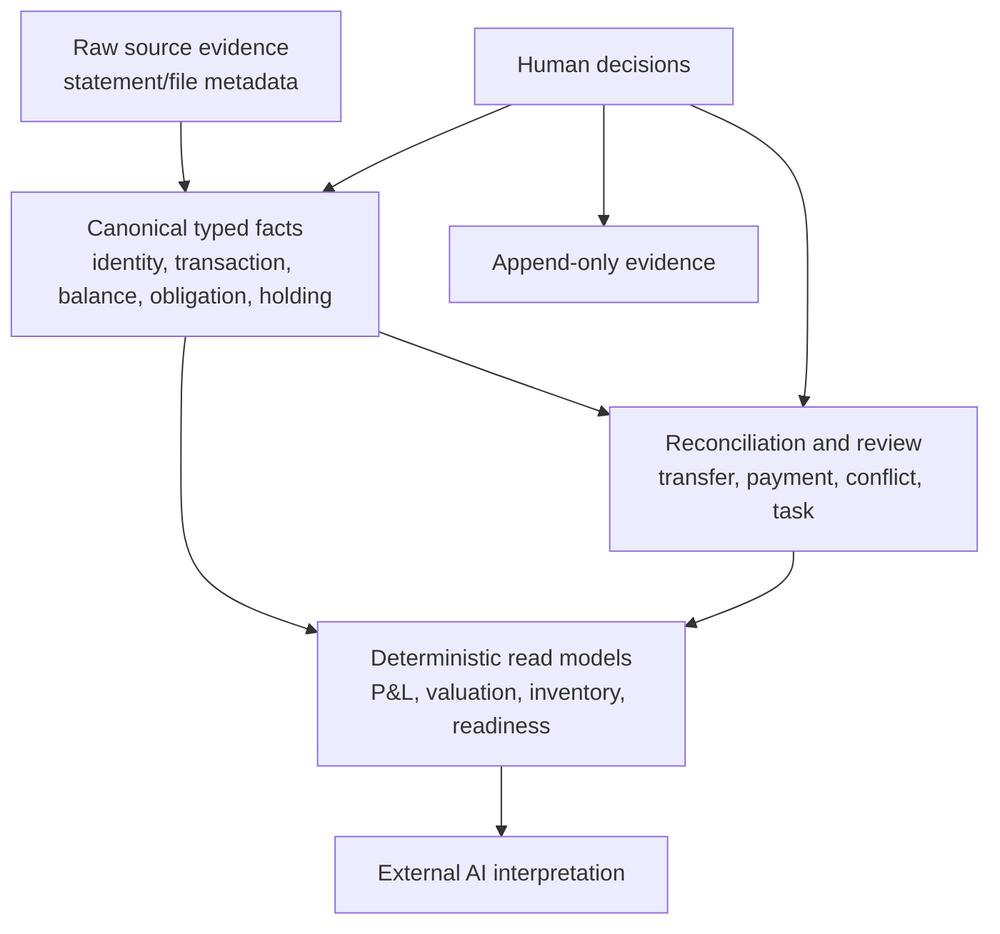
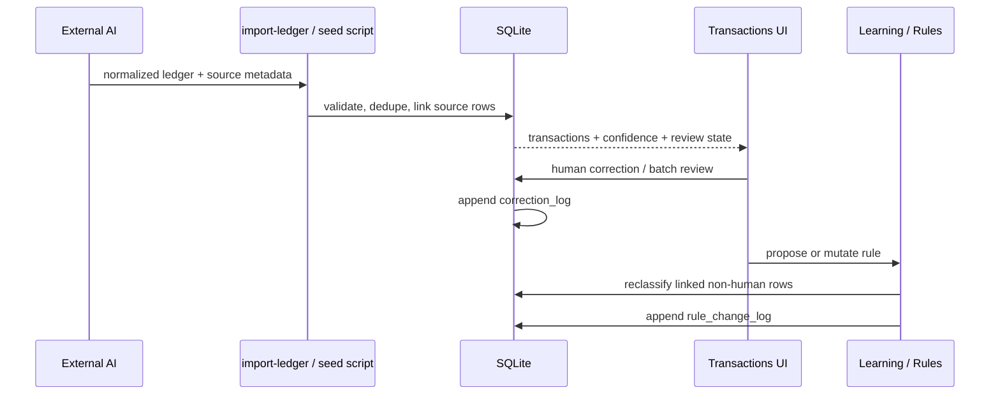
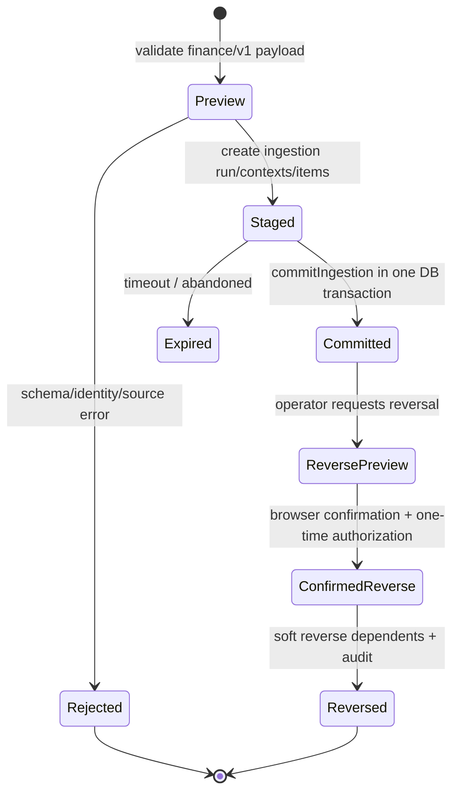
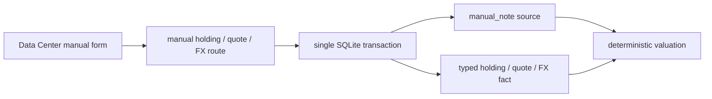

# Data And Flows

用途：描述 Last Say 的持久資料模型、事實層次、資料生命週期、主要寫入／分析流程，以及一致性與資料遺失風險。

Last validated against repository: 2026-07-15

## 資料庫與表示規則

- **Confirmed：** 單一 SQLite，預設 `data/finance.sqlite`，可由 `FINANCE_DB_PATH` 覆寫。
- **Confirmed：** schema version 6；`schema_migrations` ledger 由 `lib/db/migration-runner.js` 管理 checksum 與順序。
- **Confirmed：** money 的 typed canonical 表示是 integer minor units + ISO-like currency；`lib/finance/money/decimal.js` 定義 TWD／USD 等 exponent 2、JPY exponent 0。
- **Legacy / compatibility：** legacy transaction 欄位 DDL 宣告為 `REAL`，migration 後實際保存整數 cents。名稱與型別不表達現行語意，修改時不可假設是 major units。
- **Confirmed：** dates／timestamps 以 ISO-like TEXT 保存；as-of、period 與 source freshness 是財務解釋的一部分。

## 資料分層

事實、工具推導與 AI 解釋必須分開。Repository 不應把 AI summary 寫回 canonical financial facts，除非經 typed contract、來源與 authority policy。

## Schema 群組

### Legacy transaction／review／reporting

| 表 | 責任 |
|---|---|
| `accounts`、`sources` | legacy 起源但已由 shared-kernel migration 增補 canonical key、entity、institution、status、period 等欄位 |
| `transactions`、`transaction_sources` | 交易事實、來源 row linkage、dedupe／typed identity |
| `classification_rules`、`rule_change_log` | merchant／direction 分類規則與 append-only rule mutation evidence |
| `correction_log` | 人工修改前後值與理由；append-only |
| `report_mapping_rules`、`transaction_report_mappings` | P&L line mapping，與 classification rule 分離 |
| `tags`、`transaction_tags` | legacy tag 關聯 |

### Shared kernel（migration 0002）

`reporting_entities`、`institutions`、`institution_aliases`、`account_aliases`、`scope_attestations`、`source_expectations`、`source_expectation_goals`、`data_change_log`、`human_confirmation_requests`，並擴充 `accounts`／`sources`。

### Ingestion 與 balances（0003）

`ingestion_runs`、`ingestion_run_contexts`、`ingestion_items`、`account_balance_snapshots`，並為 transactions 加入 typed identity／status／source 欄位與 unique indexes。

### Obligations（0004）

`credit_card_profiles`、`credit_card_statements`、`credit_card_statement_items`、`credit_card_payment_matches`、`credit_card_installment_plans`、`credit_card_installment_entries`、`liability_profiles`、`loan_schedule_entries`、`loan_payment_allocations`、`commitment_templates`、`commitment_occurrences`。

### Investments（0005）

`instruments`、`investment_trades`、`holding_snapshots`、`market_quotes`、`fx_quotes`、`investment_cash_matches`。

### Reconciliation／other assets（0006）

`valued_items`、`valuation_snapshots`、`transfer_matches`、`source_conflicts`、`review_tasks`、`identity_redirects`。

**Confirmed missing schema：** 沒有 forecast runs／events、reserve policy、safe-to-spend decisions、financial alerts 或 scenario tables。

## 流程 1：legacy statement → human learning

重要 invariant：human classification／reviewed transaction 不可被普通 rule mutation 靜默覆蓋；dedupe 重跑應增加 source linkage而不是重複經濟事件。

## 流程 2：typed ingestion

`lib/finance/ingestion/index.js#commitIngestion` dispatches typed contexts；route 是 `app/api/finance/imports/[key]/commit/route.js`。Unique keys、run state 與 transaction boundaries 支援 idempotency／atomicity。reversal 會先檢查依賴並保留 history，不做任意硬刪除。

## 流程 3：analysis readiness

1. Agent 讀 `/api/health` 與 `/api/finance/capabilities`。
2. 讀 `/api/finance/inventory` 與特定 goal 的 `/readiness`。
3. readiness 依 `scope`、balances、sources、obligations、valuation、reconciliation 等 requirements 回傳 status、gaps、priority、next actions、source watermark。
4. 只有足夠時，agent 向 `/api/finance/analysis-context` 要求白名單 dataset。
5. server 只接受 registry 中 7 個 dataset 與 allowlisted filters，並限制 dataset count／response bytes。
6. AI 在 facts／derived data 之外增加 interpretation，不能把 Unknown 補成數字。

目前 8 個 readiness goals：`spending_history`、`cash_position`、`net_worth`、`debt_obligations`、`investment_value`、`cash_flow_statement`、`liquidity_forecast_90d`、`tax_or_derivatives`。最後一項明確要求 separate context；forecast readiness 不等於 forecast engine。

## 流程 4：manual investment evidence

Data Center 的 manual holding、market quote與FX輸入不直接建立無來源的fact。各route呼叫 `lib/queries/finance/investments.js` 的atomic composite，在同一DB transaction內建立`manual_note` source與typed fact；任何一步失敗都rollback。manual entry的authority是user-confirmed／manual-estimate，不等同官方statement或market feed。

正式statement、trade history或大量匯入仍應走external AI／typed ingestion，不應把manual UI當成來源擷取器。

## 流程 5：Control Phase 0 reference timeline

`lib/finance/control/project-cash-timeline.js`可從純input facts投影90日daily timeline，驗證duplicate protection、loan component sum、uncertain income exclusion、unknown commitment造成coverage降級、reserve breach、runway與safe-to-spend gate。`test/fixtures/financial-control/**`只有synthetic fixture。

這是**reference implementation，不是runtime產品能力**：尚未讀SQLite、沒有API／UI、沒有owner核准的reserve／income政策，也沒有保存forecast run。它的用途是先鎖定語意，避免未來把未知收入或未完整commitment誤算為可花金額。

## 流程 6：高風險確認

browser 取得 session nonce → server 建立待確認 request → 同源頁面以 Origin／Sec-Fetch-Site與 cookie nonce確認 → server發一次性 receipt／authorization → scope declaration、import reversal 或 identity merge 消耗授權。確認資料有 expiry／status；重放應失敗。

## 資料生命週期

| 階段 | 保存／刪除行為 | 風險控制 |
|---|---|---|
| 收集 | source metadata、optional private files | 原始檔留在 ignored private zone；不要把路徑／內容寫入公開 artifact |
| Preview | 驗 contract、identity、context | preview 不應寫 canonical facts |
| Commit | atomic typed writes + data change evidence | unique key、transaction、status guard |
| Review | correction／rule／conflict／task state | append-only evidence與 human authority |
| Derive | query-time read models，無獨立 cache | freshness／coverage／scope 隨輸出附帶 |
| Reverse | soft status／redirect／audit | preview + confirmation，不硬刪 evidence |
| Backup | bundle + manifest + hashes | explicit private destination；未加密；可read-only檢查integrity／freshness |
| Restore | 僅新 target | integrity check；人類決定是否切換 active DB |

Repository 未定義一般資料 retention／purge policy；**Needs owner decision**，尤其是 source metadata、confirmation records與已反轉資料應保留多久。

## 一致性、併發與 retry

- WAL + `busy_timeout=5000` 處理有限本機併發；重要 writes 使用 transaction／`BEGIN IMMEDIATE`。
- synchronous `DatabaseSync` 符合目前單機規模，但大型 query／write 會阻塞 request process；尚無效能基準。
- 沒有 background retry queue；HTTP client／agent應在讀取新 inventory 前確認 commit 結果，不能對未知狀態盲目重送非冪等 operation。
- ingestion identity 與 confirmation token 提供局部 idempotency／replay safety；一般 CRUD 並非全部有 idempotency key。
- **Unknown：** 高頻多 request 寫入與長時間 server 運行的 race／lock特性，沒有壓力測試證據。

## 資料正確性與治理風險

- Data Center money UI已使用canonical exponent與exact decimal conversion；後續新增金額欄位若繞過shared helper，仍可能重新引入倍率錯誤。
- legacy `REAL` 欄位實際存 cents，容易被新程式誤讀。
- P&L 與 classification 是不同 mapping owner，不應混用。
- Balance Sheet／Cash Flow目前只顯示誠實不可用狀態；沒有正式資料read model，不得把Control Phase 0 reference誤當statement或runtime forecast。
- `source_file`／CSV path 等 local metadata 若直接回傳或記 log，可能暴露本機路徑；目前 `/api/import-ledger` response 含 `csvPath`，只適合 localhost boundary。
- 沒有 DB 加密；backup bundle也不加密，存取控制由 OS／使用者負責。

更新觸發：schema／migration、money／identity semantics、資料分層、主要流程、retention、transaction／retry或備份策略改變時更新。
