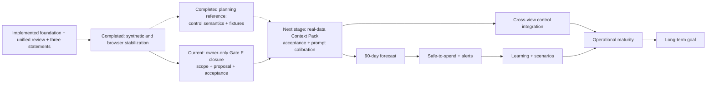

# Roadmap

用途：從目前完成的資料基礎與 [`../../Final-Long-Term-Goal.md`](../../Final-Long-Term-Goal.md) 反推能力順序。這不是日期承諾，也不代表未經owner核准的phase已排入backlog。

Last validated against repository: 2026-07-21

Status: Foundation Gate F system/operator work is complete on formal DB v10; bounded Control read models are implemented；owner-only scope、proposal、real-data Context Pack acceptance與policy decisions remain

## 推導原則

不能直接從foundation跳到漂亮control dashboard：若purchase／payment、loan principal／interest、internal transfer、scope、FX與reserve語意未鎖定，同一事件會被重複計算或以不完整資料做過度結論。

**Current gate：** AI主輸入、typed preview／commit、正式DB v10、代表性真實facts與postflight已完成。現在只由owner在UI處理scope、1筆proposal與最終接受；20筆真正未知可以明示保留。Reserve與reliable income不是目前要解的問題，不阻擋foundation closure。

**Next stage：** Owner已確認Financial Control Center接在foundation之後。Stage 2的management Balance Sheet與Stage 6的direct-method Cash Flow read model已由Gate F MP-05完成；FC-A2、FA-0、FC-A3、FC-2與FC-3也已有bounded query／API／Control consumers，下一步是用真實問題驗收Context Pack與AI提示詞。這些read models不等於safe-to-spend；reserve、reliable income、alerts與scenario policy仍等真正consumer需要時再決定。不得把未持久化的Phase 0 projector或raw forecast誤稱為完整控制中心。

## Current Gate F — Foundation Business-Flow Closure

**Active canonical master plan：** [`../plans/ai-assisted-financial-semantics-plan.md`](../plans/ai-assisted-financial-semantics-plan.md)。順序是先鎖定 economic event／cash settlement／obligation 語意與回歸樣本，再完成真實 typed obligations／reconciliation、AI context／review、三視角報表、operator Skill與owner acceptance；這些是進入 Financial Control Center 前的 foundation closure，不是另一套產品或資料真相。

**Execution status（2026-07-16）：** 上述code、正式DB migration、typed real-data代表流程與postflight均已完成。此gate不再接受新的自主foundation package；只剩owner在browser完成scope／proposal decisions並明確接受known gaps。歷史card normalization repair是既有foundation maintenance，不阻止保留partial狀態，也不授權建立第二套truth。

### 階段目標

讓已完成的資料結構與API成為順暢、可長期使用的業務閉環，而不以新增table或CRUD數量假裝foundation成熟。

### Goal contribution

- `G1`：各類財務事實經同一typed owner保存。
- `G3`：AI承擔大量輸入，人類只確認與少量修正。
- `G6`：高風險與歧義保留人類權威。
- `G8`：流程、Skill、API、UI與文件可重複接手。

### 必要工作

- 以實際owner workflow驗證accounts、balances、cards、loans、commitments、investments、sources與reconciliation的AI preflight→preview→commit→UI review路徑。
- 發現correctness、error recovery、缺口提示或資料owner問題時，以最小可驗證slice修正。
- 保持operator Skill、typed contracts、UI copy、readiness與tests一致。
- 保留manual UI作確認與例外修正；只在實際高頻摩擦有證據時增加直接輸入。

### 驗收標準

- Owner常用的基礎資料可由AI主要輸入，不需要直接改SQLite或建立臨時平行資料。
- UI能完成必要確認、歧義處理與少量修正，錯誤可理解且可恢復。
- Missing、stale、conflicted與unknown狀態如實呈現，不以0或假ready掩蓋。
- Release gate持續通過，且owner明確確認foundation業務邏輯已達可接受程度。

### 此階段不應做

Control Center UI、runtime forecast、reserve／reliable-income policy、完整admin CRUD、LAN／cloud deployment、為行數或抽象美感進行的大規模重構。

### 解鎖

進入Stage 2／3，以既有foundation建立Financial Control Center。

## Stage 0 — 穩定可信現況與可驗證性

**Status：Completed 2026-07-15.** Evidence：canonical money presentation、誠實BS／CF unavailable states、PORT launcher、Playwright E2E、CI與release integration。

### 階段目標

消除已知data／trust錯誤，讓UI與backend的critical path可在browser重現。

### 為什麼現在做

JPY minor-unit與static BS／CF是直接信任風險；完整E2E是後續跨context UI變更的安全網。

### 必要工作

- 修正UI currency exponent與round-trip validation。
- 移除static BS／CF readiness preview，改為不可混淆的unavailable state。
- 建立一條anonymous isolated browser E2E。
- 修正port設定owner；維持loopback。
- 把本次文件系統納入變更checklist。

### 前置條件

無產品策略決策；只能使用匿名fixture與隔離 DB。

### 驗收標準

- JPY／TWD／USD input-display-write assertions通過。
- Reports未實作tab不顯示可能被誤認為真實的數字。
- CI從empty isolated DB完成JPY account與balance、manual instrument／holding／quote／FX、valuation與report unavailable assertions；這是bounded critical path，不是完整import／review UI suite。
- `npm run verify:release`通過。

### 此階段不應做

新dashboard、forecast演算法、schema重寫、LAN exposure。

### 解鎖

Foundation closure與未來Control work可在有端到端安全網下進行。

## Stage 1 — Control semantics、contracts與fixtures

**Status：Reference implementation completed 2026-07-15；Control Center已確認為下一階段，具體財務policy延後到其consumer實作時決定。** Evidence：`docs/contracts/financial-position-contract.md`、`commitment-and-liability-contract.md`、`cash-forecast-contract.md`、`financial-alert-contract.md`、metric dictionary、synthetic fixture與pure timeline projector。這些不代表runtime forecast已完成。

### 階段目標

把未來財務控制需要的cross-context語意變成可執行契約。

### 為什麼現在做

foundation已完成；目前最大阻礙不再是缺table，而是缺統一metric與事件責任。

### 必要工作

- owner確認Control Center在foundation之後展開（已完成）；base currency、reserve與reliable income保留為後續consumer的explicit policy，不現在定案。
- financial-position、commitment／liability、cash-forecast、financial-alert behavior contracts。
- metric dictionary：projected cash、reserve、safe-to-spend、cash gap、debt service、reliable income、fixed commitments。
- 定義purchase／payment、principal／interest、transfer與valuation不重複計算invariants。
- 代表性匿名fixture與acceptance cases；對應existing foundation API。

### 前置條件

Reference artifacts只需Stage 0 safety net，已完成。Runtime consumer仍須遵守Current Gate F；各policy到真正被position／forecast／safe-to-spend使用時才成為該slice的entry gate。

### 驗收標準

四份contract具consumer、inputs、state、invariants、errors、acceptance與verification commands；synthetic fixture與pure projector已驗證purchase／payment、loan components、uncertain income、unknown commitment、reserve breach、runway與safe-to-spend gate。owner policy與DB adapter另由Stage 2–4驗收。

### 此階段不應做

先畫Control Center、加入AI prediction、為未定語意建大量schema。

### 解鎖

Trusted position先落地，obligation timeline接續；public response contract凍結後，對應UI與operator Skill可做bounded parallel。Forecast不得早於前兩者。

## Stage 2 — Trusted position 與 formal Balance Sheet foundation

**Implementation status（2026-07-16）：** Formal management Balance Sheet query／API／coverage／UI已由Gate F MP-05完成。此stage剩餘的是把該position contract作為Control runtime opening position，並以正式DB／owner acceptance驗證；不得另建第二套position truth。

### 階段目標

由canonical facts產生明示scope、as-of、currency、coverage與reconciliation的financial position。

### 為什麼現在做

它把已完成的accounts／balances／liabilities／investments／valued items轉成核心使用者價值，也是forecast starting point。

### 必要工作

- position read model／API，區分liquid、restricted、liability、valued item與unknown。
- FX／quote freshness與base-currency presentation policy。
- source／scope／reconciliation blockers。
- formal Balance Sheet mapping與data-backed UI（已由MP-05完成）；Control adapter必須直接消費同一read model／facts。

### 前置條件

Current Gate F完成；Stage 1 metric／boundary；完整net-worth readiness；position request具explicit base currency與statement scope。Reserve與reliable income不屬本stage前置。

### 驗收標準

fixture exact totals與equation成立；缺scope／balance／quote／reconciliation時降級而非顯示complete；每個line可追到facts；不宣稱GAAP／IFRS。

### 此階段不應做

tax／statutory adjustments、arbitrary manual balancing plug、cloud market data整合。

### 解鎖

可信starting position、net worth與reserve anchor。

## Stage 3 — Obligation 與 commitment timeline

**Implementation status（2026-07-17）：** FC-2 Obligation Timeline v0已完成pure projection、query／API、analysis-context dataset與Control consumer；正式資料與owner acceptance仍待驗收。它提供7／30／90日已知義務，不是safe-to-spend。

### 階段目標

把cards、installments、loans與commitments投影成不重複的future cash events。

### 為什麼現在做

現有typed facts已存在，但使用者仍看不到「何時要付」的統一時間軸；forecast沒有它會失真。

### 必要工作

- card statement／payment lifecycle與installment outstanding projection。
- loan schedule principal／interest／fee分離與actual allocation。
- recurring／one-off commitment occurrence materialization。
- paid／scheduled／expected／overdue／uncertain state與dedupe。
- UI calendar/list與coverage。

### 前置條件

Stage 1 event invariants；現有obligations schema與readiness。

### 驗收標準

Control Plan A1／A2／A5 fixture不重複計算；同一payment只settle對應obligation；missing schedule明示gap；timeline total可追溯。

### 此階段不應做

自動付款、利率最佳化建議或無來源的due date推測。

### 解鎖

Deterministic forecast events與near-term risk explanation。

## Stage 4 — Deterministic 90-day cash forecast

**Implementation status（2026-07-17）：** FC-3 Raw Cash Forecast v0已完成policy-aware pure projector、trusted opening cash adapter、query／API、analysis-context dataset與Control consumer；它只投影可信期初現金與已知義務，不持久化forecast run，也不提供safe-to-spend。正式資料與owner policy acceptance仍待驗收。

### 階段目標

以可信starting cash、future obligations與可選的confirmed inflows產生可重現日曲線；未定義reliable income時仍可顯示「已知承諾下的raw projection」，但不可顯示safe-to-spend或安全結論。

### 為什麼現在做

Stage 2與3已提供位置與時間；這時才有資格回答「何時不足」。

### 必要工作

- forecast run／input snapshot／event projection責任與必要persistence。
- raw／base daily curve、minimum cash、driver events；reserve breach與gap只在對應policy存在時啟用。
- source freshness、confidence與blocked/degraded semantics。
- actual vs forecast variance基礎。

### 前置條件

Stage 1–3；owner只需確認forecast horizon／as-of的簡單default。Reliable income可保持未設定，未確認inflow必須排除。

### 驗收標準

固定fixture每次產生相同曲線；漏source、過期balance、未對帳transfer可預期降級；同日事件排序與rounding有contract；AI不參與canonical計算；未設定reserve／reliable income時safe-to-spend明確unavailable。

### 此階段不應做

ML預測、無界限模擬、直接給投資／借貸建議。

### 解鎖

Safe-to-spend、reserve guardrail與proactive alerts。

## Stage 5 — Control Center、safe-to-spend 與 alerts

### 階段目標

把可信forecast轉成可行動、可解釋且由人保留決策權的控制面。

### 為什麼現在做

只有在forecast可重現後，control signal才不會是漂亮但不可驗證的數字。

### 必要工作

- reserve policy與safe-to-spend calculation。
- risk cards顯示when／how much／why／which source／what changes it。
- alert state lifecycle：open、acknowledged、resolved、superseded與dedupe。
- Data Center與readiness入口，避免把gap藏在dashboard後。
- human decision／override evidence；不自動執行財務行動。

### 前置條件

Stage 4；owner核准reserve semantics、alert threshold與notification scope。

### 驗收標準

Control Plan A8／A9可重現；每個signal能回溯forecast run、policy與facts；stale data明顯降級；alert不重複轟炸且可確認／解除。

### 此階段不應做

自動轉帳、貸款申請、投資交易、未核准遠端通知。

### 解鎖

長期目標中「風險發生前採取行動」的核心產品價值。

## Stage 6 — Formal Cash Flow 與 accounting closure

**Implementation status（2026-07-16）：** Direct-method management Cash Flow query／API／coverage／UI、typed transfer／card／loan／investment／reimbursement handling與cross-view fixtures已由Gate F MP-05完成。此stage未來只處理真實reconciliation closure、Control variance consumer與必要的accounting成熟度，不重寫statement owner。

### 階段目標

以cash boundary、transaction mapping、transfer reconciliation與begin/end cash建立可信cash-flow statement。

### 為什麼剩餘closure在Control後

核心statement已先落地並會在資料不足時降級；更完整的month-end closure與variance learning仍需Control使用脈絡與owner真實資料驗收。

### 必要工作

- operating／investing／financing mapping與coverage。
- beginning cash + net change = ending cash reconciliation。
- internal transfer elimination、card／loan cash timing。
- statement API／UI與未映射review flow。

### 前置條件

Stage 1、2、3與reconciliation completeness；owner確認management vs statutory boundary。

### 驗收標準

fixture equation成立；unmapped／unreconciled items明示blocker；statement line可追來源；仍明確不是法定會計。

### 此階段不應做

為配平而塞unknown plug、稅務／審計聲明。

### 解鎖

完整management statement set與更好的forecast variance分析。

## Stage 7 — Learning、scenarios 與 operational maturity

### 階段目標

以實際結算改善規則與forecast，在不增加失控自動化下支援可逆scenario；同時讓日常使用可恢復、可診斷。

### 必要工作

- forecast vs actual variance與policy／rule feedback。
- bounded scenario comparison，不改canonical facts。
- minimal structured logs／latency baseline／graceful shutdown。
- owner核准的backup schedule、retention、restore drill與release evidence。
- 只有需求證實後才評估notification／remote integration。

### 前置條件

前述核心能力有穩定使用資料與baseline；owner定義RPO／RTO與privacy boundary。

### 驗收標準

學習改善有客觀override／variance指標；scenario可清除且可比較；restore drill達標；diagnostics不洩漏財務資料。

### 此階段不應做

自治財務agent、microservices、multi-tenant或無證據的大規模平台化。

### 解鎖

`Final-Long-Term-Goal.md`所述產品與營運成熟狀態。

## Phase gate規則

任何stage進入執行前必須有：owner／consumer、behavior contract、匿名fixture、dependency evidence、acceptance commands、privacy review與文件回寫範圍。某stage可切小並部分平行，但不能跳過其semantic dependency。

更新觸發：stage acceptance完成、dependency改變、owner核准／否決主線或新證據改變優先順序時更新。日期排程應另存release／issue，不在此以日期取代能力gate。
