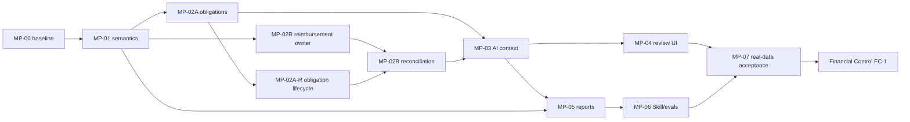

# Master Plan: AI-Assisted Financial Foundation Closure

## Plan Identity

| Field | Value |
|---|---|
| Lifecycle | Active execution；MP-00至MP-06 complete；MP-07 operator／migration／real-data closure complete，owner-only confirmations與acceptance pending |
| Profile | Master |
| Canonical role | Current Gate F 唯一 AI 語意與真實資料閉環執行計畫 |
| Owner | Project owner；Foundation integration owner 由執行 session 指定 |
| Repository／scope | `finance-viewer`；Foundation Business-Flow Closure |
| Branch／base commit | `codex/repository-audit-and-stabilization`／`f633ada491d1eb90c3a4e6e138dfaabe6b3f97d0` |
| Created | 2026-07-16 |
| Last verified | 2026-07-17，repository、209 tests、18 Skill evals、7 browser flows、release verifier與formal DB v10既有postflight（本輪未開啟正式DB） |
| Inputs | Owner 近期決策、[`CURRENT-STATUS.md`](../project/CURRENT-STATUS.md)、[`ROADMAP.md`](../planning/ROADMAP.md)、[`master-financial-control-plan.md`](master-financial-control-plan.md)、現有 behavior contracts |
| Known relevant drift | Working tree 已有未提交的 transaction classification、owner-unresolved、reporting、UI 與 Skill 變更；MP-00 已將其納入共享語意邊界，每個後續 package 仍須做 scoped diff preflight，不得覆蓋既有工作 |

本文取代本檔先前的 Standard 草案。它是後續 [`master-financial-control-plan.md`](master-financial-control-plan.md) 的上游 entry gate，不與其競爭：本計畫關閉資料基礎與 AI 協作；後者才擁有 projection、policy、alerts、scenario 與 safe-to-spend。

## Outcome and Scope

### Outcome

使用者可用自然語言與來源文件交給外部 AI；AI 能經由公開 typed APIs 把模糊財務線索整理成有證據、可預覽、必要時可確認、可回復的 canonical facts。損益、現金活動與資產負債／義務視角只認列各自應認列的事件，並明確揭露資料範圍、未知與阻礙。

### Success evidence

- 同一經濟事件不會因信用卡繳款、分期扣款、轉帳或報銷而重複成為收入／費用。
- 有來源證據的 card、liability、commitment 與 transfer facts 進入現有 typed owners，不再只留在交易備註或聊天記憶。
- AI 可完成 preflight → context → proposal → preview → commit／human confirmation → postflight；禁止直接改 SQLite。
- 三個財務視角均回傳 scope、as-of、coverage、watermark、unresolved counts／amounts 與 blockers。
- Owner 以真實資料完成常用分析，確認 AI 是主要輸入、UI 只需處理歧義與少量修正；GATE-F1 至 GATE-F6 留有 evidence。

### In scope

- 經濟認列、現金清償、未來義務三種語意與跨報表規則。
- 信用卡帳單／付款／分期、貸款／schedule／allocation、commitment／occurrence、transfer matching 的真實資料閉環。
- AI named datasets、proposal envelope、impact-based review、operator Skill 與 evals。
- 管理損益、現金活動、資產負債／義務的勾稽、coverage 與 drill-back。
- Synthetic regression、temporary DB integration、real-data guarded acceptance。

### Out of scope / non-goals

- **NG-01：** 不實作 safe-to-spend、可靠收入、安全底線或長期 forecast policy。
- **NG-02：** 不提前交付完整 Financial Control Center、漂亮 dashboard 或 full CRUD admin。
- **NG-03：** 不建立 server-side LLM、任意 SQL／URL fetch 或第二套 `ai_analysis` canonical store。
- **NG-04：** 不把未知本金、利息、用途、報銷配對或匯率當作 0／confirmed。
- **NG-05：** 不為單一真實案例先發明通用 schema；現有 owner 無法表達時才提出 migration package。
- **NG-06：** 不在 tracked 文件、logs、eval fixtures 或輸出中保存私人完整帳號與真實明細。

### Constraints

- Local-first；外部 AI 不持有 human authority，不可偽造 confirmation receipt。
- 正式 DB mutation 前必須有已驗證 backup；開發測試只能使用 temporary／synthetic DB。
- 目前 dirty worktree 屬既有工作，package owner 只能修改自身 scope。
- 現有 public APIs、authority precedence、version check、idempotency、audit 與 reversal 必須保留。

## GORE Core

### Actors and intent

| Actor／consumer | Job／outcome | Current pain／risk | 不應被迫承擔 | Source |
|---|---|---|---|---|
| Project owner | 交付資料、回答少量關鍵歧義並取得可信財務結論 | 逐筆整理太累；目前報表仍可能把生活 run-rate、固定支出與清償混在一起 | 理解 schema、手寫 SQL、審查所有低風險列 | Owner decision、`CURRENT-STATUS.md` |
| External AI operator | 理解來源、查證、提出 typed actions 並解釋缺口 | context 分散；typed obligation owners 在真實 DB 尚未落地 | 偽造事實、直接改 DB、用聊天記憶宣告完整 | `financial-data-operator-contract.md` |
| Human review UI | 呈現 material ambiguity、impact 與 recovery | 現有確認與 review surfaces 分散；尚無完整 semantic proposal flow | 成為 full CRUD 後台或要求重複輸入來源資料 | `ConfirmationQueue.jsx`、finance-data components |
| Reporting consumers | 以同一組 facts 回答損益、現金與 position | 分類與 settlement 語意可能跨報表不一致 | 猜缺值、隱藏 unresolved、各自重做分類 | reporting contracts／queries |
| Future Financial Control | 消費可信 position 與 obligation timeline | Foundation Gate F 尚未通過 | 建立第二套 account／liability／commitment owner | `master-financial-control-plan.md` |
| Maintainer／development AI | 安全修改、驗證、回寫文件與 Skill | shared registry／contracts／schema 容易平行衝突 | 用正式 DB 跑測試或把 build pass 當完成 | repo contracts／release verifier |

### Goal model

| Goal ID | Type | Goal | Parent／depends on | Observable outcome | Quality guardrail |
|---|---|---|---|---|---|
| G-01 | Primary | AI 主輸入能安全完成模糊財務資料到可信分析的完整閉環 | — | Owner 用真實資料完成常用分析且只處理 material ambiguity | 不沉默猜測、不重複認列、可回復 |
| G-02 | Supporting | 建立三時間線語意與唯一認列規則 | G-01 | 相同 fixture 在損益／現金／義務視角有唯一且可說明結果 | Deterministic、跨報表一致 |
| G-03 | Supporting | 將有證據的義務與 reconciliation 寫入既有 typed owners | G-02 | Typed tables 反映已知 facts；未知保持 partial | 不建立第二真相；authority precedence |
| G-04 | Supporting | 讓 AI 取得足夠 context 並產生標準 proposal | G-02、G-03 | Proposal 帶 source、reason、confidence、impact、recovery | Allowlisted dataset；禁止 arbitrary SQL |
| G-05 | Supporting | 只把 material ambiguity 交給使用者 | G-04 | UI 可確認／拒絕／修正且顯示影響；低風險可批次處理 | 最小人工成本；human evidence 最高 |
| G-06 | Supporting | 三種報表視角可勾稽並揭露 coverage | G-02、G-03 | 每個差異可 drill 到來源、match 或 blocker | Missing ≠ 0；partial 不冒充 complete |
| G-07 | Enabling | 把流程固化到 Skill、evals、tests 與 release evidence | G-02–G-06 | 新 AI session 可重複操作且不跨越權限 | 文件、code、Skill 同步 |
| G-08 | Acceptance | 關閉 Gate F 並安全交棒給 Financial Control | G-01–G-07 | GATE-F1…F6 有 evidence；owner acceptance 留存 | 不提前啟動 policy／forecast |

### Material goal conflicts

| Conflict | Decision／owner | Observable guardrail |
|---|---|---|
| 自動化程度 vs. 財務正確性 | 採 impact-based automation；Project owner 擁有 material confirmation | 會改變資產／負債、跨期損益、高權威事實或不可逆狀態者不得自動確認 |
| 報表可用性 vs. 資料完整度 | 允許 scoped／partial 結果，不允許假完整 | 回傳 scope、coverage、blockers；Unknown 不計入 confirmed totals |
| 學習效率 vs. 錯誤永久化 | 修正保留 evidence，但規則建立需獨立門檻 | 一次 AI guess 或 owner-unresolved 不自動產生 reusable rule |
| 快速補資料 vs. 第二套資料真相 | 重用 typed owners；Foundation integration owner 裁決 capability gap | 新 store／schema 必須先有 behavior gap、consumer、migration／rollback 證據 |

## Requirements and Invariants

| ID | Type | Requirement／invariant | Priority | Outcome evidence |
|---|---|---|---|---|
| R-01 | Requirement | AI proposal 必須含 source IDs、target owner/action、authority、confidence、reason、impact、reversibility、missing evidence | P0 | Contract／integration tests |
| R-02 | Requirement | 每個分析先查 capabilities／inventory／goal readiness，再取得 allowlisted context | P0 | Skill eval＋API test |
| R-03 | Requirement | 報表輸出明示三種時間線、scope、as-of、coverage、watermark 與 blockers | P0 | Report contract／fixture |
| R-04 | Requirement | UI review 依語意影響而非只依 AI confidence 排序 | P1 | Component state＋browser flow |
| R-05 | Requirement | 正式資料批次必須 backup、preview、atomic commit、postflight、可回復 | P0 | Backup manifest＋run/reversal evidence |
| I-01 | Invariant | 原始 amount、currency、date、account、source 與 raw identity 不被語意修正覆蓋 | P0 | Before／after tests |
| I-02 | Invariant | 一個經濟事件只進 confirmed P&L 一次；card payment／installment settlement 不另生費用 | P0 | Cross-report fixture |
| I-03 | Invariant | Economic recognition、cash settlement、obligation due date 分開保存或明確衍生 | P0 | Decision table＋API shape |
| I-04 | Invariant | 官方／原始 evidence > user-confirmed > deterministic match > AI inference | P0 | Negative authority tests |
| I-05 | Invariant | Unknown、partial、stale、conflicted、unreconciled 不可被當 0 或 complete | P0 | Readiness／coverage tests |
| I-06 | Invariant | AI 不直接寫 SQLite、不成為 human actor、不建立 confirmation receipt | P0 | API negative tests／Skill eval |
| I-07 | Invariant | Canonical state、decision、side effect 各只有一個 owner；projection 需指回 source facts | P0 | Ownership review／architecture tests |
| I-08 | Invariant | 正式個資不進 Git、logs、fixtures 或公開搜尋 | P0 | Scoped diff／output inspection |

## Verified Current State

| ID | Type | Claim | Evidence／stable anchor | Verified at | Planning impact |
|---|---|---|---|---|---|
| F-01 | Fact | 專案是 Node 22＋Next 15＋React 19＋SQLite 的 local-first app | `package.json`、`lib/db.js` | HEAD＋2026-07-16 | 可用 temporary SQLite 做完整 integration |
| F-02 | Fact | 外部 AI typed preview／commit、idempotency、audit、human confirmation、reversal 基礎已存在 | `lib/finance/ingestion/**`、`app/api/finance/imports/**`、`human-confirmations/**` | same | 不重建 write path |
| F-03 | Fact | Card／installment／liability／schedule／allocation／commitment schema、query 與 routes 已存在 | migrations `0004`；`obligations.js`；finance routes | same | 優先補 capability usage 與真實 facts，不先改 schema |
| F-04 | Fact | Transfer match、source conflict、review task schema 與 query 已存在 | migration `0006`；`reconciliation.js`；`review-tasks.js` | same | 重用 reconciliation owner |
| F-05 | Fact | Readiness 與 allowlisted analysis-context 已存在；現有 datasets 為 cash、balances、debt、investments、valued items、reconciliation、net worth | `inventory.js`、`analysis-context.js`、`analysis/registry.js` | same | 新 semantic datasets 擴充 registry，不開 arbitrary endpoint |
| F-06 | Fact | 管理損益主要由 transaction/report mappings 動態分類 | `report-lines.js::classifyTransactionForReport`、`income-statement.js::getIncomeStatement` | same | WP1 必須先鎖跨報表 semantics |
| F-07 | Fact | Formal DB為schema v10；migration postflight為1,078 transactions，07-16晚間current-card／Taishin update後為1,108 transactions、13 accounts、28 sources、12 balance snapshots；typed facts含card profile／statement／payment match、3 liabilities、2 commitments與1 proposed reimbursement；integrity `ok`、0 FK violations | typed APIs、audited source-link lifecycle、read-only `node:sqlite` count／PRAGMA，`data/finance.sqlite` | 2026-07-16 postflight | Balance Sheet已complete；cash flow仍依missing historical boundaries／matching維持partial |
| F-08 | Fact | Synthetic tests 已覆蓋 storage、preview／commit、reversal、readiness、transfer matching、installments 與 demo fixture | `test/financial-*.test.js`、`credit-card-*.test.js`、`liability-storage.test.js` 等 | HEAD＋dirty snapshot | 可由既有 suite 延伸，不從零開始 |
| F-09 | Fact | Working tree 有尚未提交的 AI classification、owner-unresolved、reporting、UI 與 Skill 變更 | `git status --short` | 2026-07-16 | 第一個 package 必須先形成乾淨 scope baseline |
| F-10 | Fact | Repository沒有reimbursement match schema/query/route/ingestion context；現有`transfer_matches`只能表達own-account from/to legs | repo-wide reimbursement search；migration `0006`；`reconciliation.js` | 2026-07-16 MP-02 preflight | 一對多報銷需要additive typed owner，不能塞入transfer或memo |
| F-11 | Resolved fact | MP-02A preflight發現compound typed obligations缺少canonical reversal owner；migration `0008`現已加入run ownership與active/reversed lifecycle，active queries／reconciliation排除reversed rows，unique identity無法安全重建時則在preview阻擋 | `0008-obligation-ingestion-lifecycle.js`、`reversal.js`、`obligations.js`、`obligation-closure.test.js` | 2026-07-16 MP-02A-R verification | Card／loan／commitment缺口已關閉；未取得owner的其他typed family仍fail closed |
| D-01 | Decision | AI 是主要輸入；UI 僅確認、歧義、高風險授權與少量修正 | Owner 2026-07-15；`CURRENT-STATUS.md` | current | 排除 full CRUD 設計 |
| D-02 | Decision | Control Center 是 foundation 完成後的下一階段；reliable income／安全底線延後 | Owner；Roadmap／control master plan | current | 本計畫不含 forecast policy |

### Current ownership

| Capability | Current／target owner | Reuse rule | Forbidden responsibility |
|---|---|---|---|
| Canonical facts | `lib/finance/**`、`lib/queries/finance/**`、`/api/finance/**` | Reuse | 不存 AI narrative 或第二套 totals |
| Ingestion lifecycle | `lib/finance/ingestion/**` | Extend additive sections only when needed | 不繞過 preview／version／audit |
| Readiness/context | `inventory.js`、`analysis-context.js`、`analysis/registry.js` | Extend named datasets | 不擁有 source facts／報表認列 |
| Report semantics | `lib/reporting/**`、`lib/queries/reports/**` | Centralize shared semantic kernel | 不在 React client 重算 |
| Review authority | `review-tasks.js`、`human-confirmations.js`、browser confirmation routes | Reuse impact metadata／receipt | AI 不可發 human receipt |
| Operator knowledge | `.claude/skills/last-say-ops/**` | 同步已上線 public capability | 不保存 runtime merchant／account facts |
| Future projections | Financial Control master plan | 只在 GATE-F6 後消費 foundation | 不回寫第二套 accounts／obligations |

### Relevant gaps

| Gap | Evidence | Affected | Consequence if unchanged |
|---|---|---|---|
| 三時間線沒有單一可測 semantic contract | 分散於 reporting、cash activity、obligation contracts | G-02、G-06 | 分期／card payment／報銷可能重複或跨期錯置 |
| 真實transfer／loan allocation與部分card evidence不完整 | F-07 | G-03、G-08 | 已知facts已有typed owner；缺失matching／schedule與歷史card normalization仍使reports partial／unreconciled |
| Reimbursement缺canonical relationship owner | F-10 | G-03、G-06 | 每次分析都需重新猜補貼與交通／住宿關係，或誤列收入／淨額 |
| AI context 缺 recurring／installment anomaly／reimbursement candidate datasets | registry 現況 | G-04 | AI 每次需重掃或依聊天上下文猜測 |
| Review 尚未以跨報表 impact 統一排序 | 現有 transaction、review-task、confirmation surfaces | G-05 | 使用者負擔高，重要歧義與普通低信心混在一起 |
| 真實使用流程尚未 owner-accepted | GATE-F6 未通過 | G-01、G-08 | 不可安全進入 Financial Control runtime |

## Target Behavior and Design

### End-to-end behavior contract

```mermaid
flowchart LR
    Q["Question / source"] --> P["Preflight: capabilities, scope, readiness"]
    P --> X["Allowlisted context + source evidence"]
    X --> A["AI proposal bundle"]
    A --> V["Typed preview + impact diff"]
    V -->|"low risk, reversible"| C["Atomic canonical commit"]
    V -->|"material / conflicted"| H["Human confirmation or correction"]
    H --> C
    C --> R["Postflight + reconciliation"]
    R --> T["P&L / cash / position views"]
    T --> O["Facts + derived + interpretation + gaps"]
```

### Semantic data map

| Concept | Source owner | Recognition／transformation | Consumer | Missing behavior |
|---|---|---|---|---|
| Economic event | Transaction／statement item／manual fact | Shared semantic kernel assigns economic role once | Management P&L | Exclude from confirmed totals and disclose blocker |
| Cash settlement | Posted cash activity | Use posted date／signed amount exactly once | Cash activity／cash-flow view | Keep cash leg even if purpose unresolved |
| Future obligation | Card installment entry、loan schedule、commitment occurrence | Due date＋known／range／unknown amount＋authority | Obligation timeline／future Control | Remain partial; no guessed schedule |
| Transfer | Two cash legs＋transfer match | Match does not create income／expense | Reconciliation／cash movement | Keep one-sided／pending status |
| Reimbursement | Expense event＋inflow evidence＋match | Preserve gross facts；derived matched/net explanation is supplemental | P&L analysis／AI explanation | Do not silently net unmatched allowance |
| AI interpretation | Context evidence | Proposal only; deterministic validation and authority checks | Preview／review | Reject unsupported owner/action |

### Review state map

| State | Entered by | User sees | Allowed action | Failure／recovery |
|---|---|---|---|---|
| Candidate | AI/context query | reason、evidence、impact、missing info | request preview／leave unknown | no canonical mutation |
| Preview ready | typed validator | before/after＋warnings | commit low-risk／request confirmation | stale preview → reread and regenerate |
| Awaiting human | material rule/conflict | explicit choice and financial impact | confirm／reject／correct | expired/mismatched receipt → new proposal |
| Committed | atomic write | postflight counts／changed readiness | continue analysis／request reversal | later conflict creates review task |
| Reversed／superseded | confirmed recovery／new evidence | audit trail | regenerate proposal | immutable source facts remain |
| Partial／blocked | readiness | known facts＋specific gap | supply evidence／accept scoped result | never auto-promote to complete |

### Failure rules

- Unknown schema、unsupported dataset、identity conflict、human-owned target、stale version、missing source 或 failed backup：fail closed；不降級為 raw SQL。
- Partial batch：canonical commit 必須 atomic；修正 bundle 後重新 preview，不手動補半批資料。
- Report mismatch：先停在 semantic／reconciliation owner；不得在 UI 用 filter 或 hardcoded adjustment 使數字看似對上。
- Capability gap：記錄 consumer、無法表達的 fact、替代方案、migration／rollback；未核准前保持 Unknown。

## Decisions, Assumptions, and Unknowns

### Decisions

| ID | Decision | Reason | Consequence |
|---|---|---|---|
| DEC-01 | 三時間線為共享 semantic contract，不由各報表各自推論 | 防止跨報表漂移 | WP1 是所有資料與 UI 工作前置 |
| DEC-02 | 報銷保留 gross expense／inflow facts；matching 與 net explanation 為 derived view | 保留可稽核性且支援一對多 | 未匹配時不淨額化 |
| DEC-03 | Material review 先採類型門檻，不先發明金額門檻 | 金額門檻尚無 baseline，類型風險已明確 | 資產／負債、跨期、高權威衝突均需確認 |
| DEC-04 | 現有 typed owners 優先；schema change 是 exception gate | Repo 已有完整骨架 | WP2 先使用 APIs，不能順手 migration |
| DEC-05 | Owner-unresolved 是有效 cash fact、不是 confirmed P&L，也不是 AI fallback | 保持帳面可對但不杜撰用途 | Coverage 維持 partial，可日後更正 |

### Assumptions

| ID | Assumption | Recheck point | If wrong |
|---|---|---|---|
| A-01 | 現有card／loan／commitment／transfer APIs足以保存其目前已知資料；reimbursement例外已由F-10否證並移入MP-02R | MP-02A／MP-02B temporary DB proof | 若其他resource也無法表達，重複capability-gap gate，不擴張MP-02R |
| A-02 | 現有 confirmation／review surfaces 可增補 impact metadata，不需新權限模型 | WP4 component/API contract | 拆出 authorization package，不用 client workaround |
| A-03 | 真實來源足以建立部分而非完整 schedules | WP2 source inventory | 保存 principal snapshot／known payment，readiness 保持 partial |

### Unknowns with bounded resolution

| ID | Question | Resolution | Blocks | Fallback／plan update |
|---|---|---|---|---|
| U-01 | 個別原始交易是否正式轉分期、正確 recognition date | WP2 讀 statement／owner confirmation | 該筆 commit，不阻擋 semantic kernel | 保持 unresolved＋partial；回寫 evidence ledger |
| U-02 | 無官方 schedule 的學貸／信貸可確認到何種精度 | WP2 只採官方／user-confirmed fields | 對應 schedule/allocation | 不估算成 confirmed；保存已知 balance/payment cadence |
| U-03 | 何時需要數值化 materiality threshold | WP7 取得 review-volume baseline | 不阻擋本計畫 | 維持類型門檻；由 owner 決定是否開後續優化 |

上述 unknown 不改變 target design 或 DAG，因此不阻擋 Ready；它們的失敗策略均為保留 Unknown，而非猜測。

## Work Package DAG

| ID | Outcome | Depends on | Produces | Parallel with | Serial integration point |
|---|---|---|---|---|---|
| MP-00 | Fresh baseline 與 contract freeze | — | Scoped diff、baseline evidence、approved semantic decision table | — | Plan／contract owner |
| MP-01 | Shared semantic kernel＋regression fixtures | MP-00 | 三時間線 API／decision functions／tests | — | Reporting owner |
| MP-02A | Card／loan／commitment typed closure path | MP-01 | Validated proposal/import recipes＋temporary DB proof | MP-02R | Ingestion／obligation owner |
| MP-02A-R | Additive obligation ingestion lifecycle／reversal owner | MP-02A validation preflight | Migration、active-state reads、run ownership、safe reversal | — | Schema／obligation integration owner |
| MP-02R | Additive reimbursement matching owner | MP-01 | Migration v7、query/route/ingestion contract、temporary DB proof | MP-02A | Schema／reconciliation integration owner |
| MP-02B | Transfer／reimbursement／recurring reconciliation path | MP-02R、MP-02A-R | Match/candidate contracts＋temporary DB proof | — | Reconciliation owner |
| MP-03 | AI context＋proposal envelope | MP-02A、MP-02B | Named datasets、impact metadata、contract tests | — | Analysis registry owner |
| MP-04 | Minimal impact-based review experience | MP-03 | Review states、confirmation flow、browser evidence | MP-05 after API frozen | UI integration owner |
| MP-05 | Three-view report integration | MP-01、MP-02A、MP-02B、MP-03 | P&L／cash／position outputs＋coverage | MP-04 after API frozen | Reporting integration owner |
| MP-06 | Operator Skill＋adversarial evals | MP-03、MP-05 | Repeatable recipes／eval corpus | — | Skill owner |
| MP-07 | Real-data guarded closure＋owner acceptance | MP-04、MP-05、MP-06 | Gate F evidence／known gaps／handoff | — | Single real-data operator |

## Work Package Details

### MP-00 — Baseline, ownership and semantic contract freeze

**Status：Completed（2026-07-16）。** Evidence：[`financial-event-semantics-contract.md`](../contracts/financial-event-semantics-contract.md)；scoped dirty-diff preflight；現有 contracts／tests cross-check。

- **Contribution：** G-02、G-07；R-01–R-03、I-01–I-08。
- **Scope：** 本計畫、受影響 contracts、current dirty diff、test inventory；不改產品 runtime。
- **Steps：** (1) 區分既有 dirty changes 與本計畫 scope；(2) 建 economic／cash／obligation decision table，覆蓋 card payment、installment、transfer、loan、refund、reimbursement、owner-unresolved；(3) 固定 proposal envelope、authority 與 material review rules；(4) 建立 contract-to-test mapping。
- **Verification：** Markdown links、contract schema、forward/backward traceability；每個案例皆有三視角預期與 Unknown branch。
- **Recovery：** 若現有 contract 衝突，停止 downstream package，由 owner 裁決並修同一 master plan。
- **Done When：** 實作者不需自行決定何時認列、何時確認、缺資料如何失敗。
- **Handoff：** Frozen semantic table、scope manifest、test matrix。

### MP-01 — Shared semantic kernel and synthetic proof

**Status：Completed（2026-07-16）。** Evidence：`lib/finance/semantics/financial-events.js`、`test/financial-event-semantics.test.js`；report exclusions已接入shared semantic owner；focused tests 25 passed、full `npm test` 163 passed、focused ESLint passed。

- **Contribution：** G-02、G-06；I-01–I-05。
- **Scope anchors：** `lib/reporting/report-lines.js`、reports queries、`cash-activity.js`、必要的新 pure domain module、financial-data fixtures、focused tests。
- **Non-changes：** 不改 source facts、schema、UI、正式 DB。
- **Steps：** 把共用決策抽成 normalized plain-input pure logic；讓 P&L、cash、obligation consumers 明示 timeline；加入原始購買＋分期、card payment、self-transfer、loan principal/interest、gross reimbursement、owner-unresolved fixtures。
- **Verification：** Focused unit tests＋existing reporting/cash/obligation suites；property/invariant check 確認同一 event 不重複；`npm test` 在 temporary DB。
- **Rollback：** 保留原 consumer contract；若抽象增加歧義，回退到最小 shared decision function，不做 framework 化。
- **Done When：** 所有代表案例在三視角有可重現輸出與明確 excluded／partial reason。
- **Handoff：** Stable semantic API、fixture vocabulary。

### MP-02A — Typed obligations closure path

**Status：Completed（2026-07-16）。** Shared preflight arithmetic／authority validation、card／loan settlement bounds與AI recurring provisional policy已落地；MP-02A-R補齊compound ingestion lifecycle與安全回復。最終整合證據為full `npm test` 173／173、focused ESLint與isolated production build通過，正式DB零寫入。

- **Contribution：** G-03；R-01、R-05、I-03–I-06。
- **Depends：** MP-01 semantic vocabulary。
- **Scope anchors：** `obligations.js`、finance card/liability/commitment routes、ingestion bundle only if current APIs cannot atomically express a source batch、storage tests。
- **Steps：** 對 card profile/statement/item/payment/installment、liability/schedule/allocation、commitment/occurrence 建 evidence-to-payload recipes；用 synthetic source mapping preview／commit；驗證 partial schedules；只在證明原 API 無法安全批次時提出 additive ingestion section。
- **Verification：** Existing storage tests＋new compound fixtures；authority、stale version、duplicate/idempotency、reversal/compensation；0 writes to real DB。
- **Recovery：** Capability gap 產生 migration proposal，不以 direct CRUD sequence 留半批資料。
- **Done When：** 支援的來源可從 evidence 形成 typed preview，temporary DB postflight 與 readiness 正確。
- **Handoff：** Typed recipes、API examples、unsupported matrix。

### MP-02A-R — Additive obligation ingestion lifecycle and reversal owner

**Status：Completed（2026-07-16）。** Evidence：migration `0008`、obligation active reads、compound run ownership、reversal blockers／soft lifecycle與`test/obligation-closure.test.js`。Fresh／legacy upgrade、safe reverse→reimport、existing-owner collision、later version edit、child evidence retention及reconciliation exclusion均有測試；full `npm test` 173／173與isolated production build通過。

- **Contribution：** G-03；R-05、I-06–I-08；關閉F-11。
- **Depends：** MP-02A validator boundary、schema v7 baseline。
- **Strategy：** Additive migration；為card profile／statement／payment match／installment plan、liability／schedule／allocation、commitment／occurrence建立一致的ingestion-run ownership與active/reversed state。Child rows由active parent治理，不hard delete。
- **Compatibility decision：** 不重建migration `0004` tables、不移除既有UNIQUE constraints。只有至少一側identity owner也由同run建立、可由新run取得新canonical identity時才允許reversal；existing liability schedule sequence、existing commitment occurrence date等會被舊UNIQUE row卡住的情境維持committed並回具名blocker。
- **Scope anchors：** next migration、`obligations.js` active filters、ingestion commit ownership、`reversal.js` impact/blocker/soft reversal、readiness/reconciliation consumers、upgrade tests。
- **Safety behavior：** 支援的obligation resource依run ownership決定soft reversal或具名blocker；其他尚無safe owner的typed resource仍以`typed_reversal_owner_missing`整批fail closed，不得回報假成功。
- **Verification：** Fresh／v7 upgrade migration；可安全重建identity的card／loan／commitment compound runs commit→reverse→reimport；existing-owner unique collision、later dependency／version負向案例；active reads/readiness排除reversed rows；source/audit/child evidence仍保留；full suite＋isolated build。
- **Done When：** Reversal要嘛完整排除整批typed obligation facts，要嘛在preview明示blocker；不存在run標reversed但canonical obligation仍active的狀態。

### MP-02B — Reconciliation and recurring candidates

**Status：Completed（2026-07-16）。** Frozen behavior見[`transfer-and-recurring-reconciliation-contract.md`](../contracts/transfer-and-recurring-reconciliation-contract.md)。Schema v9只為transfer補version／updated_at；create現在驗方向、active state、entity、account、currency與allocation bounds，PATCH以version確認／拒絕並關閉review task；rejected match不進typed legs，transfer-shaped未配對交易使summary保持unreconciled；AI provisional commitment會進review queue並在owner升格／拒絕時關閉。Evidence：`reconciliation.js`、transfer PATCH route、migration `0009`、`transfer-matching.test.js`與`reconciliation-candidates.test.js`；focused 20／20、full `npm test` 177／177、focused ESLint及isolated production build通過，正式DB零寫入。

- **Contribution：** G-03、G-06；I-02、I-04、I-05。
- **Scope anchors：** `reconciliation.js`、review tasks、cash activity、source conflicts、fixtures。
- **Steps：** 建 transfer pair、one-sided transfer、reimbursement match、recurring candidate semantics；歷史 pattern 只能產生 candidate，official/user evidence 才能建立 confirmed commitment；owner-unresolved 仍參與 cash reconciliation，但不進 confirmed P&L。
- **Verification：** One-to-one／one-to-many／duplicate／conflict／unmatched tests；reconciliation summary 不因 unknown 假 complete。
- **Recovery：** 無法唯一 matching 時保留候選與 evidence，不強制選擇。
- **Done When：** 每個 match 可 drill 到 legs，解除 match 不改來源交易，commitment 不由 pattern 自動確認。
- **Handoff：** Candidate/match API contract、blocker codes。

### MP-02R — Additive reimbursement matching owner

**Status：Completed（2026-07-16）。** Evidence：migration `0007`、`reimbursements.js`、finance routes、compound ingestion／reversal、reconciliation summary與`test/reimbursement-matching.test.js`；isolated focused tests 16 passed、focused ESLint passed、full `npm test` 166 passed、isolated production build passed。此package完成當時刻意未碰正式DB；後續MP-07已依backup gate完成v6→v9→v10正式升級與postflight。

- **Contribution：** G-03、G-06；R-01、R-05、I-01、I-04–I-08。
- **Depends：** MP-01；[`reimbursement-matching-contract.md`](../contracts/reimbursement-matching-contract.md)。
- **Strategy：** Additive foundation；沒有legacy reimbursement store、backfill、dual-write或big-bang cutover。Existing transactions／transfer matches保持不變。
- **Target schema：** `reimbursement_matches` header擁有reimbursement transaction、status、authority、confidence、review/version；`reimbursement_match_items`擁有一至多筆expense transaction與positive allocation。Header＋items原子寫入。
- **Scope anchors：** migration `0007`＋migration index、`reimbursements.js`、finance route、ingestion/reversal context、reconciliation summary、focused tests。
- **Compatibility：** Migration只add tables/indexes；舊read/write不依賴新表。新query在schema v7後啟用；unsupported older DB由normal migration runner升級。
- **Validation：** reimbursement必須active inflow；expenses必須active outflows、same currency、different IDs；allocated sum > 0且≤ inflow；duplicate item、stale version與authority conflict fail closed。
- **Verification：** Fresh v7／v6→v7 migration tests；temporary DB create/list/propose/confirm/reject；one-to-many、remainder、wrong direction/currency/over-allocation、atomic rollback、ingestion idempotency/reversal；full suite。
- **Rollback／roll-forward：** 正式DB採backup＋forward migration；migration後尚無real rows時可用verified backup restore回退binary/DB。已有rows後不down-migrate，停用new route並roll-forward修復；source transactions不受影響。
- **Adoption gate：** MP-02B與MP-03至少各有一個consumer後才算landing；否則新table視為orphan且阻擋final Done。
- **Done When：** 一筆reimbursement可原子link多筆expenses、保留gross facts、輸出allocated/remainder，且reconciliation可辨識獨立context。
- **Cleanup：** 不建立shim/flag；temporary DB與staged previews依既有retention清理。

### MP-03 — AI context and proposal envelope

**Status：Completed（2026-07-16）。** Registry由7擴為12個allowlisted datasets；新增transfer／reimbursement／recurring candidates、installment anomalies與statement blockers。`finance.proposal-envelope/v1`統一typed owner/action、resource evidence、timeline impact、missing evidence、human-review flag與recovery，且明示不是canonical mutation／human authority。Capabilities、operator contract與Skill reference已同步。Evidence：[`ai-analysis-context-and-proposal-contract.md`](../contracts/ai-analysis-context-and-proposal-contract.md)、`proposal-envelope.js`、`analysis-context.js`、`analysis-proposal-context.test.js`；focused 5／5、full `npm test` 179／179、focused ESLint與isolated production build通過，正式DB零寫入。

- **Contribution：** G-04；R-01、R-02、I-04–I-07。
- **Scope anchors：** `analysis/registry.js`、`analysis-context.js`、capabilities／inventory／readiness routes、operator contract。
- **Steps：** 增加 recurring candidates、installment anomalies、reimbursement candidates、transfer candidates、statement blockers 等 allowlisted datasets；建立共用 proposal envelope；輸出 provenance／watermark／impact／missing evidence；為每個 dataset 指定 typed target owner。
- **Verification：** Dataset allowlist、filter/limit、response size、unknown dataset、privacy、watermark tests；不得接受 SQL expression。
- **Recovery：** Dataset 不具穩定 consumer 或 owner 時不註冊；改由既有 inventory gap 回報。
- **Done When：** AI 可由 preflight 找到所需 context 並產生 validator 可接受的 proposal，不重掃整庫或依聊天記憶。
- **Handoff：** Frozen context/proposal public contract。

### MP-04 — Impact-based minimal review UI

**Status：Completed（2026-07-16）。** Frozen behavior：[`impact-review-workbench-contract.md`](../contracts/impact-review-workbench-contract.md)。`/api/finance/review-workbench`與`ConfirmationQueue.jsx`提供單一additive projection，依browser confirmation、typed actionable review、owner-unresolved cash與source conflict分組；所有決策仍由既有typed mutation owner處理，generic review-task closure不得取代typed state change。Node tests與Chromium flows覆蓋empty、typed-owner、conflict、owner-unresolved與exact transaction deep link。

- **Contribution：** G-05；R-04、I-04、I-06。
- **Scope anchors：** `ConfirmationQueue.jsx`、finance-data registers、transaction review surfaces、review/confirmation APIs。
- **Steps：** 顯示 evidence、reason、financial/timeline impact、missing info、before/after；支援 confirm／reject／small correction；區分 actionable review、owner-unresolved、conflict；loading/empty/error/stale/recovery 完整。
- **Non-changes：** 不建 full CRUD、不在 client 算財務語意、不讓 UI receipt 可重播。
- **Verification：** Component state tests、keyboard/ARIA、browser flow、stale receipt/failed commit recovery；與 API counts 對齊。
- **Rollback：** 新 metadata 可 additive；若 UI 尚未就緒，material proposals 不得改為 auto-commit。
- **Done When：** Owner 能在單一清楚流程處理 material items，低風險項不需逐筆重打資料。
- **Handoff：** Browser acceptance evidence、remaining friction list。

### MP-05 — Three-view report integration

**Status：Completed in code and synthetic/browser evidence（2026-07-16）。** `lib/queries/reports/{income-statement,balance-sheet,cash-flow}.js`、三個API routes與`ReportsView.jsx`共同提供server-side scope／as-of／coverage／drillback；React只呈現response。Typed transfer、card settlement、loan allocation、investment cash與reimbursement precedence均有cross-view fixtures；partial allocation、缺boundary／snapshot／FX與不完整match會降級，不被當成0。真實資料acceptance仍屬MP-07。

- **Contribution：** G-06；R-03、I-02、I-03、I-05。
- **Scope anchors：** reporting kernel／coverage、income statement、cash activity／cash-flow、balance sheet／obligation read models、report UI consumers。
- **Steps：** P&L 依 economic role、cash 依 settlement、position/obligation 依 as-of/due；整合 typed matches；每張表輸出 coverage metadata；提供 cross-view reconciliation bridge 與 drill-back IDs。
- **Verification：** Golden fixtures、cross-report invariants、API contract、UI partial states；原始分期＋扣款只產生一次 confirmed expense；card payment 為 cash settlement；unmatched reimbursement 保持 gross。
- **Recovery：** 差異無法解釋時回 partial/blocker，不加 hardcoded adjustment。
- **Done When：** 三視角數字不必相同，但所有差異都有時間線、match 或 blocker 解釋。
- **Handoff：** Statement-ready datasets／coverage evidence。

### MP-06 — Operator Skill and adversarial evaluation

**Status：Completed（2026-07-16）。** 已新增`analysis-recipes.md`與固定／變動支出、工作／個人／報銷、descriptive income floor、分期、未決轉帳、三視角readiness及typed review owner案例；Skill/API contract已同步三張正式報表、currency-scoped cash flow與typed owner routes，`npm run eval:skill`目前17／17通過。

- **Contribution：** G-07；R-01–R-03、I-04–I-06、I-08。
- **Scope anchors：** `.claude/skills/last-say-ops/**`、eval runner／cases、operator contract tests。
- **Steps：** 加入固定／變動支出、工作／個人／報銷、收入底線、分期 audit、未決轉帳、statement readiness recipes；回答固定為 scope/as-of → readiness → facts → deterministic derived → interpretation → gaps/actions；加入模糊商家、截斷對手方、跨期、重複付款、conflicting evidence cases。
- **Verification：** `npm run eval:skill`＋operator contract tests；檢查過度斷言、direct DB、偽造 human authority、第二 truth 與個資洩漏。
- **Recovery：** Skill 只能描述已上線能力；runtime 未 landing 的 recipe 標 unavailable，不寫未來 API。
- **Done When：** 新 AI session 只讀 Skill 與 public APIs 即可安全完成 synthetic workflow。
- **Handoff：** Versioned recipes、eval evidence。

### MP-07 — Guarded real-data closure and owner acceptance

**Status：Operator與formal-data工作完成；owner-only closure pending（2026-07-17）。** 升級前schema v6 backup已驗證並於temporary restore演練v6→v9；正式升級後另建schema v9 backup並演練v9→v10。兩段migration均保留1,078筆交易與相同交易雜湊；07-16晚間另以已驗證schema v10 backup與副本演練匯入current-card／account evidence，正式`data/finance.sqlite`現為1,108 transactions、28 sources、12 snapshots，`integrity_check=ok`、0 FK violations。已透過typed API提交可追溯的card、liability、commitment與position facts，並建立一筆不代替人決策的reimbursement proposal；三張reports與workbench已完成正式postflight，Balance Sheet目前complete。2026-07-17的`npm run verify:release`完整通過（209 Node tests、18 Skill evals、7 Chromium flows、build/runtime/privacy/backup evidence），且未開啟正式DB。只剩owner在browser執行scope／proposal decisions並接受known gaps後，才可關閉GATE-F2與GATE-F6。

- **Contribution：** G-01、G-08；R-05、全部 invariants。
- **Scope：** Local real DB、ignored evidence outputs、Gate F docs；單一 operator 串行執行。
- **Entry gate：** MP-01–MP-06 tests／release verifier 通過；scoped git diff 無私人資料；最新 backup 可驗證；health/integrity/FK 正常。
- **Steps：** 盤點 sources/scope/readiness；對已知 facts 分小批 preview；只提交可回復且 authority 合格資料；material item 走 UI；每批 postflight；產出三視角報表與 known gaps；由 owner 走常用問題並確認是否可接受。
- **Observed metrics：** owner decision count、proposal override rate、duplicate-recognition events、unresolved count/amount、完成常用分析時間。先建立 baseline，不杜撰 threshold。
- **Verification：** Backup manifest、aggregate before/after、ingestion logs、PRAGMA、readiness、report reconciliation、browser acceptance；不輸出私人 rows 到 tracked files。
- **Abort／recovery：** 任一 integrity、unexpected count、authority conflict 或 semantic mismatch 即停批；使用 confirmed reversal／backup restore procedure，不手改資料。
- **Done When：** GATE-F1…F6 evidence 完整，owner 明確接受剩餘 known gaps；Control `FC-1` entry gate 更新為 passed。
- **Handoff：** Foundation baseline、open gaps、Control consumption contract；不包含 forecast policy。

## Conditional Coverage

| Concern | Trigger | Status | Package | Verification |
|---|---|---|---|---|
| Generated／AI output | AI proposal／analysis | Covered | MP-03、MP-06 | Schema validation、golden/adversarial evals |
| Persistence／schema | Canonical typed writes；F-10已證明reimbursement gap | Covered | MP-02A/B、MP-02R、MP-07 | Fresh/upgrade migration、temporary DB、atomicity、backup／rollback |
| API contract | Context、proposal、typed mutation | Covered | MP-02A/B、MP-03 | Contract＋negative tests |
| Data/reporting | 三時間線與 coverage | Covered | MP-01、MP-05 | Source map、golden fixtures、cross-view invariants |
| UI／accessibility | Material review | Covered | MP-04 | State／keyboard／browser tests |
| Security／privacy | 財務資料與 human authority | Covered | 全包；MP-07 final | Negative auth、scoped diff、no-sensitive-output check |
| Concurrency／idempotency | Preview／commit／receipt | Covered | MP-02A/B、MP-04 | Stale version、duplicate key、receipt replay tests |
| Operations／recovery | Real DB mutation | Covered | MP-07 | Backup verify、integrity、reversal/restore rehearsal |
| Performance | Context response／review workload | Bounded | MP-03、MP-07 | Limit/bytes guard、baseline metrics；無 premature benchmark |

## Integration, Rollout, and Cleanup

### Ownership and parallel rules

- MP-02A 與 MP-02B 可平行，但不得同時修改 ingestion registry、shared enums、analysis registry 或 operator contract；交會點由 integration owner 串行落地。
- MP-04 與 MP-05 只能在 MP-03 public contract freeze 後平行；React client 不得自行推導 semantic fields。
- Migration、shared registry、route contract、release verifier 與正式 DB batch 永遠單一 owner。

### Integration stages

| Stage | Entry | Exit evidence | Cannot claim yet |
|---|---|---|---|
| S1 Semantic/owner landing | MP-00 | MP-01–02 contracts＋focused tests | 真實資料已完整 |
| S2 Integration stabilization | S1 | MP-03–06 APIs/UI/reports/Skill＋full synthetic suite | Owner 已接受真實流程 |
| S3 Real-data acceptance | S2＋backup gate | MP-07 Gate F evidence | Safe-to-spend／forecast 可用 |

### Rollout and abort

| Stage | Entry criteria | Action | Guardrail | Abort／rollback |
|---|---|---|---|---|
| Synthetic | Contract freeze | Temporary DB fixtures | No real DB path | Delete temp DB／revert package |
| Shadow/read-only | Full tests pass | Query real readiness/context only | No mutation | Repair context/report semantics |
| Small real batch | Verified backup＋preview | One resource family at a time | Aggregate before/after＋postflight | Reversal；stop next batch |
| Foundation acceptance | All supported families stable | Owner workflow rehearsal | Known gaps explicit | Keep Gate F open |

### Cleanup

| Transitional item | Exit criteria | Owner | Blocks final Done |
|---|---|---|---|
| Temporary fixtures/DBs | Tests/evidence captured；only intentional reusable fixtures retained | Package owner | Yes if sensitive or untracked debris remains |
| Staged ingestion previews | Committed、expired or explicitly abandoned | Ingestion owner | Yes if stale proposals can be mistaken active |
| Duplicate semantic branches | All consumers use shared kernel | Reporting owner | Yes |
| Draft Skill future recipes | Runtime capability exists or recipe removed/marked unavailable | Skill owner | Yes |
| Gate F temporary evidence notes | Aggregate evidence merged into canonical status/audit docs | Integration owner | Yes |

## Validation and Deferred Verification

### Final validation

| Layer | Check | Proves |
|---|---|---|
| Static | `npm run lint`、`git diff --check`、Markdown link check | Structure、forbidden debris、docs integrity |
| Unit | Focused semantic/report/review tests | I-01–I-05 |
| Integration | `npm test` with temporary DBs | Typed owners、preview/commit/reversal、API contracts |
| Skill | `npm run eval:skill` | G-04、G-07、AI boundaries |
| Build/runtime | `npm run build`、`npm run smoke:runtime` or `npm run verify:release` | Integrated Next runtime without real DB |
| Browser | Review＋partial report flow | G-05、G-06 actor experience |
| Operational | Backup check、PRAGMA、small-batch reversal evidence | R-05、I-08 |
| Acceptance | Owner completes representative questions | G-01、G-08 |

### Deferred verification ledger

| ID | Check | Reason deferred | Owner／when | Blocks | Failure returns to |
|---|---|---|---|---|---|
| DV-01 | Full cross-package browser flow | Completed：Data Center/report flow＋four review-workbench flows，Chromium 5／5 | Integration owner；2026-07-16 | Closed | MP-03/04/05 |
| DV-02 | Real-data source-family previews | Sensitive local data; only after release gate＋backup | Real-data operator in MP-07 | GATE-F3–F6 | MP-02A/B/03 |
| DV-03 | Materiality numeric threshold | Needs actual review baseline | Owner after MP-07 baseline | Does not block Gate F if type rules accepted | Future optimization plan |

## Traceability

| Goal | Requirements／invariants | Packages | Outcome evidence |
|---|---|---|---|
| G-01 | R-01–R-05、I-01–I-08 | MP-00–MP-07 | Owner acceptance＋Gate F evidence |
| G-02 | R-03、I-01–I-05 | MP-00、MP-01 | Decision table＋cross-report fixtures |
| G-03 | R-01、R-05、I-03–I-07 | MP-02A、MP-02R、MP-02B、MP-07 | Typed inventory/readiness＋postflight |
| G-04 | R-01、R-02、I-04–I-07 | MP-03、MP-06 | Context/proposal contract＋evals |
| G-05 | R-04、I-04、I-06 | MP-04、MP-07 | Browser review evidence＋decision count |
| G-06 | R-03、I-02、I-03、I-05 | MP-01、MP-02R、MP-05、MP-07 | Three-view reconciliation＋coverage |
| G-07 | R-01–R-03、I-06–I-08 | MP-00、MP-06 | Skill/eval/release evidence |
| G-08 | R-05、全部 invariants | MP-07 | GATE-F1…F6 passed＋Control handoff |

## Readiness Verdict

### Verdict: MP-07 is ready for owner-only acceptance

**Blockers：** 自主code、migration、typed real-data與postflight工作無blocker；只剩scope attestation、reimbursement proposal決策與GATE-F6 acceptance必須由owner操作。個別真實交易、歷史card normalization、分期與schedule未知維持Unknown／partial，不迫使implementation猜測。

**Execution risks：** 本輪整合diff涵蓋schema、semantics、queries、UI、tests、Skill與文件；必須在privacy scan、full release verifier、scoped diff review與commit後才形成可交棒baseline。正式資料路徑不得被test／migration演練開啟。

**Next executable package：** 僅MP-07的owner-only步驟：在`/confirmations`確認或拒絕目前proposal、建立並確認五類scope attestation，再以常用問題驗收三張表與known gaps。AI不得代按browser confirmation，也不得在GATE-F6前啟動Control policy或forecast。

**Preflight before every package：** 比較當前 HEAD／dirty diff；重驗 owner、public contract、schema、tests、DB safety；若 drift 改變三時間線、authority、canonical owner、migration 或 DAG，修復本 master plan 與所有 downstream packages後再執行。

**Forward pass：** MP-00 先產生 contract；MP-01 鎖 semantic kernel；MP-02A重用既有obligation owners、MP-02R補齊reimbursement owner、MP-02A-R補上obligation lifecycle，MP-02B再整合reconciliation；MP-03固定AI contract；MP-04/05才整合UI/report；MP-06固化operator；MP-07最後碰真實資料，無缺失dependency或循環。

**Backward pass：** Owner 的可信分析 outcome 可追溯到 Gate F acceptance；Gate F 依賴 Skill、UI、reports；其依賴 context、typed facts 與 semantic kernel；每層均有 requirement、package、驗證與 recovery。沒有 package 只以 build 或檔案存在作完成證據。

## Maintenance Rule

每個 package 完成後，在本檔更新 lifecycle/status、實際 evidence、deferred checks 與下一個 package；不得另建第二份 phase plan。若 public behavior、typed owner、schema、authority、三時間線或 Gate F entry condition改變，先修本計畫與 traceability。短期文案、視覺樣式或單一商家規則不應改變 master outcome。MP-07 完成後將本文標為 Complete，並由 Financial Control master plan 接手；不能讓兩份 plan 同時宣稱擁有同一 runtime phase。
