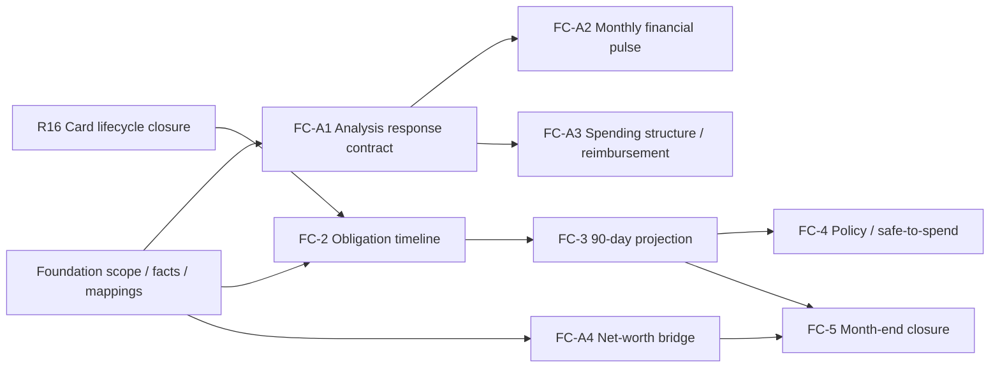

# Last Say 完整財務掌控 Master Plan

> - 狀態：Canonical spec-plan；Control Center已確認為資料基礎建設之後的下一階段；Phase 0 reference、FC-A1 analysis contract、FC-A2 Monthly Financial Pulse、FA-0 Financial Health Review v0與foundation R16 card lifecycle已完成第一輪code／synthetic closure，下一步先以五個問題驗收FA-0，再決定FC-A3
> - 日期：2026-07-17（原始規劃 2026-07-13）
> - 適用範圍（proposed）：個人與家戶優先；local-first；AI主輸入＋UI確認／少量修正；Control MVP沿用TWD簡單default，需要時再擴充
> - 上位目標：把 Last Say 從「事後看懂交易」推進為「在未來義務追上現金以前，先看見風險並採取行動」
> - Canonical goal：[Final Long-Term Goal](../../Final-Long-Term-Goal.md)／原始 `LTG-1`
> - 上游資料 owner：已實作的foundation code與[`financial-data-core-contract.md`](../contracts/financial-data-core-contract.md)、[`account-balance-storage-contract.md`](../contracts/account-balance-storage-contract.md)、[`liability-and-commitment-storage-contract.md`](../contracts/liability-and-commitment-storage-contract.md)、[`investment-valuation-storage-contract.md`](../contracts/investment-valuation-storage-contract.md)
> - 報表關聯契約：[`reports-phase1-implementation-contract.md`](../contracts/reports-phase1-implementation-contract.md)、[`balance-sheet-contract.md`](../contracts/balance-sheet-contract.md)、[`cash-flow-contract.md`](../contracts/cash-flow-contract.md)、[`report-coverage-contract.md`](../contracts/report-coverage-contract.md)

執行順序固定為「財務資料基礎建設 → 本計畫」。本計畫擁有 projection、policy、safe-to-spend、alerts 與 scenario semantics；entity、account、source、balance、card、liability、commitment、investment、valuation 與 reconciliation 的 canonical persistence 由上游資料基礎計畫擁有。本文提到的資料表或欄位若與上游衝突，以資料基礎計畫與其 behavior contracts 為準，不建立第二套資料真相。

Owner於2026-07-15進一步確認：目前仍屬foundation業務流程收斂期；AI是主要輸入方式，UI只負責確認與少量修正。只有owner對foundation實際流程滿意後才啟動本計畫runtime phases。Reserve、reliable income與其他進階policy延後到對應consumer，不是目前工作。

本文所稱「第二階段」是owner對「資料基礎建設完成後的Financial Control工作」的總稱；它涵蓋Roadmap Stage 2–7，不等於本文單一Phase 2。後續執行一律使用本文的`FC-*` work package ID，避免「專案第二階段」「Roadmap Stage」與「Control Phase」三套編號互相混淆。

## 1. 結論先行

貼文指出的不是單純「沒有記帳」，而是三個時間差造成的控制失靈：

1. 刷卡日在經濟上已經支出並形成負債，但銀行存款尚未下降。
2. 貸款讓眼前戶頭仍有現金，但未來每月已被還款義務占用。
3. 使用者通常只在扣款後看見結果，沒有在扣款前看見最低現金點與死線。

目前 Last Say 已能回答：

- 這筆錢花到哪裡；
- 哪些交易需要人工審查；
- 本月相較常態有何變化；
- 哪些商家規則可以在下次匯入時自動套用；
- 在資料覆蓋有限的前提下，本期管理損益大致如何。

目前還不能可靠回答：

- 今天實際還能安全花多少；
- 未出帳信用卡與已出帳帳單合計承諾了多少未來現金；
- 下一次現金低於安全水位是哪一天；
- 所有貸款、卡費、房租與固定帳單扣完後，90 天內最低餘額是多少；
- 哪個風險來自真的超支，哪個只是資料過期或帳戶漏匯；
- 若現在少花、延後購買或調整還款，死線會移動多少。

因此正確方向不是只加一個「月預算進度條」，而是先建立：

> **可信的現況資產負債 + 未來承諾日曆 + 每日現金預測 + 有覆蓋率保護的安全可花金額 + 使用者定義的消費守門線。**

完成 Phase 0-4 後，產品即可處理貼文描述的核心情境。完成 Phase 5-6 後，才接近完整、可持續改善的個人財務控制系統。

---

## 2. Repo Reality：目前能支援到哪裡

以下判定已於2026-07-16依實際程式碼、tests與本輪驗證更新，不以UI標籤或舊計畫推測。

| 能力 | 現況 | 可支援程度 | 主要證據／限制 |
|---|---|---:|---|
| 銀行／信用卡交易匯入 | 已有 | 高 | 外部 AI 依 Skill 整理 ledger，再由 `/api/import-ledger` 匯入；有去重與來源紀錄。 |
| 商家分類與信心度 | 已有 | 高 | 每筆可有分類、信心度、判斷理由；低信心進待審。 |
| 人工修正與持續學習 | 已有 | 高 | `correction_log` append-only；學習 API 只採可信人類證據；規則變更會重新校正歷史未審資料。 |
| 月度支出／分類／趨勢 | 已有 | 中高 | Overview、Breakdown、Trend、Top movers、固定底盤；回答「發生了什麼」。 |
| 全期間總覽 | 已有 | 中 | `month=all` 可跨月查詢，但仍以已匯入交易為界。 |
| 管理損益表 | 已有第一版 | 中 | 可做 scoped P&L、coverage、report mapping；不是稅務或完整權責制報表。 |
| 資產負債表 | 正式server-backed read model／報表已完成 | 中 | 以typed snapshots／valuations／FX輸出assets、liabilities、net worth、coverage與drillback；真實scope／freshness不足時partial。 |
| 現金流量表 | 正式direct-method read model／報表已完成 | 中 | 依requested currency、cash boundaries、typed transfer／settlement／allocation輸出三類流量與reconciliation；真實matching不足時partial／unreconciled。 |
| 帳戶資料 | typed foundation與manual UI已有 | 高 | entity、institution、account kind、currency、status、aliases與balance snapshots已存在；所有account kinds可由Data Center建立。 |
| 當前信用卡暴險 | typed facts與current→posted lifecycle已有，統一timeline未完成 | 中高（資料）／中（Control） | profiles、statements、items、payment matches、installments及R16 lifecycle importer已存在；尚無Control read model整合即時／未出帳／已出帳／due。 |
| 貸款契約與還款表 | typed facts已有，Control projection未完成 | 中 | liability profile、schedule entries、payment allocations已存在；尚無統一future cash timeline。 |
| 固定／週期承諾 | typed templates／occurrences已有 | 中 | 可保存recurring／one-off facts；unknown amount／due與materialization仍需Control policy。 |
| 投資與FX | typed facts與manual UI已有 | 中高 | instruments、holdings、quotes、FX與valuation存在；manual source＋fact原子寫入，正式statement／trade import仍走operator/API。 |
| Control Phase 0 | pure reference已完成 | 中（語意）／無（runtime） | 四份contracts、metric dictionary、synthetic fixture與90日timeline projector已驗證；不讀真實DB、無API／UI。 |
| 每日現金預測 | 只有pure reference | 無runtime能力 | 尚缺trusted starting position、DB adapter、統一future events、owner policies與runtime surface。 |
| 安全可花金額 | 沒有 | 無 | 沒有 reserve floor、forecast coverage、支付工具時點模型。 |
| 預算與警示 | 沒有 | 無 | 無 alert rule、事件、確認／處理紀錄與通知節流。 |
| 情境模擬 | 沒有 | 無 | 無「多花 X、延後 Y、收入晚到」的 before/after projection。 |

### 2.1 管理報表成立所需的資料要素

這些報表不能只靠交易明細或單一餘額拼出來。每張表都必須先固定
`entity／account scope`、日期或期間、幣別與來源權威，並通過對應的
reconciliation；資料存在不等於報表成立。

| 報表／分析 | 必要來源事實 | 必要關係與推導 | 完整性門檻 |
|---|---|---|---|
| 資產負債表／淨資產快照 | as-of日的全部現金與存款餘額、投資部位、其他資產、信用卡應付、貸款本金、FX與市場價格 | 原幣事實不可覆寫；以同日或明確新鮮度的quote／FX換算base currency；資產－負債＝淨資產 | cash／credit card／liability／investment／valued-item scope已聲明；material項目無missing／stale／conflict；估計值與排除項明示 |
| 現金流量表 | 每個現金帳戶的期初餘額、期間全部現金進出、期末餘額 | 分為營運、投資、融資；自己帳戶轉帳抵銷；卡費付款只清償負債；貸款付款拆本金、利息、費用 | 每個納入帳戶均符合「期初＋期間淨流量＝期末」；沒有未配對的重大轉帳／settlement |
| 個人收支／管理損益 | 期間收入、消費、利息、費用、退款、補貼與必要accrual／mapping | 排除內部轉帳、信用卡繳款、貸款本金與投資本金；同一經濟事件只認列一次 | 重大交易已分類；mapping coverage與低信心金額揭露；現金制／權責處理方式固定 |
| 淨資產變動表 | 期初與期末資產負債表、期間收支、借款與還本、投資交易、期初期末quote／FX | 期初淨資產＋儲蓄＋投資價格變動＋匯兌變動＋其他調整＝期末淨資產 | 兩端position可重建；現金變動、非現金估值變動與資料修正可分開 |
| 負債與償債分析 | 每筆負債本金、APR、期數、due date、付款帳戶、官方／確認過的schedule與實際付款 | 每次付款拆本金／利息／費用；新增借款與還本屬融資現金流 | 不由APR反推官方schedule；信用卡未出帳／已出帳與貸款scope完整 |
| 投資績效 | 期初部位、買賣、入出金、股息、費用、期末部位、quote與FX | 區分外部淨投入、已實現／未實現損益與匯率效果 | trade／cash-leg可追溯；沒有用aggregate現值假造ticker／cost basis |
| 現金安全與90日預測 | 可動用現金、可靠收入、必要支出、卡費／貸款／房租等承諾的金額與日期 | 形成future event timeline、daily projected cash、reserve floor與scenario | starting position可信；future obligation coverage明示；未知金額使用range／unknown而非假精準 |

共通資料鏈如下：

```text
scope + source evidence
→ native balances / transactions / obligations / holdings
→ identity and settlement matching
→ classification and accounting mapping
→ beginning/end reconciliation
→ quote/FX valuation
→ readiness-gated report
```

其中資產負債表是某一時點的「存量」；現金流量表、收支表與淨資產
變動表是某一期間的「流量與變動」。只有活動帳戶明細而沒有期初／期末
餘額與轉帳配對，仍不能形成可信現金流量表；只有期末餘額而沒有期間活動，
則只能形成position snapshot，無法解釋資產為何增加或減少。

### 現況產品定位

目前是可信的 **AI 協作交易審查與月度理解工具**。它已具備升級所需的好基礎：來源、理由、信心度、審核、規則、歷史修正和 coverage 思維；但尚不是主動的財務控制系統。

---

## 3. GORE／產品意圖

### 3.1 Primary Goal

**PG-1：使用者在未來付款義務造成現金短缺以前，能可靠知道可安全動用的金額、風險發生日與原因，並完成一個可驗證的因應行動。**

PG-1 是 canonical [Final Long-Term Goal](../../Final-Long-Term-Goal.md) 在本計畫 Phase 0-4 的階段性 operationalization。這個目標不能被「新增預算功能」「做一張現金圖」或「完成 build」取代。

### 3.2 Actors And Jobs

| Actor | Job to be done | 系統不應逼他做的事 |
|---|---|---|
| 一般使用者 | 快速知道今天能不能花、下次壓力何時出現、該先處理什麼 | 每天手動重算所有卡費、貸款與帳戶；閱讀會計底稿才得到答案 |
| 深度使用者／家庭管理者 | 管理多帳戶、多卡、多筆貸款與共同支出 | 用試算表重建 Last Say 已有的交易與分類 |
| 外部 AI operator | 解析帳單、契約、現行明細與餘額，提出有證據的結構化資料 | 猜測未提供的負債、直接把低信心資料當真、在 Skill 保存私人商家字典 |
| 人類 reviewer | 確認高風險且 AI 無法可靠判斷的欄位 | 逐筆重做 AI 已有高品質證據的工作 |
| 開源維護者 | 擴充新銀行格式、帳戶類型與控制規則 | 接觸使用者真實資料或依賴單一銀行私有格式 |

### 3.3 Supporting Goals

| Goal ID | Goal | Depends on | Observable outcome |
|---|---|---|---|
| G1 | 建立可信的當下財務位置 | 現有交易、帳戶、餘額 snapshot | 使用者可看到納入範圍、現金、信用卡負債、貸款與資料新鮮度 |
| G2 | 把未來義務具體化 | G1、帳單／契約／週期規則 | 每筆未來付款有日期、金額或範圍、來源、狀態與可信度 |
| G3 | 建立可解釋的每日現金預測 | G1、G2 | 90 天每日投影、最低現金點、首個破底日可重算且可 drill down |
| G4 | 提供可行動的守門指標與警示 | G3 | 安全可花、現金 runway、消費守門線、未來 7/30 天義務與警示原因一致 |
| G5 | 不以假精準掩蓋缺資料 | 所有目標 | 缺帳戶、過期餘額或未知卡費時，顯示 partial／range／unknown，而非精確綠燈 |
| G6 | 建立可持續的人類 + AI 操作循環 | G1-G5 | AI 準備資料，人類只審高風險項，審完即重算，月結可對帳 |
| G7 | 從預測誤差與修正中學習 | G6 | 週期金額、日期與分類的建議逐月改善，但人類確認仍具最高權威 |
| G8 | 與三大管理報表共用同一財務事實 | G1、G2、既有 reporting plan | 卡費、貸款、轉帳不重複計算；控制中心與報表能互相追溯 |

### 3.4 Soft Goals

- **可信**：每個重要數字都有來源、as-of time、coverage 與推導說明。
- **低負擔**：正常週期只需數分鐘確認，不要求使用者重做記帳員工作。
- **可行動**：警示必須回答「發生什麼、何時、影響多少、可檢查哪些資料」。
- **不羞辱**：呈現風險，不用道德化文案評價消費者。
- **local-first**：真實財務資料預設只在本機；AI 仍為外部 operator。
- **可擴充**：銀行格式與 AI provider 不成為核心財務模型的一部分。

### 3.5 Domain Invariants

1. 匯入的金額、日期、來源、原始文字不可為了預測或報表對帳而竄改。
2. 信用卡消費在交易日形成支出與負債；信用卡繳款是現金清償，不可再算一次支出。
3. 貸款本金是負債清償；利息與費用才是期間成本。
4. 未確認的 AI 推測不可讓 forecast coverage 變成 `complete`。
5. 缺少必要帳戶或過期 snapshot 時，不得顯示單一精確「安全可花」數字。
6. 所有規則、契約、承諾、警示的語意變更都需保留 append-only change evidence。
7. Forecast 是可重建的 projection，不是新的交易事實來源。
8. 人類修正優先於 AI、歷史規則與統計推測。
9. 所有開發、測試、demo 必須使用隔離 DB，不得碰 `data/finance.sqlite`。
10. 所有新 API 與 operator 欄位必須在同一 Phase 更新 `.claude/skills/last-say-ops/`。

### 3.6 Non-Goals

- 不做銀行法規意義的授信或債務建議。
- 不宣稱能取代會計師、理財顧問、債務協商或稅務服務。
- MVP 不做銀行即時串接；先支援使用者提供檔案、餘額與外部 AI 操作。
- MVP 不做投資部位逐日市價、稅務成本、投資 lot accounting。
- MVP 不做多幣別合併總額；先儲存 currency，未有 FX 規則時分幣別呈現。
- 不以 AI 對未提供的收入、債務或繳款條件做「合理猜測」。
- 不把月預算達成率當作完整財務健康分數。

---

## 4. 核心領域模型：三個時間軸與一個新鮮度軸

### 4.1 經濟事件時間軸

交易發生時就影響消費、損益或資產負債。例如刷卡買 NT$10,000 商品：

- P&L：交易日認列支出；
- Balance Sheet：信用卡負債增加；
- 銀行現金：此時不變。

### 4.2 帳單／義務時間軸

結帳、分期、貸款契約與固定帳單把經濟事件轉成可執行的付款義務：

- statement close date；
- payment due date；
- amount due／minimum due；
- loan principal／interest split；
- autopay source account。

### 4.3 現金時間軸

真正從銀行、現金、電子錢包流入或流出的日期。這是 daily cash forecast 與 runway 的基礎。

### 4.4 Data Freshness 軸

任何 projection 都要附：

- 資料最後更新時間；
- 使用官方帳單、當前明細、人工輸入或估計；
- 哪些帳戶／義務未納入；
- 下一次應更新的時間。

**沒有新鮮度就沒有可信的安全可花。** 每月只匯正式帳單，可以做月結；若要在扣款前預警，還需每 1-3 天提供信用卡當前交易／未出帳資訊，並定期更新銀行餘額。

---

## 5. 指標定義

### 5.1 Projected Cash

```text
projected_cash[d]
= opening_liquid_cash
+ dependable_inflows[<= d]
- committed_outflows[<= d]
- modeled_variable_outflows[<= d]
```

- `opening_liquid_cash` 只含納入範圍且 snapshot 新鮮的流動帳戶。
- `dependable_inflows` 只含已確認或符合可靠性政策的收入；不把期待中的案款當成確定現金。
- `committed_outflows` 包含卡費、貸款、房租、保險、訂閱、稅費與確認的一次性付款。
- `modeled_variable_outflows` 是可選的保守估計，必須與已知承諾分開顯示。

### 5.2 Reserve Floor

使用者設定最低保留現金，可為：

- 固定金額；
- 必要支出 N 天；
- 指定帳戶不可動用金額；
- 多者取高。

產品不替所有人硬編一個唯一正確比例。

### 5.3 Safe-to-Spend

```text
headroom[d] = projected_cash[d] - reserve_floor[d] - uncertainty_buffer[d]
safe_to_spend = max(0, min(headroom[d] within horizon))
```

實作必須考慮支付工具：

- 現金／簽帳卡：新增支出立即降低現金；
- 信用卡：新增支出立即增加負債，並在預估繳款日降低現金；
- 分期：依已確認分期表形成多筆未來義務。

若 coverage 不完整，顯示區間或「目前無法可靠計算」，不可給假精準單值。

### 5.4 Cash Runway

```text
cash_runway_days = 首個 projected_cash[d] < reserve_floor[d] 的日期 - as_of_date
```

沒有破底日則顯示「在目前 90 天 horizon 內未破底」，而不是「永遠安全」。

### 5.5 Debt Service Ratio

```text
debt_service_ratio = 當月已確認債務付款 / 當月可靠收入
```

僅作描述與趨勢，不用單一硬門檻替使用者下授信或財務健康結論。

### 5.6 Fixed Burden Ratio

```text
fixed_burden_ratio
= (必要固定支出 + 債務付款) / 可靠收入
```

它比單純「本月花了多少」更能說明收入有多少在月初就失去自由度。

### 5.7 Forecast Coverage

沿用既有報表 coverage 心智模型：

| 狀態 | 條件 | UI 行為 |
|---|---|---|
| `empty` | 無 opening balance 或無納入帳戶 | 不計算 safe-to-spend，提示下一個必要輸入 |
| `partial` | 有足夠資料看趨勢，但缺卡片、貸款、承諾或 snapshot 過期 | 顯示已知 projection、缺口與 range，不顯示安全綠燈 |
| `unreconciled` | 現金投影與實際 snapshot／轉帳對不上 | 顯示差額與 drilldown，要求對帳 |
| `complete` | 範圍、snapshot、承諾與 reconciliation 均通過當期政策 | 可顯示 safe-to-spend 與正式警示 |

### 5.8 Discretionary Spend Pace

```text
discretionary_spend_pace
= period_discretionary_spend / user_guardrail_amount
```

- `user_guardrail_amount` 是使用者針對日／週／月、整體或分類設定的提醒線，不是系統宣稱的「正確預算」。
- 信用卡消費以交易日計入 pace，不等扣款日；退款與 reversal 必須按原始語意沖回。
- 守門線只能補充 safe-to-spend，不能取代它：即使尚未超過月度守門線，若未來卡費會讓現金破底，仍應警示。
- 未設定守門線時不顯示假造的百分比；可由歷史分布提出 candidate，但需人類確認。

---

## 6. 使用者與 AI 的完整操作流程

### 6.1 Foundation完成前的首次建檔

使用者可提供：

- 所有銀行、現金、電子錢包、信用卡、貸款與投資帳戶清單；
- 各帳戶目前餘額與 as-of date；
- 最近一期信用卡帳單及目前未出帳交易；
- 貸款契約或官方攤還表；
- 房租、保險、訂閱、稅費等已知週期義務。

此時不要求owner先定義可靠收入、reserve floor、uncertainty buffer或警示門檻。這些不是foundation completeness條件；到forecast、safe-to-spend或alert consumer真正開始實作時再用最小必要決策補上。

AI operator：

1. 識別來源、帳戶、日期、幣別與官方／暫定狀態。
2. 逐項提出 account profile、snapshot、liability terms、commitment。
3. 每項帶來源、信心度、人話理由與是否需人工確認。
4. 不從本金與利率猜官方月付；有官方 schedule 時以 schedule 為準。
5. 將低信心或語意衝突項目送到統一 review queue。

人類必須確認：

- 帳戶是否完整、哪些納入控制範圍；
- 信用卡結帳／繳款條件與目前應繳；
- 貸款剩餘本金、月付、利率、到期日；
- 固定義務與明確排除範圍。

人類不必逐筆重做AI已能由來源可靠辨識的欄位。只有`declared_complete` scope、identity merge、ingestion reversal，以及日後會改變控制政策的高風險操作，必須停在瀏覽器UI等待人類確認。

### 6.2 日常／每週循環

1. 使用者提供銀行餘額或近期明細、信用卡當前交易／未出帳金額。
2. AI 先跑既有交易 Flow A／B，再更新 snapshot 與 commitment occurrences。
3. 系統重算 90 天 projection、safe-to-spend、runway 與 alerts。
4. 人類只審：新帳戶、未知負債、金額大幅偏移、日期衝突、低信心承諾。
5. 審核完成後卡片自動收起，projection 立即更新。

建議操作頻率：

- 信用卡當前交易：每 1-3 天，否則刷卡風險會延遲；
- 銀行 snapshot：每週或大額收支後；
- 正式帳單：每月；
- 貸款與保險契約：條件變更時；
- 月結：每月一次，完成 reconciliation 與報表 review。

### 6.3 警示後的行動循環

每個 alert 需提供：

- 風險發生日；
- 預估最低現金與 reserve 差額；
- 造成差額的主要義務；
- 資料缺口與 freshness；
- 可執行但非命令式的 scenario，例如「減少未承諾支出」「延後計畫購買」「更新缺少的帳戶資料」。

使用者可：

- 查看來源；
- 修正資料；
- 確認已知風險；
- 建立暫定行動方案；
- snooze，但不可刪除歷史警示證據。

### 6.4 月結循環

1. 正式帳單取代 provisional estimate，但不刪除先前來源紀錄。
2. occurrence 與實際交易配對，計算日期／金額 forecast error。
3. 卡費、貸款、轉帳按會計規則處理，避免重複計算。
4. 完成 P&L、Balance Sheet、Cash Flow coverage review。
5. AI 從人類修正與預測誤差提出新規則，不自行提升未確認資料權威。

### 6.5 兩種AI協作角色

本計畫區分兩種AI，兩者都不能成為財務事實的第二owner：

| 角色 | 責任 | 不得做 |
|---|---|---|
| External AI operator | 讀來源、查health／capabilities／inventory／readiness、建立typed preview、提交低風險資料、解釋缺口與結果 | 直接寫SQLite、偽造human receipt、猜官方schedule／FX／缺漏收入、替使用者做金錢行動 |
| Development AI | 依Goal ID與behavior contract修改code／tests／docs，在synthetic或temporary DB驗證 | 用真實DB跑開發測試、改產品目標、平行修改共享contract／migration／registry、把build pass當成產品完成 |

產品使用中的AI協作由`.claude/skills/last-say-ops/`擁有；開發協作由本文第17節、`AGENTS.md`、active behavior contracts與release verifier共同約束。未來即使更換AI provider，這兩種責任也不能混成server內建LLM或任意資料庫代理。

---

## 7. 目標資料架構

本節保留 decision-layer 的邏輯需求與歷史命名，**不是 canonical DDL**。實作前由 Phase 0 將 account、snapshot、card、liability、commitment 與 reconciliation 全部映射到既有foundation owner；現行責任切分以[`financial-data-core-contract.md`](../contracts/financial-data-core-contract.md)及各storage contracts為準。重複名稱應改成引用或 read model，不得照本文另建同義 tables。

### 7.1 四層資料責任

| 層 | 內容 | 原則 |
|---|---|---|
| Source Facts | 原始來源、交易、帳戶 snapshot、官方帳單、契約 | 不可為了 projection 改寫 |
| Financial Semantics | account role、liability terms、report mapping、commitment templates | AI 可提案，人類確認優先 |
| Derived Projection | occurrences、daily projected balances、metrics、scenario outputs | 可由 facts + policy 重建 |
| Decision Evidence | 修正、規則變更、警示、acknowledgement、scenario decision | append-only 或有 append-only change log |

### 7.2 沿用既有資料

- `transactions`
- `sources` / `transaction_sources`
- `accounts`
- `classification_rules` / `rule_change_log`
- `correction_log`
- `transaction_report_mappings` / `report_mapping_rules`

不得建立另一份平行交易帳本。

### 7.3 與既有 Accounting Plan 共用

- reporting entities；
- account register 語意；
- `account_balance_snapshots`；
- `transfer_matches`；
- report coverage；
- report-line mapping；
- foundation migration runner。

### 7.4 Foundation-owned 輸入

下列是本計畫需要消費的 logical facts，不由 Financial Control 建表或提供第二套 write API。欄位、authority、review、version、supersession 與 API 以資料基礎 contracts 為準。

#### Credit-card facts

`credit_card_profiles`、`credit_card_statements`、statement items、payment matches與installment plans／entries分別擁有卡片條件、正式帳單、付款配對與未來分期。Statement close／due、statement balance與installment schedule不能搬到通用liability JSON，也不能從歷史交易猜成official fact。

#### `liability_profiles`與loan schedule

`liability_profiles`表達信貸、房貸、車貸等非信用卡負債條件：account、kind、original principal、currency、rate type／APR、start／maturity與payment frequency。Current principal由`account_balance_snapshots(balance_kind='principal')`擁有；未來本金／利息／費用由`loan_schedule_entries`擁有；實際付款拆分由`loan_payment_allocations`擁有。

信用卡與貸款維持不同typed owner，不塞入opaque JSON或共用liability mega-table。

#### `commitment_templates`

目前canonical template保存：entity／optional account、kind、direction、fixed／range／unknown amount欄位、currency、cadence、start／end／next due、status、authority與review state。若Control日後真的需要essentiality、priority、source FK或更細policy，必須先有consumer與migration contract；不能在read model假設這些欄位已存在。

#### `commitment_occurrences`

目前canonical occurrence保存commitment、due date、optional amount、occurrence status與optional matched transaction。Range／unknown、reliability、source watermark、forecast error與跨card／loan來源連結屬`FC-2A` projected event output，除非後續consumer證明需要持久化，否則不得反向擴充成第二套source facts。

### 7.5 本計畫新增概念

#### `forecast_policies`

- horizon days；
- reserve floor；
- dependable-income policy；
- uncertainty buffer；
- freshness thresholds；
- included account scope。

#### `spending_guardrails`

- cadence：daily、weekly、monthly；
- scope：all discretionary、category、merchant group；
- amount、warning threshold、effective date；
- user-confirmed／AI-candidate、source note、change evidence；
- 僅產生提醒與 scenario，不直接封鎖付款。

#### `alert_rules` / `alert_events` / `alert_change_log`

- rule：cash below zero、below reserve、large card acceleration、due soon、stale data、commitment mismatch；
- event：trigger date、severity、explanation、projection watermark；
- acknowledgement／snooze／resolved 需有歷史紀錄。

### 7.6 不建議持久化的資料

MVP 的每日 projected balance 與 safe-to-spend 優先由 query deterministic 計算，必要時才用帶 source watermark 的 cache。不能讓舊 forecast cache 變成第二事實來源。

---

## 8. Target Owner Architecture

以下是依目前repository實際路徑修正後的owner邊界；標記`(new)`者尚未存在，不要求在第一個work package一次建立：

```text
lib/finance/control/
  project-cash-timeline.js          # existing pure reference
  financial-position.js            # new pure normalization/projection
  project-obligations.js           # new pure occurrence projection
  policy/                           # new only when FC-4 has an approved consumer

lib/queries/finance/control/        # new DB adapters/read models
  position.js
  obligations.js
  forecast.js
  alerts.js                         # only after alert persistence is approved

app/api/finance/control/            # new routes, remains under finance/v1
  position/route.js
  obligations/route.js
  forecast/route.js
  policies/*                        # only after FC-4 decision gate
  alerts/*                          # only after FC-4 decision gate

components/financial-control/
  ControlCenter.jsx
  CashTimeline.jsx
  UpcomingCommitments.jsx
  CoveragePanel.jsx
  LiabilitySummary.jsx
  ScenarioSheet.jsx

app/(app)/control/page.js           # new; do not replace `/` until owner accepts it
```

邊界規則：

- domain calculation 不直接依賴 React 或 HTTP。
- route 只做 parse／validate／respond，SQL 放 query owner。
- UI 不自行重算財務公式。
- 報表與 Control Center 共用 account、snapshot、transfer、liability facts，但各有自己的 query。
- `TransactionTable.jsx` 不因本計畫被一次性拆解；僅透過既有 filter／drilldown 契約連接。
- 不建立`lib/financial-control/`或`app/api/financial-control/`第二套頂層邊界；現有canonical owner是`lib/finance/**`、`lib/queries/finance/**`與`/api/finance/**`。
- `lib/queries/finance/inventory.js`、`analysis-context.js`與`lib/finance/analysis/registry.js`是既有readiness／named-dataset owner；新增Control dataset必須擴充它們或透過清楚子owner接入，不得繞過capabilities建立隱藏API。
- Domain module只接收normalized plain input，不import DB、Next.js、React或外部AI；query adapter負責SQL與watermark；route只做HTTP validation／response。

---

## 9. UI／UX Blueprint

### 9.1 Navigation

```text
今日（Control Center）
交易
時間軸
報表
帳戶與負債
規則與學習
```

「今日」是實際工作畫面，不是行銷首頁。

### 9.2 今日／Control Center

第一視窗只回答四件事：

1. **安全可花**：有 complete coverage 才給單值；否則顯示 range／unknown。
2. **下一個風險日**：距離 reserve 破底或現金不足幾天。
3. **未來 7／30 天承諾**：卡費、貸款、房租與其他固定付款。
4. **資料可信度**：最後更新、缺少帳戶、未審項目。

下方才顯示：

- 90 天 daily cash timeline；
- 造成最低點的 Top obligations；
- 本月 discretionary spend pace；
- 守門線剩餘額與超出原因；
- 待審與資料更新 CTA；
- 本月 vs 常態與現有 Top movers。

### 9.3 Cash Timeline

- 折線顯示 projected cash 與 reserve floor。
- 每個 inflow／outflow event 可點開來源。
- official、confirmed、estimated 使用不同視覺語意，不只不同顏色。
- 顯示最差日，不用讓使用者自行尋找圖表低點。
- 可切換 conservative／base scenario，但預設不展示過多模型選項。

### 9.4 帳戶與負債

使用緊密列表或表格，不用裝飾性卡片牆：

- 帳戶最新餘額與 freshness；
- 信用卡 current statement、unbilled、due date、limit；
- 貸款剩餘本金、下一期付款、到期日；
- 缺資料／需確認狀態；
- 直接更新 snapshot 或開啟來源。

### 9.5 Mobile

手機首頁優先順序：

1. 安全可花／目前無法計算；
2. 下一個風險日；
3. 7 天內付款；
4. 更新資料／處理待審；
5. 簡化 timeline。

不在手機首屏塞完整會計報表；報表保留摘要與 drilldown。

### 9.6 Alert UX

- 警示不是 toast-only；必須有持久 inbox／timeline 紀錄。
- Severity 由現金差額、時間距離、資料可信度共同決定。
- stale-data alert 與 overspend alert 必須明確區分。
- 同一根因的 alert 需 dedupe／cooldown，避免每次重算重複轟炸。
- 不用「你又亂花錢」等羞辱式文案。

### 9.7 Control畫面的Data Source Map

下表是實作前的來源約束。若對應read model尚未完成，UI必須顯示unavailable／partial，不得用fixture或client-side加總補值。

| 顯示內容 | Canonical facts | Derived owner | 最早可用work package |
|---|---|---|---|
| 納入帳戶與最新餘額 | `accounts`、`account_balance_snapshots`、scope attestations | `control/position` read model | FC-1C |
| 信用卡／貸款負債 | card statements、principal snapshots、`liability_profiles` | `control/position` read model | FC-1C |
| 投資與其他估值 | holdings、quotes、FX、valuation snapshots | `control/position` read model | FC-1C |
| 7／30／90日義務 | card due／installments、loan schedule、commitment occurrences | `project-obligations` | FC-2B |
| 每日預估現金與最低點 | trusted opening cash + projected obligations／confirmed inflows | `project-cash-timeline` + runtime adapter | FC-3B |
| Safe-to-spend／runway | forecast + owner-approved reserve／income／uncertainty policy | FC-4 policy owner | FC-4B |
| 警示與處理狀態 | forecast/readiness evidence + versioned alert policy／events | FC-4 alert owner | FC-4C |
| Balance Sheet／Cash Flow | 同一foundation facts + report mappings／reconciliation | report query owners | FC-1E／FC-5 |

`source_watermark`、as-of、coverage、gaps與excluded facts是每個Control response的必要欄位，不是可省略的debug資訊。

---

## 10. 分階段實作計畫

> 本文件的 Phase 編號只描述Financial Control工作；現行reporting與foundation責任分別由active contracts及既有code擁有。共用schema／API時，由較早落地的owner建立，後續不得重建平行表。

### Phase 0：Outcome Contracts、Metric Dictionary、Demo Fixtures

**Execution status：Completed as a reference package on 2026-07-15；owner financial policies intentionally deferred to their runtime consumers。**

#### Goal Contribution

- G1-G8：建立共用語意與可驗證樣本。

#### Deliverables

- `docs/contracts/financial-position-contract.md`
- `docs/contracts/commitment-and-liability-contract.md`
- `docs/contracts/cash-forecast-contract.md`
- `docs/contracts/financial-alert-contract.md`
- metric dictionary：每個指標的 numerator、denominator、as-of、coverage、unknown policy。
- anonymized fixtures：銀行、兩張卡、信貸、薪資、房租、訂閱、缺資料與風險情境。
- 引用並驗證 foundation migration／rollback／newer-version evidence；本計畫不另做 migration ledger 決策。
- 將既有reporting contracts與實作之間的「規格／已實作」狀態標記清楚。

#### Invariants And Boundaries

- 不新增正式 UI。
- 不碰真實 DB。
- 不先硬編 safe-to-spend threshold。
- 不把 readiness preview 說成正式資產負債表／現金流量表。

#### Outcome Evidence

- 同一 fixture 能算出明確的 90 天最低現金、card due、loan due 與 coverage expectation。
- 每個 Goal ID 都映射到 requirement、Phase 與 acceptance example。
- 所有測試 DB 使用 `FINANCE_DB_PATH` 隔離路徑。

#### 2026-07-15 Execution Record

- Contracts：`docs/contracts/financial-position-contract.md`、`commitment-and-liability-contract.md`、`cash-forecast-contract.md`、`financial-alert-contract.md`。
- Metrics：`docs/planning/FINANCIAL-CONTROL-METRIC-DICTIONARY.md`。
- Synthetic fixture：`test/fixtures/financial-control/post-style-pressure.json`，涵蓋兩銀行、兩卡、貸款、薪資、房租、訂閱、保險、不確定收入、stale card與unknown commitment。
- Pure projector：`lib/finance/control/project-cash-timeline.js`；duplicate、loan component sum、uncertain income exclusion、coverage degradation、reserve breach、runway與safe-to-spend gate都有test。
- Fixed fixture result：coverage=`partial`、最低現金TWD minor `5800000`（2026-08-20）、首次reserve breach 2026-08-05、runway 21日、safe-to-spend=`null`。
- Boundary：尚無DB adapter、API、UI或forecast persistence；不得對外宣稱runtime forecast可用。

### Phase 1：Trusted Financial Position

#### Goal Contribution

- G1、G5、G8。

#### Deliverables

- foundation position adapter：entity、scope attestation、accounts、balances、cards、liabilities、investments。
- Control-specific position／coverage read model；不新增 canonical account／snapshot／liability tables。
- 帳戶與負債缺口導向 foundation Data Center，Control Center 不複製 CRUD UI。
- 正式 Balance Sheet query 的最小版本，沿用既有 coverage contract。
- Skill 新增 financial-control preflight；補 account／snapshot／liability 仍走 foundation workflow。

#### Invariants And Boundaries

- transaction running balance 只能當 hint，不能替代官方／人工 snapshot。
- 推測 account kind 必須 reviewable。
- 混合幣別不產生未定義合併總額。

#### Outcome Evidence

- 使用者可看到所有納入帳戶、最新餘額、信用卡／貸款負債與 freshness。
- 缺一張信用卡時，Balance Sheet 與 Control coverage 皆為 partial。
- 資產 = 負債 + 淨值檢查可 drill down。

### Phase 2：Commitment Calendar And Card／Loan Lifecycle

#### Goal Contribution

- G2、G5、G6、G8。

#### Deliverables

- foundation obligations adapter：commitments/occurrences、card statement/unbilled/due/installments、loan schedules/allocations。
- projection event normalization，只產生可由 foundation facts + policy 重建的 derived events。
- upcoming 7／30／90-day obligations API 與 review queue。
- Skill 的契約解析、承諾更新與人類確認引用 foundation workflow；本計畫只增加 forecast usage。

#### Invariants And Boundaries

- 歷史固定底盤不可直接轉成 confirmed commitment。
- AI 可由歷史提出 candidate，但需人類或官方來源確認。
- 卡費 settlement 不重複成 expense。

#### Outcome Evidence

- 新增信用卡消費後，負債立即上升且預估卡費在 due date 出現。
- 貸款每期本金／利息正確進入 Balance Sheet、P&L 與 future cash event。
- 修改 recurring due date 後，舊值保留在 change log，未來 occurrence 重建。

### Phase 3：Deterministic 90-Day Cash Forecast

#### Goal Contribution

- G3、G5、G8。

#### Deliverables

- pure domain forecast engine。
- daily projected cash、minimum cash、risk date、headroom。
- raw known-obligations projection；confirmed inflow可選，uncertain inflow排除。
- source watermark 與 deterministic cache policy。
- `/api/finance/control/forecast`。
- direct-method cash flow所需 transfer matching／reconciliation 只消費 foundation owner；缺 owner 時本 Phase blocked，不自行補表。

#### Invariants And Boundaries

- UI 不重算公式。
- 未確認收入不能在 conservative scenario 救回破底。
- 未設定reserve／reliable-income policy時可顯示raw timeline，但不得顯示safe-to-spend或安全綠燈。
- one-sided transfer 不可被靜默當作消費或收入。

#### Outcome Evidence

- 固定 fixture 在任意重跑得到相同每日 projection。
- 新增 NT$10,000 卡費時，payment instrument timing 正確影響最低現金點。
- 缺 opening snapshot 時 API 明確回 `empty`，不是回 0。
- 期末實際 snapshot 可計算 reconciliation delta。

### Phase 4：Control Center、Safe-to-Spend、Alerts

#### Goal Contribution

- PG-1、G4、G5、G6。

#### Deliverables

- 今日 Control Center。
- safe-to-spend、cash runway、7／30 日義務、fixed burden、discretionary spend pace。
- 使用者可設定日／週／月整體或分類守門線；AI 只能提出 candidate。
- Cash Timeline 與最低點 explanation。
- alert rules、persistent alert inbox、ack／snooze／resolved history。
- review completion 後自動重算與收起。
- desktop、mobile、empty、partial、unreconciled、complete、error evidence。

#### Invariants And Boundaries

- partial coverage 不顯示精確安全綠燈。
- alert 必須可追到 source events。
- toast 只用於操作回饋，不承擔持久風險通知。
- 不做背景銀行同步；資料 stale 時直接告知。

#### Outcome Evidence

- 貼文式情境可在卡費扣款前至少 7 天顯示風險，前提是資料按 freshness policy 更新。
- 使用者修正一筆卡費或收入後，risk date／safe-to-spend 即時一致更新。
- 同一根因不產生重複 alert storm。
- 手機可在不開完整報表下完成「看風險 → 看原因 → 更新資料／處理待審」。

### Phase 5：Accounting Closure And Month-End Reconciliation

#### Goal Contribution

- G5、G8。

#### Deliverables

- 沿用已落地的 Balance Sheet 與 Cash Flow owner，不建立第二套報表計算。
- 消費 foundation transfer matches 與 beginning／ending cash facts，完成歷史cash boundary與report reconciliation closure。
- 建立淨資產變動橋接，分開儲蓄、投資淨投入、價格／匯率變動與資料修正。
- report review queue 與 control alert 共用 blocker references。
- 月結 occurrence settlement 與 forecast accuracy。
- P&L、Balance Sheet、Cash Flow、Control Center 的 cross-report consistency tests。

#### Invariants And Boundaries

- 不因 Control Center 需要速度而繞過 accounting mappings。
- 不把 cash-flow settlement 改名成 expense。
- partial／unreconciled 一律可見。

#### Outcome Evidence

- Card charge、card payment、loan principal、interest、internal transfer 在四個 surface 不重複且可追溯。
- opening cash + cash flows = ending cash，否則明確 unreconciled。
- 月結後 forecast error 與 coverage 可計算。

### Phase 6：Adaptive Learning And Scenario Decisions

#### Goal Contribution

- G6、G7。

#### Deliverables

- 從 settled occurrence 學習 recurring amount／date range。
- forecast error attribution：資料晚到、金額變動、漏帳戶、規則錯誤。
- scenario：減少 discretionary spend、延後 planned purchase、收入延遲、調整 reserve。
- 個人化但可解釋的 alert threshold candidates。
- Skill 新增「分析風險但不越權替使用者做決策」契約。

#### Invariants And Boundaries

- AI 不可從單次異常建立高權威 recurring rule。
- scenario 不直接改 source facts；採用方案需形成明確 policy／commitment change。
- 不提供保證性投資、借貸或債務協商建議。

#### Outcome Evidence

- 連續三期穩定帳單可提出候選範圍；人類確認後才成為 commitment。
- 預測誤差可被歸因且次月改善，不只顯示一個平均準確率。
- scenario before／after 使用同一 source watermark，可重現差異。

---

## 11. Acceptance Scenarios

### A1：貼文式貸款 + 卡費壓力

- **Given** 使用者有薪資帳戶、NT$1,500,000 聯合信貸與官方 7 年還款表，每月約 NT$20,000 自動扣款
- **And** 使用者有兩張信用卡與當前未出帳消費
- **And** 銀行帳戶目前看起來仍有錢
- **When** 系統建立 90 天 projection
- **Then** loan due、card due 與必要支出皆出現在具體日期
- **And** 顯示最低現金點、reserve 差額與首個風險日
- **And** 新刷卡會在扣款前降低 safe-to-spend

### A2：刷卡不應等到扣款才算

- **Given** 使用者新增 NT$10,000 信用卡消費
- **When** 交易匯入
- **Then** P&L 支出與信用卡負債立即增加
- **And** 現金仍不變
- **And** 預估 payment occurrence 出現在對應 due date
- **And** 實際繳卡費時不重複計入支出

### A3：資料過期

- **Given** 信用卡當前交易已 10 天未更新
- **When** 使用者開啟今日頁
- **Then** coverage 為 partial
- **And** safe-to-spend 顯示 range 或 unavailable
- **And** UI 指出需更新哪張卡，不把風險誤寫成已安全

### A4：可靠收入與不確定收入

- **Given** 月薪已確認，另有一筆尚未確定的自由工作收入
- **When** conservative forecast 計算
- **Then** 月薪可列 dependable inflow
- **And** 未確認案款不得消除現金破底警示

### A5：貸款拆分

- **Given** 本期付款含本金 NT$19,000、利息 NT$1,000
- **Then** cash forecast 減少 NT$20,000
- **And** P&L 只認列 NT$1,000 利息
- **And** Balance Sheet 負債減少 NT$19,000

### A6：帳戶漏匯

- **Given** 銀行轉出 NT$50,000 但收款自有帳戶未納入
- **Then** transfer 保持 unmatched
- **And** cash flow／forecast coverage 不得 complete
- **And** 人類可確認外部支出或補上另一帳戶

### A7：人類修正承諾

- **Given** AI 將年繳保費誤判為月繳
- **When** 人類修正 frequency
- **Then** change evidence append-only
- **And** 未來 occurrences 重建
- **And** 已結清歷史交易不被竄改

### A8：完整使用者控制

- **Given** 所有納入帳戶 snapshot 新鮮、義務已審、轉帳已對帳
- **When** 使用者查看今日頁
- **Then** coverage complete
- **And** safe-to-spend、runway、timeline、P&L、Balance Sheet、Cash Flow 使用相容的同一組財務事實

### A9：花到守門線即提醒

- **Given** 使用者設定每月非必要支出守門線 NT$15,000，80% 時先提醒
- **And** 本月刷卡非必要支出在交易日累計達 NT$12,000
- **When** 最新交易匯入並完成分類
- **Then** 系統建立可追溯的 pace alert
- **And** 顯示目前累計、守門線、剩餘額與主要支出來源
- **And** 若 safe-to-spend 已因未來卡費破底，風險警示優先於「尚有 NT$3,000 額度」的守門線訊息

---

## 12. KPI Framework

KPI 不只量「使用者有沒有打開 App」，而要證明它真的提早揭露風險並降低維護負擔。

### North Star

**可行動預警覆蓋率**：實際造成 reserve 破底或付款失敗的事件中，有多少在至少 N 天前被有效揭露，且當時 coverage 足以採取行動。

### Outcome KPIs

| KPI | 定義 | 初期目標方向 |
|---|---|---|
| Early-warning lead time | 實際風險日 - 首次有效警示日 | 越早越好，但同時控制 false positive |
| Surprise shortfall count | 未曾被預警的現金不足次數 | 趨近 0 |
| 7-day balance forecast error | 7 日前預估餘額與實際 snapshot 的絕對差 | 逐月下降 |
| Obligation match rate | 已到期 occurrence 成功配對實際交易比例 | 逐月上升 |
| Safe-to-spend availability | 有 complete coverage 的活躍日比例 | 上升，但不可用放寬 coverage 造假 |

### Quality Guardrails

- false alert rate；
- stale-data days；
- missing required account count；
- unreconciled delta；
- AI proposal override rate；
- 人類每週 review 分鐘數；
- 高風險欄位未審數。

### Learning KPIs

- recurring candidate confirmation rate；
- recurring amount／date prediction error；
- merchant rule applied／overridden；
- forecast error attribution coverage；
- 人類修正後下一期相同錯誤重發率。

禁止用單一「財務健康分數」掩蓋指標定義與資料缺口。

---

## 13. Goal-To-Plan Traceability

| Goal ID | Requirement | Owner／Phase | Evidence |
|---|---|---|---|
| PG-1 | 扣款前呈現風險、原因與行動 | P3-P4 | A1、early-warning lead time、mobile flow evidence |
| G1 | 帳戶、snapshot、負債位置 | P1 | A6、Balance Sheet coverage、freshness tests |
| G2 | 未來承諾與 occurrence | P2 | A1、A2、A5、recurrence tests |
| G3 | 90 天 deterministic forecast | P3 | A3、A4、golden projection fixtures |
| G4 | safe-to-spend、runway、spending guardrails、alerts | P4 | A1、A3、A9、alert dedupe／coverage tests |
| G5 | partial／unreconciled 誠實呈現 | 全 Phase | A3、A6、coverage contract tests |
| G6 | 人類 + AI 操作閉環 | P1-P4 | Skill eval、review completion browser evidence |
| G7 | 從誤差與修正學習 | P6 | A7、next-period repeat-error KPI |
| G8 | 跨報表同一事實 | P1、P3、P5 | A2、A5、A8、cross-report consistency tests |

---

## 14. 主要決策與衝突裁決

### D1：先做預算還是先做承諾／預測

**裁決：先承諾與預測。** 月預算只能說本月花費速度，不能處理卡費扣款日、貸款死線與收入到帳時間。預算 pace 在 Phase 4 作為次級 guardrail。

### D2：Safe-to-spend 是否永遠顯示

**裁決：否。** Coverage partial 時顯示 range／unknown 與缺口。可信度比總有一個漂亮數字重要。

### D3：歷史固定支出是否自動變未來承諾

**裁決：只能形成 candidate。** 官方帳單、契約或人類確認後才是 confirmed commitment。

### D4：是否先做銀行 API 串接

**裁決：否。** MVP 延續外部 AI + 本地 API；先證明資料模型與控制價值。Bank connector 是後續 adapter，不得污染核心。

### D5：Forecast 是否持久化每日結果

**裁決：先 deterministic query，必要時 watermark cache。** 避免衍生資料成為第二事實來源。

### D6：是否給統一債務健康門檻

**裁決：不硬編唯一標準。** 顯示 ratio、趨勢、使用者 policy 與資料來源；若日後採地區性指引，需版本化並說明適用範圍。

### D7：帳務報表與控制中心是否分開建資料

**裁決：不分開建事實。** 共用 account、snapshot、liability、transfer、mapping；query 與呈現可分 owner。

### D8：直接自動替使用者採取財務行動

**裁決：不做。** 系統提供 scenario 與提醒；付款、借貸、投資或債務協商仍由人類決定。

---

## 15. 風險與 Spike

### SPIKE 1：信用卡 due-date 模型

- 需驗證跨銀行的結帳日、繳款日、假日順延、分期與退款。
- fallback：官方帳單 due date 優先；未出帳只給 range／estimated。
- Blocks：Phase 2 完整信用卡 projection。

### SPIKE 2：Recurring Detection

- 需驗證固定金額、浮動帳單、年繳、月末日期與商家名稱漂移。
- fallback：只產生 candidate，不自動 confirmed。
- Blocks：Phase 6 自動學習；不阻擋手動 commitment。

### SPIKE 3：Payment-Instrument Safe-to-Spend

- 需用 cash、debit、不同 card cycle、installment fixture 驗證新增支出的最差現金影響。
- fallback：先提供 conservative headline，不提供 payment-method comparison。
- Blocks：Phase 4 單值 safe-to-spend。

### SPIKE 4：Forecast Performance

- 以 100k transactions、1k occurrences、365 日 horizon benchmark SQLite query。
- fallback：按 source watermark cache projection。
- Blocks：公開效能主張，不阻擋小型個人資料 MVP。

### SPIKE 5：資料新鮮度實務

- 驗證使用者實際可取得的銀行／信用卡當前明細格式。
- fallback：手動輸入 current balance／unbilled total 並附 source note。
- Blocks：貼文式「扣款前預警」可靠性。

---

## 16. Master Definition Of Done

只有同時滿足以下條件，才能稱為「完整財務掌控第一版」：

1. 使用者可建立完整的帳戶、信用卡、貸款、snapshot 與未來承諾範圍。
2. 新刷卡會立刻影響負債與 safe-to-spend，不等實際扣款。
3. 90 天 projection 能指出最低現金點與首個 reserve 破底日。
4. Coverage 不完整時不顯示假精準安全數字。
5. Alert 可追溯、可處理、可去重並保留歷史。
6. P&L、Balance Sheet、Cash Flow 與 Control Center 不重複計算卡費、貸款或轉帳。
7. 外部 AI Skill 能只靠自身契約完成 onboarding、更新、review 與月結寫入。
8. 人類修正會形成 evidence，下一期相同錯誤率可量測。
9. Desktop／mobile 的核心流程都有 demo DB 瀏覽器證據。
10. 所有 release gate、privacy scan、隔離 DB 與真實資料保護持續通過。
11. 至少一個貼文式 fixture 證明系統能在現金短缺前提早發現問題。
12. 使用者每週維護成本、false alert 與 forecast error 有可觀測 KPI，而非只宣稱「AI 更聰明」。
13. 使用者可設定消費守門線，且守門線訊息不會掩蓋更嚴重的現金破底風險。

---

## 17. 第二階段執行規格與AI協作

### 17.1 Verdict與目前位置

**Verdict：Planning Ready；FC-A2已提供第一個bounded runtime consumer，完整Control execution仍未啟動。** `FC-1`至`FC-3`在下列Foundation Real-Data Acceptance Gate通過後可依序實作；`FC-4`之後刻意保留owner policy decision，現在不能假裝execution-ready。

已確認的技術基線：repository code與正式DB均為schema v10；12個named analysis datasets、proposal envelope、unified review workbench、三張management reports、readiness、preview／commit、browser confirmation、backup／restore、synthetic Control fixture與pure cash projector均存在。Migration postflight原為1,078筆交易、24個來源與13個帳戶；07-16晚間在新備份與副本演練後補入主要信用卡provisional明細，以及主要卡片／低活動現金帳戶的同日快照，正式DB現為1,108筆交易、28個來源、13個帳戶與12個balance snapshots。Card profile／statement／payment、3筆liability、2筆commitment、investment／FX、valued items與1筆proposed reimbursement已進入typed foundation。v6→v9、v9→v10及晚間real-data write都先backup／rehearsal並驗證integrity與FK。當前Balance Sheet已complete；仍缺owner scope attestations、部分歷史cash boundaries、loan allocations及歷史card normalization closure，因此不可把Control UI接成完整真實結論。

### 17.2 Foundation Real-Data Acceptance Gate

此gate是第二階段唯一入口。它驗收資料基礎能否支撐Control，不要求先決定reserve或reliable income。

| Gate | 通過條件 | 現況 |
|---|---|---|
| GATE-F1 DB安全 | 正式寫入前有可驗證backup；migration後integrity=`ok`、0 FK violations、legacy交易數不減 | **Passed**：兩段正式migration皆先backup／restore rehearsal；正式v10保留1,078筆交易與交易雜湊。07-16 real-data write另先建立並驗證schema v10備份、在副本演練，寫入後為1,108筆交易，integrity=`ok`、0 FK violations |
| GATE-F2 帳戶範圍 | cash accounts、credit cards、liabilities、investments、valued items都有`declared_complete`或明確excluded note | **Owner action pending**：typed inventory已存在，但五類scope必須由browser-bound human confirmation聲明；AI不可代按 |
| GATE-F3 當前位置 | 每個納入帳戶有dated balance／principal／holding／valuation；FX缺口不被當0 | **Passed for 2026-07-16 position**：主要卡片current-liability與低活動現金帳戶的same-date snapshot已補；正式Balance Sheet為complete、equation delta 0、blockers 0。這不代表歷史cash boundary已補齊；精確私人金額只存在ignored evidence zone |
| GATE-F4 義務資料 | 卡片、貸款與固定義務至少具官方或user-confirmed的目前狀態；未知schedule保持partial | **Passed with disclosed gaps**：1 card profile／exact statement／payment match、3 liabilities與2 commitments已typed；未知loan starts、estimated principal與未提供schedule／allocation保持partial |
| GATE-F5 AI業務閉環 | AI可完成preflight→preview→commit→postflight；高風險項由UI確認，無直接SQLite修補 | **Passed for implemented typed flows；real card lifecycle acceptance pending**：正式card／liability／commitment write與reimbursement proposal走typed API及postflight；R16 current／unbilled→posted matcher、supersession與reversal已產品化並由synthetic tests驗證。07月正式帳單仍須backup／副本rehearsal後才可算real-data accepted |
| GATE-F6 Owner acceptance | Owner明確表示常用資料已能以AI主輸入、UI少量確認完成，並接受仍列出的known gaps | 未通過 |

Gate evidence只記錄aggregate counts、readiness、watermarks與known gaps，不把私人帳戶金額寫入tracked Markdown。

### 17.3 固定執行順序與work packages

所有package都遵守：先更新或核准behavior contract，再做pure domain，再做DB adapter／API，最後才做UI／operator文件。任何package若同時需要migration、domain、API、UI與E2E，必須再拆，不可一次交給單一AI硬做。

#### Release 1 — Trusted Financial Position

| ID | Goal | 主要owner／預計檔案 | Done when |
|---|---|---|---|
| `FC-1A` | 鎖定G1／G5 position輸出 | 核准並更新`docs/contracts/financial-position-contract.md`；新增`test/fixtures/financial-control/trusted-position.json`並更新manifest | as-of、scope、currency、tiers、unknown／stale／conflicted狀態與normalized output有contract tests；不改runtime |
| `FC-1B` | 建立pure position model | `(new) lib/finance/control/financial-position.js`、`(new) test/financial-position.test.js` | 不import DB／React／Next；同input產生相同output；0與unknown分離；跨幣缺FX會降級 |
| `FC-1C` | 接上canonical facts | `(new) lib/queries/finance/control/position.js`、`(new) app/api/finance/control/position/route.js`、`lib/finance/analysis/registry.js`、`lib/queries/finance/analysis-context.js`、`lib/finance/capabilities.js`、`(new) test/control-position-api.test.js` | response含facts、derived totals、coverage、as-of、watermarks與exclusions；無新canonical tables |
| `FC-1D` | 提供第一個可見Control surface | `(new) app/(app)/control/page.js`、`(new) components/financial-control/ControlCenter.jsx`、`(new) components/financial-control/PositionSummary.jsx`、`(new) components/financial-control/ControlCoveragePanel.jsx`、`(new) e2e/financial-control.spec.js`；navigation由integration owner序列修改 | empty／partial／unreconciled／complete都有browser evidence；此時不顯示forecast或safe-to-spend |
| `FC-1E` | 正式Balance Sheet最小版 | **Foundation MP-05已提前完成**：`lib/queries/reports/balance-sheet.js`、API route、`BalanceSheet.jsx`、focused／browser tests；Control不得重做 | 同一position facts可對回資產、負債、淨值；partial不可冒充正式完整statement。FC-1只需驗證／消費此owner |
| `FC-1F` | 讓AI能讀position而不越權 | `.claude/skills/last-say-ops/`的API／financial-control reference與eval corpus | AI先跑position readiness，只取named dataset，分開facts／derived／interpretation並附watermarks；Skill eval通過 |

Release 1不得新增policy、alert或forecast persistence，也不得為了畫面方便從inventory直接在client加總。

`FC-1B`、`FC-1C`必須序列；`FC-1C`response shape凍結後，`FC-1D`與`FC-1F`才可由互斥owner bounded parallel。`FC-1E`已由Foundation MP-05完成，後續只做consumption／cross-check，不另建report。Navigation secondary writes是`components/AppSidebar.jsx`與`app/(app)/layout.js`，只由integration owner處理。

#### Release 2 — Obligation Timeline

| ID | Goal | 主要owner／預計檔案 | Done when |
|---|---|---|---|
| `FC-2A` | 把G2 facts正規化為future events | 核准`docs/contracts/commitment-and-liability-contract.md`；`(new) lib/finance/control/project-obligations.js`與`(new) test/control-obligation-projection.test.js` | card statement／installment、loan schedule、commitment各自映射；stable key、date、amount／unknown、reliability、source facts完整；payment不再算expense |
| `FC-2B` | 提供7／30／90日read model | `(new) lib/queries/finance/control/obligations.js`、`(new) app/api/finance/control/obligations/route.js`、analysis registry／context與`(new) test/control-obligations-api.test.js` | 每筆event可drill back；missing schedule顯示blocker；相同event不重複 |
| `FC-2C` | 顯示可審查的義務日曆 | `(new) components/financial-control/UpcomingCommitments.jsx`、Control page section、browser fixture | confirmed／estimated／range／unknown／overdue／settled可分辨；修改資料後重新讀API，不在client重建語意；`CashTimeline.jsx`留給FC-3C |
| `FC-2D` | 讓AI能操作新能力 | `.claude/skills/last-say-ops/`相關reference與eval corpus | AI先查readiness再讀timeline；只對缺漏facts提出typed action；Skill eval與operator contract tests通過 |

Release 2完成後，Control Center可先回答「現在有多少」「接下來要付什麼」，即使尚不能回答「安全可花多少」。這是第一個建議交給owner實際使用的Control MVP。

`FC-2A`、`FC-2B`必須序列；event response凍結後，`FC-2C`與`FC-2D`可平行，最後由main coordinator跑跨context與browser gates。

#### Release 3 — Deterministic Cash Forecast

| ID | Goal | 主要owner／預計檔案 | Done when |
|---|---|---|---|
| `FC-3A` | 分離raw cash projection與財務policy | 更新`docs/contracts/cash-forecast-contract.md`、`lib/finance/control/project-cash-timeline.js`與`test/control-cash-timeline.test.js` | 未設定reserve／reliable income時仍可顯示「已知承諾下的raw projection」，但`safe_to_spend`與安全狀態必為unavailable；不以reserve=0偽裝已設定 |
| `FC-3B` | 建立runtime adapter／API | `(new) lib/queries/finance/control/forecast.js`、`(new) app/api/finance/control/forecast/route.js`、analysis registry／context與`(new) test/control-forecast-api.test.js` | opening cash只取trusted position；event只取FC-2；同watermark可重現；缺口可預期降級 |
| `FC-3C` | 顯示90日時間軸 | `(new) components/financial-control/CashTimeline.jsx`、`components/financial-control/ControlCenter.jsx`與`e2e/financial-control.spec.js` | 顯示最低現金點、included／excluded events與coverage；不先顯示綠色安全判斷 |
| `FC-3D` | 鎖定跨領域不重複 | cross-context invariant tests、fixture variants | purchase／card payment、loan principal／interest、internal transfer在position、timeline與P&L不重複 |
| `FC-3E` | 讓AI解釋raw forecast的限制 | `.claude/skills/last-say-ops/`forecast reference與eval cases | AI明示raw／policy-evaluated模式、excluded income與coverage；未設定policy時不回答safe-to-spend |

Release 3不需要先定義「真正能計入的收入」；未確認收入保持excluded或uncertain。若沒有reliable inflow，畫面只陳述已知義務下的保守路徑，不做健康結論。

`FC-3A`、`FC-3B`必須序列；forecast response凍結後，UI與operator reference可平行，`FC-3D`由integration owner集中驗證，避免不同agent各自發明card／loan／transfer語意。

#### Release 4 — Policy、Safe-to-Spend與Alerts

`FC-4`開始前必須另做owner decision gate；這正是目前已明確延後的內容。

| ID | Goal | 前置決策／owner | Done when |
|---|---|---|---|
| `FC-4A` | 定義最小versioned policy | base currency／FX、liquid account inclusion、reserve、reliable income、uncertainty、horizon；若需persistence才建立migration contract | policy可版本化、可追溯、可缺省；未設定時不產生假值 |
| `FC-4B` | 提供safe-to-spend與guardrails | pure metrics + query/API + UI；AI只能提案policy candidate | complete coverage才出單值；partial顯示unknown／range；payment instrument timing fixtures通過 |
| `FC-4C` | 建立alert lifecycle | 核准`financial-alert-contract.md`；persistence、evaluator、inbox、ack／snooze／resolve | stable cause fingerprint、dedupe、data-quality vs financial-risk分離；原始evidence不被刪除 |
| `FC-4D` | 完成mobile與AI解釋閉環 | mobile E2E、Skill eval、owner usability pass | 手機可完成看風險→看原因→更新資料／確認；AI不替人做轉帳、借貸或投資決策 |

#### Release 5–6 — Accounting Closure、Learning與Scenarios

| ID | Goal | 核心內容 | Entry gate |
|---|---|---|---|
| `FC-5` | G8四個surface一致 | 消費既有Formal Cash Flow與Balance Sheet owner、net-worth bridge、month-end settlement、forecast error、P&L／BS／CF／Control cross-report tests | reconciliation completeness與management／statutory boundary決定 |
| `FC-6` | G6／G7降低維護負擔 | recurring candidates、error attribution、scenario before／after、threshold candidates | 至少數個真實月結週期有可匿名統計的誤差／修正evidence |

`FC-5`與`FC-6`不得因「看起來完整」提前進入。若Release 2的owner使用證據已顯示主要價值或不同問題，先修正前面流程，不照表機械開發。

### 17.4 產品使用中的AI權限矩陣

| 行為 | AI可直接做 | 必須UI／人類確認 | 禁止 |
|---|---:|---:|---:|
| health／capabilities／inventory／readiness／named datasets | ✓ |  |  |
| 建立typed preview、解釋warning／gap | ✓ |  |  |
| 無衝突、已preview的標準import commit | ✓ | owner可抽查 |  |
| 低信心分類、commitment candidate、policy candidate | 只可提案 | ✓ |  |
| 宣告scope完整、identity merge、ingestion reversal | 只可建立proposal | ✓，且走same-origin browser receipt |  |
| 改reserve／reliable-income／alert policy | 只可提出影響預覽 | ✓ |  |
| 直接SQLite、偽造human actor／receipt、任意SQL／hard delete |  |  | ✓ |
| 自動付款、轉帳、借貸、投資、協商債務 |  |  | ✓ |

每次AI財務回答仍分三層：`source-backed facts`、`deterministic derived values`、`AI interpretation`。回答必須附goal、scope、as-of、readiness、datasets、watermarks、material gaps與下一個人類動作。

### 17.5 Development AI執行協定

每個新開發session在修改前依序：

1. 讀`Final-Long-Term-Goal.md`、`docs/project/CURRENT-STATUS.md`、本plan與該package的behavior contract。
2. 從專案根目錄執行CodeGraph status／context或對應`rg`查核；不得從`D:\_CabLate_Agents`上層範圍代替專案索引。
3. 回答：本slice改善哪個Goal ID、保留哪些invariants、使用者可見outcome、明確non-goals。
4. 確認allowed files、forbidden files、existing owners、focused tests與deferred verification。
5. 只使用anonymous fixture、temporary DB或明確isolated DB；`data/finance.sqlite`不得成為開發測試輸入。
6. 實作後先跑focused tests，再由integration owner跑完整release gate；同步contract、Skill、Current Status／Roadmap中真的改變的部分。

AI handoff最少包含：

```text
Work package / Goal IDs:
Changed owners and files:
Preserved invariants:
User-visible outcome:
Focused verification:
Deferred verification:
Known gaps / owner decisions:
Real DB touched: No
Docs / Skill updated:
```

### 17.6 平行化與整合責任

預設是一個primary development AI完成一個小package。只有contract與public response shape已凍結後，才使用最多三條bounded tracks：

| Track | 可平行owner | 禁止碰觸 | Integration owner |
|---|---|---|---|
| Domain／query | `lib/finance/control/**`、指定`lib/queries/finance/control/**`、focused tests | UI、navigation、lockfile、未授權migration | Main coordinator |
| UI consumer | `components/financial-control/**`、指定page、component tests | DB query、schema、capabilities contract | Main coordinator |
| Operator／evidence | `.claude/skills/last-say-ops/**`、eval、package-specific docs | runtime semantics、schema、共享registry | Main coordinator |

下列永遠由單一integration owner序列處理：behavior contract status、DB migration、`lib/finance/analysis/registry.js`、capabilities public shape、navigation、shared report mapping、package／lockfile、legacy刪除、完整release verification與真實DB操作。不能平行實作時可以平行做read-only impact map，但不能讓多個agent同時寫共享檔案。

### 17.7 驗證階梯與完成聲明

| Level | 何時 | 最低證據 | 可宣稱 |
|---|---|---|---|
| L0 Contract | package開始前 | contract／acceptance／test mapping一致 | 可以施工，不代表功能完成 |
| L1 Focused | 每個package | syntax／lint相關範圍、unit／query／API focused tests | 該owner行為可整合 |
| L2 Integration | 每個Release | full Node tests、migration／integrity、Skill eval、affected API | Release整合穩定，不代表使用者流程通過 |
| L3 Browser | user-visible Release | isolated Chromium，desktop／mobile與empty／partial／complete／error states | 該使用者流程在匿名資料可用 |
| L4 Release | 合併前 | `npm run verify:release`、privacy scan、backup／restore、build／runtime smoke | 可交付候選 |
| L5 Owner acceptance | 真實使用前後 | verified backup、typed preview、aggregate postflight、owner確認 | 才可標記該Control能力accepted |

重型browser／release gate可集中到integration，但每個package必須留下deferred verification、執行命令與失敗回修owner。沒有ledger不能宣稱package complete。

### 17.8 Owner decision gates

| Gate | 何時才問 | 最小問題 |
|---|---|---|
| `OD-FX` | FC-1跨幣合併前 | base currency、eligible FX來源與freshness；未決時分幣呈現 |
| `OD-FORECAST` | FC-3 runtime前 | as-of／horizon的簡單default；未確認income排除即可 |
| `OD-POLICY` | FC-4前 | reserve、reliable income、uncertainty、可動用帳戶 |
| `OD-ALERT` | FC-4C前 | severity、cooldown、ack／snooze與通知範圍 |
| `OD-ACCOUNTING` | FC-5前 | management vs statutory statement boundary |

Owner不必現在回答後三項。未到consumer就不建偏好中心、通用rules engine或大型policy schema。

### 17.9 啟動與停止規則

下一個agent只有在`GATE-F1`至`GATE-F6`與`FC-1A` contract approval完成後才能啟動`FC-1B`。回答不出下列問題時停止實作並修plan：

> 此slice改善哪個Goal ID？保留哪些domain invariants？哪個使用者可見結果證明成功？哪些non-goals阻止scope expansion？

若同一阻礙重複、package需要跨越未授權owner、真實資料可能被改寫、或必須猜policy才能繼續，停止該package並記錄blocker；不得用fake default、第二套schema或擴大scope繞過。

### 17.10 報表產品化與計算責任

本節固定「哪些工作應由工具自行重算，哪些工作才需要AI或owner」。產品目標不是每次提問都讓AI重新讀明細、做加總與臨場判斷，而是讓AI在新資料進入或語意不明時協助一次；確認結果寫成canonical fact、typed relationship、mapping、rule或policy後，日後報表由程式直接重算。

#### 17.10.1 不讓AI進入日常重算路徑

```text
新檔案／自然語言
→ AI解析、查證並建立typed preview或候選規則
→ owner只確認高風險或模糊語意
→ canonical facts／relationships／rules／policies
→ deterministic read models
→ 報表、Control metrics與drillback
→ AI僅在需要時解釋結果或提出改善候選
```

固定原則：

1. 加總、期間切分、幣別換算、比率、到期日、重複排除、已確認match與coverage判定一律由server-side deterministic owner負責，不呼叫AI。
2. 同一DB、scope、日期、幣別、policy version與source watermark必須得到相同結果；離線、未啟用AI時仍可開啟與重算報表。
3. AI可解析新PDF／CSV、查不明商家、提出分類／match／recurring候選與自然語言說明，但不得把候選直接當已確認事實。
4. owner對商家身分、工作／個人用途、必要／可省、scope、identity merge與policy等判斷只需確認一次；確認後應持久化，不能每次報表再問一次。
5. 缺資料時，工具輸出`empty／partial／unreconciled`與blockers；不得在背景呼叫AI補數字或把unknown視為0。
6. UI不得重建財務語意或自行加總canonical rows；UI只顯示read model、確認候選與少量修正。
7. 每個正式輸出至少包含`scope`、`period／as_of`、`currency`、`coverage`、`blockers`、`source_watermarks`、`formula_version`與drillback keys。

#### 17.10.2 四層責任矩陣

| 層級 | 可以做什麼 | 不可以做什麼 | 典型owner |
|---|---|---|---|
| Deterministic tool | 算術、分組、FX換算、已確認關係的排除／分攤、比率、時間軸、reconciliation、coverage與drillback | 猜用途、把候選升格、用缺值補0 | report／control query與pure domain owner |
| Rule／candidate engine | 依相同商家、金額、日期、帳號與歷史規則找分類、轉帳、報銷、recurring、statement lifecycle候選 | 在多候選或衝突時自行選定真相 | foundation matching／learning owner |
| AI operator | 解析非結構化來源、上網查商家、綜合證據、產生typed preview／proposal、解釋報表與情境 | 每次重算報表、直接改SQLite、偽造human confirmation | `.claude/skills/last-say-ops`與proposal API |
| Human owner | 確認scope、模糊identity、工作／個人用途、必要性、policy與高風險關係 | 不需要逐筆做可由既有規則安全處理的算術與重複分類 | browser-bound confirmation UI |

下列語意不能只靠金額推導，但確認後可以完全自動重算：

| 問題 | 一次性權威來源 | 後續工具如何使用 |
|---|---|---|
| 這筆是不是消費、轉帳、卡費清償、貸款本金或投資本金？ | typed event／match與financial event contract | P&L、Cash Flow、position與forecast共用排除／拆分 |
| 這筆屬於哪個收支科目？ | `transaction_report_mappings`或reviewed mapping rule | 管理損益、支出結構與收入來源表直接彙總 |
| 這是不是固定義務？ | confirmed `commitment_templates／occurrences`；三個月重複只算candidate | 固定底盤、義務日曆與forecast直接重算 |
| 這是工作費、可報銷費用還是純個人消費？ | business report line與confirmed `reimbursement_matches` | 同時顯示gross expense、recovery與net personal burden |
| 這筆是否「必要／可省」？ | owner-confirmed category／merchant guardrail policy | 之後計算essential／discretionary，不讓AI每月重新判斷 |
| 哪些收入可放進安全預測？ | FC-4才建立的dependable-income policy | 現階段只顯示實收收入；未決收入不抵銷未來義務 |

`tags／transaction_tags`目前只是通用標記，不足以單獨成為高權威財務語意。若essentiality等consumer真的開始實作，優先建立最小、typed、可版本化的policy owner；不先建立通用dimension平台。

#### 17.10.3 可產品化的表與現況

| 表／輸出 | 工具可直接計算的內容 | AI／owner只負責 | 現況與優先級 |
|---|---|---|---|
| 月度支出、分類與趨勢 | 分類金額、占比、月增減、top movers、交易drillback | 新商家分類候選與少量確認 | **Existing**：Overview／Breakdown／Trend；固定底盤目前是三月重複heuristic，不能當正式固定義務 |
| 管理損益表 | 收入、費用、淨收支、排除項與mapping coverage | 模糊report line一次性確認 | **Existing**：`getIncomeStatement`；下一步只應改善coverage與消費體驗，不重算一套 |
| 資產負債表／淨資產 | 同日資產、負債、原幣與TWD估值、等式與blockers | scope、snapshot與來源確認 | **Existing／2026-07-16 complete**：Control position只能消費相同facts |
| 現金流量表 | 營運／投資／融資現金流、轉帳抵銷、期初期末reconciliation | 未配對transfer／settlement與loan allocation確認 | **Existing but real-data partial**：先補歷史cash boundary與matching，不另做AI版現金流 |
| 月度財務脈搏 | 同頁列收入、管理費用、淨收支、現金淨變動、債務支付、投資淨投入、報銷回收、未解項目 | 只解釋異常，不參與算術 | **Implemented／FC-A2**：query-time composition已重用P&L、Cash Flow與typed owners；formal-data acceptance pending |
| 財務健康與決策Context Pack | 資產負債位置、流動性、負債餘額／APR／還款schedule、指定投資因子曝險、-10%／-20%壓力測試、資料缺口 | AI只解釋Context Pack、比較選項；標的範圍與槓桿假設必須明示 | **FA-0 v0／Implemented；正式資料partial**：query-time deterministic read model與synthetic fixture已完成；不回答safe-to-spend、可靠收入或三個月runway |
| 支出結構表 | 科目、商家、固定已確認／非固定、工作費、報銷、個人淨負擔與月變動 | 固定／用途／必要性模糊項目只確認一次 | **Next／P1**：先用report mappings、commitments與reimbursements；未設定essentiality時不冒稱「可省」 |
| 固定義務與訂閱表 | confirmed commitment金額、頻率、下次到期、實際發生與漏／變價 | recurring candidate確認 | **Next／P1，接FC-2**：現有templates／occurrences與candidates可沿用 |
| 負債與還款表 | 本金、APR、期數、月付、下一期、已確認本金／利息／費用與還款日曆 | 官方schedule或allocation缺口確認 | **Next／P1，接FC-2**：資料不完整時顯示partial；不由APR假造官方拆分 |
| 信用卡暴險與生命週期表 | 即時授權、未出帳、已出帳、應繳、已繳、due與available limit | 多候選跨來源identity確認 | **Foundation R16 implemented；Control table仍是Next／P1**：matcher、explicit release、source supersession與reversal已存在，下一步由Control read model消費其canonical結果 |
| 報銷／工作費淨負擔表 | gross工作支出、已確認回收、待回收與個人net burden | expense↔reimbursement proposal確認 | **Next／P1**：confirmed match後全程deterministic；proposal不可先扣除 |
| 收入來源與集中度表 | 各來源實收、月數、波動、占比與單一來源集中度 | 來源身分／用途映射 | **Next／P2**：只描述歷史實收，不等同「可靠收入」 |
| 淨資產變動表 | 期初淨值＋期間儲蓄＋投資淨投入＋價格／FX變動＋其他調整＝期末淨值 | 無法配對的調整項確認 | **Next／P2，接FC-5**：需兩端可信position與交易／估值橋接 |
| 投資部位與配置表 | 原幣部位、TWD現值、資產／幣別占比、價格與FX freshness | instrument identity與來源確認 | **Partly existing／P2**：typed holdings／quotes／FX已可算，需正式read model／UI |
| 投資績效表 | 淨投入、股息、費用、已實現／未實現與匯率效果 | trade／cash-leg identity確認 | **Blocked／Later**：目前aggregate現值不足，不得反推cost basis |
| 資料品質與可用性表 | 各goal readiness、缺來源、過期、未配對、待審金額、watermark | owner處理指定blocker | **Existing pieces／P1**：應在Control統一呈現，而非每次問AI「還缺什麼」 |
| 7／30／90日義務表 | 已知卡費、貸款、commitment的日期、金額／range、狀態與來源 | unknown或candidate確認 | **Planned／FC-2**：不需要AI逐次計算 |
| 90日現金時間軸 | opening cash＋已確認future events的每日餘額、最低點與coverage | AI只解釋；owner稍後決定policy | **Pure engine exists／FC-3**：缺DB adapter／API／UI |
| Safe-to-spend與守門線 | 在完整coverage與owner policy下計算headroom、runway與pace | reserve、可靠收入、必要性與門檻由owner決定 | **Deferred／FC-4**：不是現階段前置條件 |
| Forecast vs actual／情境表 | 同watermark下比較預測與實際；對使用者輸入的情境做before／after | AI可協助解釋原因與提出情境，不替owner採用 | **Later／FC-5–6**：要先累積真實月結週期 |

#### 17.10.4 近期work packages與依賴

不新增另一套canonical transactions、accounts、assets、liabilities或investments。新增工作只建立pure calculation、composition read model、API／UI consumer與必要的最小policy；所有金額仍回到既有source facts與typed relationships。



| ID | 內容與主要owner | 前置條件 | 驗收標準 | 明確不做 |
|---|---|---|---|---|
| `FC-A1` | 核准共用analysis response shape；優先重用report coverage、money、scope與drillback helper，不先建立大而全framework | 盤點現有三張report與12 datasets | contract／fixture固定scope、period、currency、coverage、blockers、watermarks、formula version；無AI依賴 | 不新增canonical table、不統一所有query成一次大重構 |
| `FC-A2` | **Implemented 2026-07-17**：`lib/queries/finance/control/monthly-pulse.js`、API、focused tests與Control summary consumer；compose P&L、Cash Flow、obligations、investment cash與reimbursement owner | `FC-A1`；Cash Flow可partial | 同一期間所有數字可drillback；P&L淨收支、cash change與investment／debt movements不混用；離線重算相同 | 不把cash inflow直接叫收入、不把卡費繳款再算費用 |
| `FA-0` | **Implemented 2026-07-17 v0**：`lib/queries/finance/control/financial-health.js`、API、contract、synthetic fixture與focused tests；提供position／liquidity／debt／investment factor／stress Context Pack | `FC-A1`；既有Balance Sheet、liability、card與investment owners | 同一DB與request可重算；缺schedule、可靠收入、必要支出與factor時partial／null；五個決策問題先做能力驗收 | 不自動判斷買／賣／還貸；不建立第二套canonical facts、policy或完整Control UI |
| `FC-A3` | 支出結構read model／UI：report line、confirmed commitment、business expense、confirmed reimbursement與candidate disclosure | `FC-A1`；現有mapping／commitment／reimbursement contracts | 固定事實與heuristic分開；gross／recovery／net可對回交易；未設定essential policy時顯示unknown | 不讓AI每月判「可不可以省」；不把proposal先扣除 |
| `R16` | **Implemented 2026-07-17**：foundation card current／unbilled／posted lifecycle importer與matcher | 07月正式帳單匯入前 | Code／synthetic已通過同一消費從provisional到posted不重複、explicit release、supersession、source lineage與reversal；real posted source仍待backup rehearsal | 不靠刪除重複列、不以名稱＋金額單一弱鍵自動合併衝突 |
| `FC-A4` | 淨資產變動bridge pure model、query／API與cross-report tests | 至少兩個可信position；期間P&L、investment cash與quotes／FX可用 | bridge delta=0或明確unreconciled；儲蓄、淨投入、market／FX與correction分開 | 不由aggregate現值虛構交易或報酬率 |

執行優先序原為`FC-A1 → R16 → FC-A2／FC-A3`；FC-A1、R16、FC-A2與FA-0 v0已完成第一輪code／synthetic closure，因此下一個runtime package先以五個決策問題驗收FA-0，再決定`FC-A3`是否值得立即投入，之後沿既定`FC-2 → FC-3`。`FC-A4`等待第二個可信position或所選期初已完整後再做。Safe-to-spend、essentiality與dependable-income policy仍留在FC-4，不為了讓近期報表看起來完整而提前猜值。

`FC-A1`只有contract／fixture，可在`GATE-F6`前先完成L0；`FC-A2`與FA-0已完成code／synthetic層，正式資料接受仍遵守17.2的Foundation Real-Data Acceptance Gate；`FC-A3`亦同。`R16`是foundation資料安全工作，不等待第二階段gate，且優先於同一張卡片的下一次posted statement匯入。

**2026-07-17 FC-A1 execution record：Completed at L0。** 新增`docs/contracts/deterministic-analysis-read-model-contract.md`、synthetic response fixture、fixture manifest entry與focused contract test；固定query-time recomputation、minor-unit string、coverage／watermark／drillback、candidate separation與no-AI hot path。此package沒有runtime query／API／UI、schema migration或正式DB write，因此不代表FC-A2／FC-A3已啟動。

**2026-07-17 FC-A2 execution record：Implemented in code；formal-data acceptance pending。** 新增Monthly Financial Pulse contract、query／API、`/control` consumer、synthetic fixture、3個focused tests與2個browser flows；每次查詢重用P&L／Cash Flow與typed owners，分開economic result、cash change、obligation／investment movement及reimbursement candidate。實作同時修正card payment typed owner已寫入`settled`但Cash Flow只接受legacy`confirmed`的落差，以及API client無法解析nested error envelope的共通錯誤邊界。當時release verifier以209/209 Node、18/18 Skill eval、7/7 Chromium及build／runtime／privacy／backup restore通過；後續加入FA-0測試後完整gate為212/212。沒有schema migration、report persistence或正式DB write。

**2026-07-17 FA-0 execution record：Implemented v0；five-question acceptance next。** 新增`financial-health-review` behavior contract、query／API、capability advertisement、Operator Skill handoff、synthetic fixture與3個focused tests。每次查詢重用Balance Sheet、liability／card與investment owners，輸出position、liquidity、debt、指定factor exposure、-10%／-20% stress與coverage；明示request assumption，缺少debt schedule／reliable income／essential spend時保留partial／null。正式資料只以read-only DB connection核對，沒有schema migration、report persistence或正式DB write。

#### FA-0 five-question acceptance（2026-07-17）

這一輪只驗證「Context Pack是否把可程式化的數字準備到足以讓AI做專業解讀」，不把AI的建議當成產品公式或投資指令：

| 使用者問題 | FA-0目前能提供 | 驗收判定 | 尚缺的最小能力 |
|---|---|---|---|
| 我現在能不能再買指定的00675L？ | cash、confirmed liabilities、factor exposure、stress loss、coverage | **Partial：可提供決策素材，不輸出買／不買結論** | owner-approved cash floor、必要支出與投資／還貸policy |
| 台灣下跌20%會不會影響生活？ | 指定標的的underlying stress loss與stress後net worth | **Partial：能量化資產／淨值衝擊，不能直接推生活安全** | 可信現金時間軸、essential spend、收入與義務到期日 |
| 6.5%信貸應該先還還是拿去投資？ | current balance、APR、已知schedule狀態、曝險與壓力 | **Partial：能列比較所需facts，不能替owner排序** | after-tax／liquidity／risk policy與可比較的投資情境 |
| 如果收入中斷三個月，現金夠不夠？ | current cash與confirmed liabilities，但runway明確為`null` | **Not answerable in v0，且已正確揭露缺口** | reliable income、essential monthly spend與future obligation timeline |
| 這個月淨值為什麼變動？ | current as-of position snapshot | **Not answerable in v0，不能假造變動原因** | compare-as-of net-worth bridge、期間cash flow與price／FX attribution |

結論：FA-0已證明「先由工具準備compact deterministic context，再讓AI解釋」的工作方式可行；它也證明下一個切片不應直接做完整Control Center，而應先依owner實際使用結果選擇`FC-A3`（支出／報銷）或net-worth bridge／future obligations的最小補強。

**2026-07-17 R16 execution record：Implemented in code；real-data acceptance pending。** 新增`finance.card-transaction-lifecycle/v1` contract、capability schema、ingestion matcher／commit、typed reversal、synthetic mapping fixture、4個focused tests與Operator Skill recipe。唯一強identity才晉升既有provisional transaction；新row才建立交易；release需明確列key；舊current source只有在範圍內沒有ambiguous／unresolved provisional fact時才能supersede。該slice當時Full Node suite為209/209、Skill eval 18/18、lint與diff check通過；加入FA-0後最新Node suite為212/212，未做migration或正式DB write。七月posted statement仍須backup、restore副本preview／commit／reversal與statement total驗收。

#### 17.10.5 「不需要AI」完成標準

某張表只有同時符合以下條件，才可標示為工具功能，而不是AI臨時分析：

1. 關閉網路與AI provider後，指定DB與參數仍可產生完整或誠實降級的結果。
2. 新增、修正或確認一筆typed fact後，重新讀API即可反映，不需要新的prompt。
3. 每個彙總數都能drill back至交易、snapshot、holding、quote、match、commitment或policy。
4. 候選、unknown、stale、conflict與unreconciled不進入confirmed subtotal，且有可執行blocker。
5. API、UI、AI解釋共用同一read model；AI不得自行重算另一個答案。
6. pure／query／API tests覆蓋正常、重複、缺值、partial、跨幣與反轉案例；使用者可見表另有isolated browser evidence。
7. formula或policy變更有version、contract與fixture evidence；歷史結果可說明為何改變。

---

## 18. 參考框架

- CFPB, [Financial well-being scale user guide](https://files.consumerfinance.gov/f/201512_cfpb_financial-well-being-user-guide-scale.pdf)：產品結果不只是一個帳戶餘額，也包含日常控制、承受衝擊、目標進度與選擇自由；本計畫將其轉成可觀測產品能力，但不直接複製成單一健康分數。
- Last Say [`reports-phase1-implementation-contract.md`](../contracts/reports-phase1-implementation-contract.md)、[`balance-sheet-contract.md`](../contracts/balance-sheet-contract.md)、[`cash-flow-contract.md`](../contracts/cash-flow-contract.md)與[`report-coverage-contract.md`](../contracts/report-coverage-contract.md)：現行statement、transfer、coverage與presentation語意。
- Last Say [Operator Skill](../../.claude/skills/last-say-ops/SKILL.md)：外部 AI 與人類審核的現有操作契約。

## 19. 維護規則

- Gate狀態、owner decision、canonical owner、public response shape、package依賴或acceptance evidence改變時更新本文。
- 每個`FC-*`開始／完成／blocked時，同步`CURRENT-STATUS.md`、`ROADMAP.md`、對應contract與deferred verification ledger；不得只改本文的狀態文字。
- 私人金額、帳號、商家與真實交易不得寫入本文；只保留aggregate evidence與可重現anonymous fixture。
- AI不得因單次實作、框架偏好或現有schema容易使用而改變Primary Goal、domain invariants或non-goals。需要改變時先記錄owner decision／ADR，再更新goal traceability。
- 每次更新必須重新查核實際code paths、tests、Git狀態與CodeGraph專案索引；只更新日期不算重新驗證。

更新觸發：Foundation Real-Data Acceptance Gate有新證據、任何`FC-*`狀態改變、Control contract核准／修訂，或owner改變Financial Control優先順序時。
