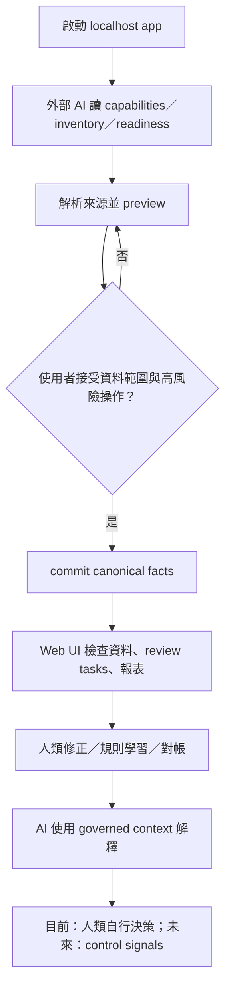

# Product And Users

用途：記錄 Last Say 目前可由 Repository 證實的產品定位、使用者工作與人機責任；未獲 owner 確認的市場假設維持為 Inferred 或 Needs owner decision。

Last validated against repository: 2026-07-15

## 產品定位

**Confirmed：** Last Say 是帶入自己 AI 的本機財務審查與事實保存工具。它不嵌入模型、不要求 AI API key，也不把資料庫交給雲端財務 SaaS。證據：`README.md`、`README.en.md`、`package.json`、`.claude/skills/last-say-ops/SKILL.md`。

**Owner-confirmed（2026-07-15）：** 目前先完成並收斂財務資料基礎建設的實際業務流程；Financial Control Center是下一階段，而且只能建立在foundation canonical facts之上。Reserve、reliable income與進階control policy不是當前工作。

**Owner-confirmed operating model：** 外部AI是主要資料輸入與流程操作方式；Web UI負責確認、歧義處理、高風險授權與少量修正。產品不追求讓使用者完全不用AI，也不以替所有backend resources建立完整CRUD UI為成熟標準。

## 主要使用者

### Confirmed primary user

願意在自己的電腦執行 Node.js 工具，並使用 Claude Code、Codex 或相容 agent 處理財務來源的個人使用者。他重視：

- 財務資料留在本機；
- AI 能做繁重整理，但不能自行決定高風險變更；
- 每月不必從零教 AI 同一套分類；
- 結果能追溯來源、缺口與人工裁決。

### Inferred adjacent user

家庭財務主要維護者，或需要把銀行、卡片、貸款、承諾與投資放進同一視野的人。現有 `reporting_entities` 支援 entity 概念，但 Repository 沒有多人協作、角色權限或共同編輯流程。

### Needs owner decision

- 是否正式支援家戶而不只個人。
- 是否永遠維持 single-user localhost，或未來接受遠端／多人部署的安全成本。

## 核心 Job-to-be-done

1. 匯入來源後，知道哪些資料已成功保存、哪些衝突或缺漏仍待處理。
2. 只審查不確定或高價值項目，修正後讓下期結果更準確。
3. 在指定 scope 與期間查看支出、趨勢、管理 P&L、資產／負債／承諾／投資事實。
4. 在要求 AI 解釋前，先知道資料是否足以回答，以及答案包含哪些來源。
5. 反轉錯誤匯入、合併 identity 或宣告 scope 時，保留人類確認與稽核證據。
6. **Planned, not implemented：** 預先看到 90 日內現金缺口、safe-to-spend 與風險來源。

## 目前使用者旅程

### 已消除的摩擦

- 重複匯入有 dedupe／idempotency 與 ingestion run。
- 人工修正不會被一般 reclassification 覆蓋。
- readiness 可在分析前指出 scope、freshness、coverage blocker。
- 高風險 operation 不接受單純 `actor` header 冒充人類確認。

### 尚存摩擦

- 多數typed resources主要透過外部AI／API建立是已確認的產品模式；真正的摩擦是Skill、typed preview／commit、錯誤恢復與UI確認能否在實際來源中順暢閉環，而不是CRUD數量。
- Data Center已支援全部account kinds，以及manual instrument／holding／quote／FX；statement、trade history與schedule仍由AI／typed API主導。
- 沒有 forecast／alert，使用者仍需自行把事實轉成未來風險判斷。
- Chromium E2E目前覆蓋Data Center、三張server-backed報表與unified review workbench的主要empty／partial／typed-owner流程；完整新手onboarding、真實AI ingestion、mobile與多瀏覽器journey仍缺usability／acceptance證據。

## 人類、AI 與系統責任

| 角色 | 應負責 | 不應負責 |
|---|---|---|
| Last Say | 保存來源事實、契約驗證、deterministic calculation、readiness、稽核、確認與少量修正介面 | 自行做價值判斷、把不完整資料呈現成完整答案、複製一套只服務UI的資料真相 |
| 外部 AI | 作為主要輸入方式，解析來源、查缺口、preview／commit、提出修正、解釋named dataset | 直接操作SQLite、繞過typed contract／confirmation、虛構缺失值 |
| 人類／UI | 核准scope、高風險變更、歧義與例外修正、最終財務決策 | 被迫逐筆輸入可由AI安全處理的大量資料，或維護完整admin CRUD |

## 成功情境

使用者可讓AI完成主要來源輸入，在UI只確認與修正必要項目；完成後能從同一套有來源證據的資料回答「現在有多少、欠多少、何時要付、資料缺什麼」。目前階段的成功標準是這個foundation閉環在實際使用中順暢且令owner滿意；下一階段才加入Control Center。長期成功情境另見[`../../Final-Long-Term-Goal.md`](../../Final-Long-Term-Goal.md)。

## 非目標

- 法定會計、GAAP／IFRS、稅務申報或審計證明。
- 投資報酬保證、信用建議或取代專業財務顧問。
- server-side autonomous AI。
- 未經 owner 決策的多租戶 SaaS、社群或金融資料聚合平台。

更新觸發：目標使用者、核心 job、人機責任、主要旅程或非目標改變時更新；市場與商業假設必須標記來源或 owner 決策。
