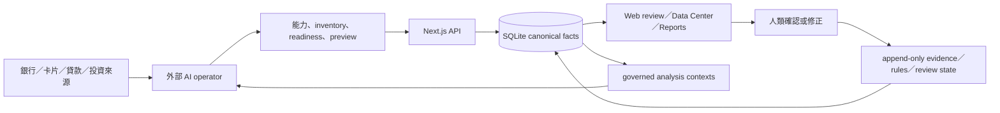

# Project Overview

用途：用可驗證的 Repository 證據回答 Last Say 是什麼、由哪些執行單元組成，以及使用者資料如何在系統內流動。

Last validated against repository: 2026-07-16

## 一句話

**Confirmed：** Last Say 是一個 localhost、local-first、human-in-the-loop 的個人財務事實與審查工具。外部 AI 負責解析與提案；Next.js 應用程式保存 SQLite 事實、規則、人工裁決、對帳狀態與受治理分析資料集；人類對高風險變更保有最後決定權。

證據：`package.json`、`README.md`、`AGENTS.md`、`.claude/skills/last-say-ops/SKILL.md`、`lib/db.js`、`app/api/**`。

## 解決的問題

- AI 對話可以快速理解帳單，但無法可靠保存跨期規則、來源與人工裁決。
- 試算表能保存數字，卻不自然保存分類理由、coverage、對帳差異與可回溯變更。
- 雲端財務工具增加資料交付與供應商信任成本。
- 全自動化財務判斷會混淆事實、推導與建議，也可能越過人的授權。

**Confirmed：** 現有產品以「交易審查與可追溯學習」起家，現已具備 typed financial foundation；控制型能力仍是下一階段，不是現況。

## Repository 與技術輪廓

| 項目 | 現況 | 證據 |
|---|---|---|
| Repository | 單一 Next.js 應用，非 monorepo／workspace | `package.json`、根目錄結構 |
| Runtime | Node.js 22.5+；使用內建 `node:sqlite` | `package.json#engines`、`lib/db.js` |
| Web | Next.js 15 App Router、React 19 | `package.json`、`app/**` |
| UI | Tailwind CSS 4、Radix、Recharts、lucide-react | `package.json`、`components/**` |
| API | Next route handlers；主要為 JSON REST 風格 | `app/api/**/route.js` |
| Persistence | 單一 SQLite DB，code schema version 9，WAL；正式DB升級受backup gate約束 | `lib/db.js`、`lib/db/migration-runner.js`、`lib/db/migrations/**` |
| Language | JavaScript／JSX；沒有 TypeScript typecheck | `rg --files`、`package.json#scripts` |
| Tests | Node test runner＋Playwright browser suite | `test/**`、`e2e/**`、`npm test`、`npm run test:e2e`；精確通過數見`CURRENT-STATUS.md` |
| CI | GitHub Actions 執行 release verifier；另有 CodeQL | `.github/workflows/ci.yml`、`.github/workflows/codeql.yml` |
| AI | 外部 agent skill；server 不呼叫 LLM | `.claude/skills/last-say-ops/**`、Repository 搜尋 |

## 第一方執行單元

1. **Next.js Web UI**：`app/**` 與 `components/**`。主要頁面是 Overview、Transactions、Reports、Data Center、Trend、Corrections、Rules、Confirmations。
2. **HTTP API**：`app/api/**`。包含 legacy transaction／reporting API 與 `/api/finance/**` typed foundation API。
3. **Domain／query layer**：`lib/finance/**`、`lib/queries/**`、`lib/reporting/**`。負責契約驗證、money semantics、readiness、ingestion、reversal、分析 registry、SQL 與 read model。
4. **SQLite persistence**：`lib/db.js`、`lib/db/**`。提供 lazy singleton、transaction wrapper、compatibility schema 與 checksummed migrations。
5. **Operator CLI**：seed、backup／restore、backup health、release verification與isolated browser E2E runners under `scripts/`。
6. **Control reference library**：`lib/finance/control/project-cash-timeline.js`，只對explicit inputs做pure deterministic projection；尚未連正式DB/API/UI。
7. **Verification tooling**：`scripts/verify-release.mjs`、`scripts/smoke-runtime.mjs`、`scripts/eval-last-say-skill.mjs` 與 `test/**`／`e2e/**`。
8. **External AI operator contract**：`.claude/skills/last-say-ops/**`，不是 server process。

生成與外部邊界：`.next/`、`node_modules/`、coverage、cache 與套件 lockfile 不是第一方產品邏輯；`data/`、`uploads/`、`outputs/` 是私密 runtime data zone，不是文件證據來源。

## 核心使用流程

legacy CSV／ledger 流程仍存在：外部 AI 產生 ledger → `/api/import-ledger` → `scripts/seed-from-ledger.js` → transactions／sources／rules → UI review。typed ingestion 則使用 `/api/finance/imports/preview`、staging run、commit 與可確認的 reversal。

## 目前成熟階段

**Confirmed：** 資料基礎、AI proposal contract、統一待審工作台與三張管理報表已在code／synthetic／browser層完成。正式DB仍待受保護v6→v9升級與owner acceptance；產品仍處於「可信事實、人工裁決與管理報表平台」到「主動財務控制工具」之間。

- 已具備：canonical identity、source／scope、typed ingestion、balances、cards、liabilities、commitments、investments、valuations、reconciliation、unified review workbench、readiness、analysis contexts、management P&L／Balance Sheet／Cash Flow、currency-aware Data Center、browser E2E、backup／restore／health，以及Control Phase 0 reference semantics。
- 尚未具備：formal DB v9 publication與owner acceptance、foundation-backed forecast API/UI、safe-to-spend、alerts、scenario policy、正式deployment／monitoring。

詳細狀態見 [`CURRENT-STATUS.md`](CURRENT-STATUS.md) 與 [`FEATURE-INVENTORY.md`](FEATURE-INVENTORY.md)。

## 核心界線

- Local-first、預設只綁 `127.0.0.1:3127`。
- 伺服器不內建 AI、不得把 AI 推論冒充事實。
- 高風險資料變更使用 browser confirmation 與一次性 authorization。
- 真實資料不得進 Git、公開文件、log 或 demo screenshot。
- 不是法定會計、稅務、投資建議或多租戶 SaaS。

更新觸發：主要 runtime、第一方執行單元、核心流程、產品成熟階段或信任邊界改變時更新。
